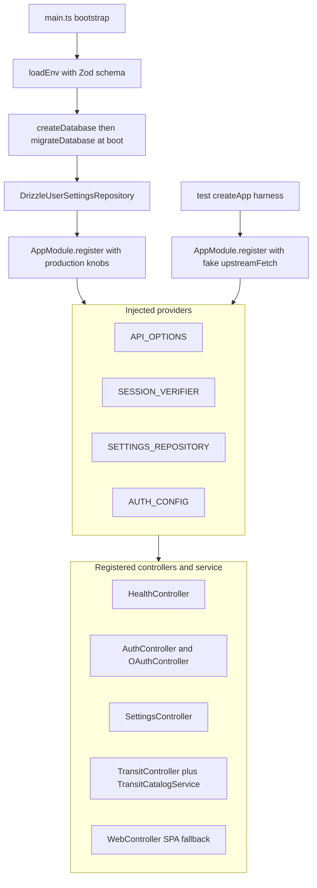
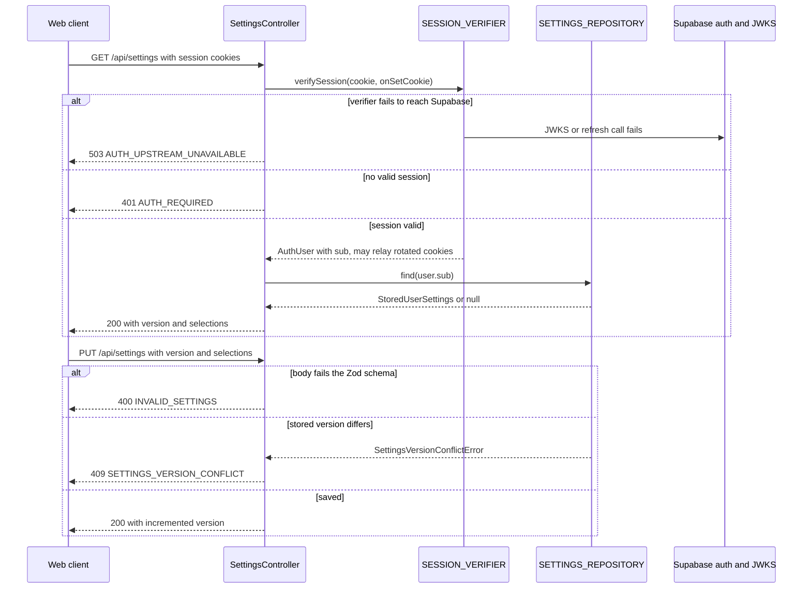

# API Service (NestJS + Fastify)

The `apps/api` workspace is the single production process: one NestJS 11
application on a Fastify adapter that serves both `/api/*` JSON routes and the
built Vite SPA from the same container. There is no separate gateway — mota
owns its Google login (PKCE against the shared Supabase project), verifies
Supabase access tokens locally against the JWKS, and reads/writes user
settings through a repository interface implemented by the Drizzle package
(`@mota/db`). See `/openwiki/workflows/authentication.md` for the full login
flow and `/openwiki/architecture/database.md` for the persistence side.

## Composition root: `AppModule.register`

`AppModule` is a deliberately static-only class whose `register(options)`
returns a `DynamicModule`. Every collaborator arrives through
`AppModuleOptions`; the module imports nothing environment-specific itself.
This is what makes the whole HTTP surface testable without Postgres, real
network, or timers:

*Composition: everything is passed in, then re-exposed as four symbol tokens
consumed by the controllers.*

The knobs in `AppModuleOptions` (all optional) are resolved into a single
`ApiOptions` value at `apps/api/src/app.module.ts`:

| Option | Default | Used by |
|---|---|---|
| `upstreamFetch` | global `fetch` | every Seoul upstream adapter and the OAuth client |
| `verifySession` | built from `oauthConfig` (see below) | `AuthController`, `SettingsController` |
| `settingsRepository` | `UnavailableSettingsRepository` (throws on use) | `SettingsController` |
| `oauthConfig` | `null` | `OAuthController`, default session verifier |
| `now` | `undefined` → `Date.now` inside `TransitCatalogService` | catalog freshness and retry math |
| `subwayArrivalUpstream` | `undefined` → adapter default origin | `/api/subway/arrivals` |
| `transitCatalogRefreshMs` | 24 h (`DEFAULT_CATALOG_REFRESH_MS`) | both managed catalogs |
| `transitCatalogRetryMs` | 15 min (`DEFAULT_CATALOG_RETRY_MS`) | bounded retry backoff |
| `warmTransitCatalogs` | `false` | whether `onModuleInit` warms the catalogs |
| `minimumBusCatalogItems` | `1` | bus catalog completeness gate |
| `minimumSubwayCatalogItems` | `1` | subway catalog completeness gate |
| `random` | `Math.random` | refresh-schedule jitter (injectable for tests) |

The resolved `ApiOptions` (plus its `verifySession` and `settingsRepository`
members and `oauthConfig`) is exposed through the four `Symbol` tokens defined
in `apps/api/src/app.tokens.ts` — `API_OPTIONS`, `SESSION_VERIFIER`,
`SETTINGS_REPOSITORY`, and `AUTH_CONFIG` — so no controller ever reads
`process.env` or constructs a client of its own. `TransitCatalogService` is the
only class provider; it receives `API_OPTIONS` and turns the
`transitCatalog` sub-object into two `ManagedCatalog` instances (bus and
subway) sharing `now`, `random`, `refreshMs`, `retryMs`, `warmup`, and the
minimum-item thresholds. Deep-dive on that machinery lives in
`/openwiki/concepts/transit-catalogs.md`.

### Deliberate test defaults

The defaults are chosen so that a bare `AppModule.register({})` boots, is
quiet (no timers, no network), and fails loudly rather than silently if a
production-only collaborator is missing:

- `UnavailableSettingsRepository.find`/`save` throw
  `Settings repository is not configured.` instead of returning empty data.
- With `oauthConfig === null` and no injected `verifySession`, the default
  verifier throws `Supabase auth is not configured.` on first call.
- `warmup` defaults to `false`, so `onModuleInit` does not fire warmup loads
  or schedule refresh timers; catalogs load lazily on the first request
  (trigger `cold-request`).
- Minimum catalog items default to `1`, so a one-row fixture satisfies the
  completeness gate. Production `main.ts` instead passes `10_000` bus and
  `100` subway, which is what makes the "complete catalog" guarantee real —
  a truncated upstream payload is rejected and the service falls back
  (`/apps/api/test/transit-catalog-fallback.e2e.test.ts` proves the bus
  fallback to the location-scoped live lookup).

When `oauthConfig` *is* provided (production and the auth e2e tests), the
default `verifySession` is `(cookie, onSetCookie) => verifySupabaseSession(cookie, { config, onSetCookie })` — local
JWKS verification of the access-token cookie plus server-side refresh-token
rotation, with fresh cookies relayed back through the `onSetCookie` callback.

## Bootstrap in `main.ts`

Production wiring differs from the test defaults in exactly the ways that
matter operationally (`apps/api/src/main.ts`):

1. `loadEnv()` parses and validates the environment (see below).
2. `createDatabase(env.databaseUrl)` then `migrateDatabase(database, env.migrationsPath)` run
   **before** the app is created — the process does not start serving with an
   unmigrated schema.
3. `DrizzleUserSettingsRepository` is constructed and passed as
   `settingsRepository`.
4. Production catalog policy: `warmTransitCatalogs: true`,
   `minimumBusCatalogItems: 10_000`, `minimumSubwayCatalogItems: 100`, plus
   `subwayArrivalUpstream` and `transitCatalogRefreshMs` from env.
5. `oauthConfig` is built from `env.oauth` with the global `fetch` as fetcher.
6. The app is created on `new FastifyAdapter({ logger: true, requestTimeout: 65_000 })`. The 65 s
   server timeout sits above the web client's 35 s allowance for slow
   catalog-backed subway searches (`fetchNearbySubwayStations`) and the
   adapters' own 30 s catalog fetch timeout, so the client's abort wins
   rather than the server's.
7. `app.useStaticAssets({ root: env.webDistPath, prefix: "/", decorateReply: true, wildcard: false })` serves the built SPA.
   `wildcard: false` is the load-bearing detail: it stops `@fastify/static`
   from registering its own catch-all `GET /*` route, which leaves the
   wildcard to `WebController` (below). `decorateReply: true` is what makes
   `reply.sendFile` available to that controller.
8. `app.enableShutdownHooks()`, and `process.once("SIGTERM"/"SIGINT", () => void client.end())` close the
   Postgres connection pool on container stop before `app.listen(env.port, env.host)`.

## Controller surface

| Route | Controller | Behavior |
|---|---|---|
| `GET /api/health` | `HealthController` | Always 200: `{ status: "ok", service: "mota", transitCatalogs: { bus, subway } }` with the non-gating catalog readiness snapshot. Used by the Compose healthcheck. |
| `GET /api/auth/session` | `AuthController` | `{ authenticated: false }` or `{ authenticated: true, user }`; rotates cookies via `onSetCookie`. |
| `GET /api/auth/google` | `OAuthController` | 302 to the Supabase authorize URL with PKCE `S256` challenge and `prompt=select_account`; sets three host-only flow cookies. |
| `GET /api/auth/callback` | `OAuthController` | Validates `state` (timing-safe), exchanges the code, clears flow cookies, sets session cookies, 302 to the remembered same-site return path. |
| `POST /api/auth/logout` | `OAuthController` | 200 `{ status: "ok" }`; clears session cookies first, then revokes the Supabase session best-effort. |
| `GET /api/settings` | `SettingsController` | Authenticated snapshot `{ version, selections }`; `{ version: 0, selections: null }` for a user with no row. |
| `PUT /api/settings` | `SettingsController` | Compare-and-swap save keyed by the Supabase `sub`. |
| `GET /api/stops/nearby` | `TransitController` | `{ stops }` from the bus catalog (haversine radius filter), falling back to the live nearby lookup when the catalog is unavailable. |
| `GET /api/subway/nearby` | `TransitController` | `{ stations }` from the official station catalog, deduped by station name. |
| `GET /api/subway/arrivals` | `TransitController` | Realtime proxy through `options.subwayArrivalUpstream`; returns `{ arrivals, updatedAt }` where `updatedAt` is the adapter **receipt** time (not upstream `recptnDt`), which the client's 90-second freshness rule keys on. |
| `GET /api/arrivals/:arsId` | `TransitController` | Realtime Hermes BIS arrivals — deliberately never catalog-cached — plus an `updatedAt` receipt timestamp. |
| `GET /*` | `WebController` | SPA fallback (next section). |

All request validation happens with the shared Zod schemas from
`@mota/contracts` (`nearbySearchSchema`, `subwaySearchSchema`,
`subwayArrivalLookupSchema`, `arrivalLookupSchema`,
`transitSettingsUpdateSchema`) *before* any upstream call — the e2e suite
asserts `upstream` is not called for out-of-Seoul coordinates.

## The shared error contract

Every intentional failure is thrown as a Nest `HttpException` whose body is a
plain object `{ error: <CODE>, message: <Korean copy> }`. Because Nest passes
an object body through unchanged, the wire shape is exactly that object; no
global exception filter or validation pipe exists — the mapping is done
inline in each controller. `UPSTREAM_UNAVAILABLE` additionally carries a
`detail` string from `errorDetail(error)`.

| Code | Status | Raised by | Meaning |
|---|---|---|---|
| `INVALID_LOCATION` | 400 | `TransitController` nearby routes | Coordinates outside the Seoul service boundary (schema bounds 37.3–37.8 / 126.7–127.3). |
| `INVALID_STATION` | 400 | `GET /api/subway/arrivals` | Missing/oversized station query. |
| `INVALID_ARS_ID` | 400 | `GET /api/arrivals/:arsId` | ARS number is not a 5-digit numeric id. |
| `INVALID_SETTINGS` | 400 | `PUT /api/settings` | Body fails `transitSettingsUpdateSchema`. |
| `UPSTREAM_UNAVAILABLE` | 502 | all `TransitController` routes | Upstream adapter threw (`UpstreamError` or any unexpected error). |
| `AUTH_REQUIRED` | 401 | `SettingsController.requireUser` | No verified session. |
| `AUTH_NOT_CONFIGURED` | 503 | `OAuthController.requireConfig` | `oauthConfig` is `null` (login routes only). |
| `AUTH_CALLBACK_INVALID` | 401 | `GET /api/auth/callback` | Missing/forged `state`, missing cookies, or a rejected code exchange; flow cookies are cleared. |
| `AUTH_UPSTREAM_UNAVAILABLE` | 503 | `AuthController`, `SettingsController` | `SupabaseUnavailableError` from the verifier — an outage is reported as an outage, never as "anonymous". |
| `SETTINGS_VERSION_CONFLICT` | 409 | `PUT /api/settings` | Repository raised `SettingsVersionConflictError` (compare-and-swap mismatch). |

The `error` code — not the Korean `message` — is the contract. The web client
(`apps/web/src/api/client.ts`) wraps every non-OK response in an
`ApiError(status, code)` by reading `payload.error` from the JSON body, and
branches on the code: `isServiceAreaError(error)` checks for
`INVALID_LOCATION` so `useInlineMapSearch` can show "서울 서비스 범위
밖이에요…" instead of a generic retry message. Any body without a string
`error` becomes a code-less generic `ApiError`, so adding a code is backward
compatible for existing clients.

Adapters under `apps/api/src/upstream/` never format user-facing copy. They
throw `UpstreamError` (message + machine `detail`) per the taxonomy in
`apps/api/src/upstream/upstreamError.ts`, and the routes map it onto the fixed
502 shape.

## Authenticated request flow

*An authenticated settings request, including every documented failure exit.*

The same `requireUser` shape (verify → `AUTH_UPSTREAM_UNAVAILABLE` on
`SupabaseUnavailableError` → `AUTH_REQUIRED` on no user → relay rotated
cookies) is shared by `AuthController.session` and both settings routes.

## SPA static serving and the wildcard fallback

`WebController` is registered with a bare `@Controller()` and a single
`@Get("*")` handler that implements a deliberate three-way decision:

- URLs starting with `/api/` throw `NotFoundException` — the wildcard must
  never shadow a real (or genuinely missing) API route.
- Requests whose `Accept` header does not include `text/html` also 404, so
  probes and non-navigational requests don't receive HTML.
- Everything else gets `reply.type("text/html")` and
  `reply.sendFile("index.html")` from the static root configured in
  `main.ts` (`env.webDistPath`, `/app/web` in the image).

Asset files (JS/CSS/icons) are served directly by `@fastify/static` at
prefix `/`, whose `wildcard: false` setting is what keeps its routing out of
the way of this controller. The service worker never caches `/api/*` (see
`/openwiki/architecture/pwa-service-worker.md`), and deployment topology is
covered in `/openwiki/operations/deployment.md`.

## Environment configuration

`loadEnv` (`apps/api/src/config/env.ts`) parses `process.env` with a Zod
schema before anything else happens:

- `HOST` default `0.0.0.0`, `PORT` default `3000` (1–65535).
- `SUPABASE_URL` and `SUPABASE_ANON_KEY` are required — the process refuses
  to start without them.
- `PUBLIC_URL` default `http://localhost:5173`; trailing slashes are stripped
  from it and `SUPABASE_URL`, and the `https:` scheme of `PUBLIC_URL` is what
  selects `__Host-` cookie prefixes elsewhere in the auth stack.
- `SUBWAY_ARRIVAL_UPSTREAM` defaults to the shared k-skill proxy origin; only
  the origin is overridden.
- `WEB_DIST_PATH` default `/app/web`, `MIGRATIONS_PATH` default `/app/drizzle`.
- `TRANSIT_CATALOG_REFRESH_MS` clamped to 1 minute–7 days, default 24 h.
- Database: `DATABASE_URL` wins, otherwise a URL is assembled (with component
  encoding) from `DATABASE_HOST/PORT/NAME/USER/PASSWORD`; with neither, boot
  fails with `DATABASE_URL or DATABASE_PASSWORD is required.`

## Lifecycle and shutdown

`TransitCatalogService` implements `OnModuleInit`/`OnModuleDestroy`: init
starts both catalogs (which warm up only when `schedule`/`warmup` is true and
otherwise wait for the first request), destroy stops the refresh timers.
Catalogs are atomically swapped snapshots with single-flight loading, stale
fallback on refresh failure, jittered proactive scheduling, and bounded
retry — the details belong to `/openwiki/concepts/transit-catalogs.md`. On
`SIGTERM`/`SIGINT` the Postgres client is ended explicitly so drain happens
cleanly under Compose.

## Testing seams

The composition root *is* the test seam. `apps/api/test/create-test-app.ts`
builds the real module with `Test.createTestingModule({ imports: [AppModule.register({ ...options, upstreamFetch })] })`
and issues requests through Fastify's `inject`, returning a standard
`Response`. Because every outbound dependency is an option:

- `app.e2e.test.ts` stubs the whole Seoul upstream surface with a `vi.fn()`
  and asserts catalog caching, single-flight loading, stale fallback,
  normalization, and each error code — including that rejected coordinates
  never reach upstream.
- `auth.e2e.test.ts` runs against a real local HTTP fake of Supabase
  (`fake-supabase.ts`: ES256 JWKS, PKCE and refresh grants, signout recorder)
  via the injected `oauthConfig.fetcher`.
- `settings.e2e.test.ts` substitutes an in-memory `UserSettingsRepository`
  and a cookie-regex `verifySession` to test 401/400/409/503 behavior
  without either production dependency.
- `transit-catalog-fallback.e2e.test.ts` sets `minimumBusCatalogItems: 2` to
  force catalog rejection and observe the live-lookup fallback.
- `settings.postgres.integration.test.ts` is gated on `DATABASE_URL` being
  present (`describe.runIf`) and exercises the real Drizzle repository
  through the same HTTP boundary.
- `managedCatalog.test.ts` injects `now` and `random` to test refresh
  scheduling deterministically; fake timers verify the proactive timer runs
  and is cleared by `stop()`.

## Related pages

- `/openwiki/workflows/authentication.md` — the full PKCE login, cookie, and
  JWKS verification flow behind `/api/auth/*`.
- `/openwiki/concepts/transit-catalogs.md` — `ManagedCatalog` semantics in
  depth.
- `/openwiki/integrations/seoul-upstreams.md` — the upstream adapters and
  their normalization contracts.
- `/openwiki/architecture/database.md` — the `user_settings` table and
  compare-and-swap repository.
- `/openwiki/operations/deployment.md` — container, env wiring, healthcheck.
