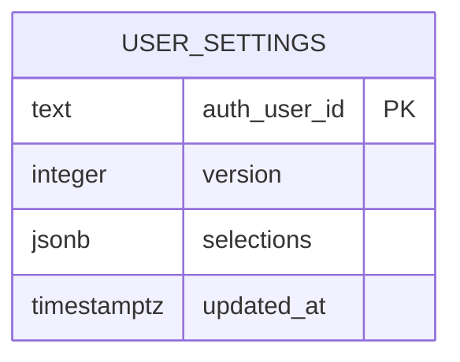

# Database (Drizzle + PostgreSQL)

`packages/db` (`@mota/db`) is the only workspace that talks to PostgreSQL. It
exposes four things through its barrel (`packages/db/src/index.ts`):
`createDatabase` (client construction), `migrateDatabase` (boot-time
migrations), `DrizzleUserSettingsRepository` (compare-and-swap persistence),
and `userSettings` (the Drizzle table definition). Everything else in mota
consumes the repository through the `UserSettingsRepository` interface; the
Nest API never imports Drizzle outside its composition root.

Package boundary (AGENTS.md): `packages/db` imports `@mota/contracts` and
Drizzle only — it never imports Nest or React. The Zod schema
`transitSelectionsSchema` is the shared definition of what a `selections`
document may contain.

## The one table



`user_settings` as declared in `packages/db/src/schema.ts` and materialized by
the migration `packages/db/drizzle/0000_user_settings.sql`:

| Column | Type | Constraints | Meaning |
|---|---|---|---|
| `auth_user_id` | `text` | `PRIMARY KEY NOT NULL` | Supabase `sub` claim — the whole identity |
| `version` | `integer` | `NOT NULL DEFAULT 1` | Compare-and-swap token |
| `selections` | `jsonb` | `NOT NULL` | A `TransitSelections` document |
| `updated_at` | `timestamp with time zone` | `NOT NULL DEFAULT now()` | Last write, JS `Date` in Drizzle |

Two invariants from AGENTS.md shape this shape:

- **Mota never stores a duplicate user record.** There is no local user table
  and no users–settings join. Identity is the Supabase `sub` claim verified
  from mota's own login (README restates this: "Mota stores only
  `user_settings`"). Rows are keyed directly by `sub`, so one human with two
  concurrent sessions still has exactly one row.
- **Database JSON is untrusted.** `.$type<TransitSelections>()` on the jsonb
  column is a compile-time annotation only — nothing in Postgres enforces the
  shape. Every read re-validates at runtime (below).

`packages/db/src/schema.test.ts` pins this contract: table name
`user_settings`, exactly these four columns in this order, and `auth_user_id`
as the (inline) primary key.

## Client construction rules

`createDatabase(databaseUrl)` (`packages/db/src/client.ts`) builds one
postgres-js connection pool and wraps it once:

```ts
const client = postgres(databaseUrl, { max: 5, prepare: false });
return { client, database: drizzle(client, { schema }) } as const;
```

- `max: 5` caps the pool — the API is a single small container, so this bounds
  concurrent Postgres connections against the shared `home-server-pg`.
- `prepare: false` disables prepared statements. This matters behind
  connection pooling / statement-name collisions and keeps behavior predictable
  with the pooler-free postgres-js path.
- The returned `client` must be ended by the caller; the pool is a process-wide
  resource, closed on shutdown (see below).

The connection string comes from `loadEnv` (`apps/api/src/config/env.ts`):
`DATABASE_URL` wins outright; otherwise a URL is assembled with component
encoding from `DATABASE_HOST` (default `home-server-pg`) / `DATABASE_PORT`
(5432) / `DATABASE_NAME` (`mota`) / `DATABASE_USER` (`mota`) /
`DATABASE_PASSWORD`. With neither, boot fails with
`DATABASE_URL or DATABASE_PASSWORD is required.` Production Compose passes the
`DATABASE_*` fields and pulls `POSTGRES_PASSWORD` from
`../home-server-infra/.env`; `home-server-infra` owns the `mota` database and
role.

## Repository: reads re-validate, writes compare-and-swap

`DrizzleUserSettingsRepository` implements `UserSettingsRepository`, whose
contract is just two methods: `find(authUserId)` returning
`StoredUserSettings | null`, and `save(authUserId, expectedVersion, selections)`
returning `StoredUserSettings`. Both map rows through a single `toStored`
helper.

### Read path

`find` selects at most one row by primary key. Whatever comes back goes through
`toStored`, which runs `transitSelectionsSchema.safeParse(row.selections)` and
throws `InvalidStoredSettingsError` on failure. Because
`transitSelectionsSchema` is a transforming union (legacy documents with a
singular `selectedBusStopId` migrate to a one-element `selectedBusStopIds`
list, and bare point selections are lifted into `commutes`), the re-parse is
also the **migration mechanism** for older stored documents — reading an old
row yields the current shape without a backfill migration. `updatedAt` is
normalized to an ISO string.

### Write path (compare-and-swap)

<!-- openwiki: mermaid parse failed and this diagram was converted to a text fence so it does not break rendering. Fix the diagram source and restore the mermaid fence. Parser error: Heuristic: an unescaped angle bracket inside a label breaks rendering; rephrase the label. -->
```text
flowchart TD
    subgraph save ["save authUserId expectedVersion selections"]
        direction TB
        S0{"expectedVersion === 0?"}
        S0 -->|yes| INS["INSERT row version 1<br/>onConflictDoNothing<br/>returning"]
        S0 -->|no| UPD["UPDATE set version = expectedVersion + 1<br/>where authUserId matches<br/>and version = expectedVersion<br/>returning"]
        INS --> R{"returned a row?"}
        UPD --> R
        R -->|no| CONFLICT["throw SettingsVersionConflictError"]
        R -->|yes| OUT["toStored row -> StoredUserSettings"]
    end
```

The two branches are deliberately asymmetric:

- **`expectedVersion === 0` (first write)** issues
  `INSERT ... VALUES (authUserId, version: 1, ...) ON CONFLICT DO NOTHING
  RETURNING *`. If the row already exists, the insert is silently skipped and
  `.returning()` yields no row — an empty result therefore means "someone else
  created the row first", which is surfaced as `SettingsVersionConflictError`.
- **`expectedVersion >= 1`** issues
  `UPDATE ... SET version = expectedVersion + 1, selections, updated_at WHERE
  auth_user_id = ? AND version = expectedVersion RETURNING *`. The `version`
  predicate *in the WHERE clause* is what makes the check-and-set atomic in a
  single statement: zero matched rows means another writer bumped the version
  first, and also raises `SettingsVersionConflictError`.

Both `version 0 → row existed` and `UPDATE matched nothing` collapse into the
same error, because from the client's point of view they are the same
situation: the caller's view of the data is stale.

### How the API surfaces it

`SettingsController` (`apps/api/src/settings/settings.controller.ts`) is the
only consumer:

- `GET /api/settings` returns `{ version, selections }` from the stored row, or
  `{ version: 0, selections: null }` when `find` returns null (never-seen
  user). Invalid stored JSON escapes as a 500 via `InvalidStoredSettingsError`,
  not a conflict.
- `PUT /api/settings` first validates the body with
  `transitSettingsUpdateSchema` (400 `INVALID_SETTINGS`), then calls
  `repository.save(user.sub, parsed.data.version, parsed.data.selections)` and
  maps a caught `SettingsVersionConflictError` to HTTP 409
  `SETTINGS_VERSION_CONFLICT` ("다른 화면에서 설정이 변경되었습니다.").
  Success echoes `{ version: saved.version, selections: saved.selections }`.

This is the optimistic-concurrency mechanism that AGENTS.md calls out:
"compare-and-swap versions prevent silent multi-tab overwrites." The end-user
flow — reload, rebase, retry — belongs to
`/openwiki/workflows/settings-sync.md`.

## Migrations

### Runtime path (boot)

`migrateDatabase(database, migrationsFolder)` is a one-line wrapper over
`drizzle-orm/postgres-js/migrator`'s `migrate`. It is called exactly once, at
boot, from the API composition root (`apps/api/src/main.ts`):

```ts
const { client, database } = createDatabase(env.databaseUrl);
await migrateDatabase(database, env.migrationsPath);
```

Migration runs **before** `NestFactory.create`, so a failed migration fails the
boot; the API never serves requests against an un-migrated schema. There is no
separate migration job or init container.

`env.migrationsPath` comes from `MIGRATIONS_PATH` (`z.string().min(1)`, default
`/app/drizzle`). Two layouts resolve it:

- **Container:** the Dockerfile sets `ENV MIGRATIONS_PATH=/app/drizzle` and
  copies `packages/db/drizzle` to `/app/drizzle`, so the default is correct
  out of the box; `compose.yaml` re-states it explicitly.
- **Local:** nothing rewrites the default and there is no dotenv loader in the
  API, so a local boot must export `MIGRATIONS_PATH` pointing at the
  repository-relative `packages/db/drizzle` (the `.env.example` only documents
  the `DATABASE_*` fields).

The migration folder must contain both the SQL files and
`drizzle/meta/_journal.json`. The journal currently holds a single entry,
`0000_user_settings`, which creates the `user_settings` table. That is mota's
only migration to date.

### CLI paths (developer)

- `pnpm db:generate` (root) → `pnpm --filter @mota/db generate` →
  `drizzle-kit generate`. **All schema changes go through this**: edit
  `packages/db/src/schema.ts`, generate SQL into `packages/db/drizzle`, and the
  next boot applies it. Hand-written SQL is not the workflow.
  `drizzle.config.ts` (dialect `postgresql`, `schema: "./src/schema.ts"`,
  `out: "./drizzle"`, `strict: true`, `verbose: true`) throws immediately
  without `DATABASE_URL` — Drizzle commands need it even though generation
  itself doesn't connect meaningfully.
- `pnpm db:migrate` → `tsx src/migrate.ts`: a standalone runner that reads
  `DATABASE_URL` from the environment, migrates from the hardcoded
  `./drizzle` (relative to `packages/db`, so run it from the package or via the
  workspace script), and ends the client in a `finally`.
- `pnpm db:studio` opens Drizzle Studio against the same config.

## Wiring, lifecycle, and the seam

The Nest module deliberately does **not** know about Postgres.
`AppModule.register` accepts an optional `settingsRepository`; when none is
supplied it falls back to `UnavailableSettingsRepository`, whose `find` and
`save` both throw "Settings repository is not configured." All real database
construction therefore lives in `main.ts`: build client, migrate, construct
`DrizzleUserSettingsRepository`, pass it into `AppModule.register`. This is
what lets `apps/api/test/settings.e2e.test.ts` swap in a `MemorySettingsRepository`
(a `Map`-backed implementation that reproduces the CAS semantics by throwing
`SettingsVersionConflictError` when `(current?.version ?? 0) !== expectedVersion`)
and test 401/400/409 behavior with zero database dependency.

Shutdown: `main.ts` registers `process.once("SIGTERM", ...)` and
`process.once("SIGINT", ...)` handlers that call `client.end()`, closing the
postgres-js pool so Compose stop/restart drains cleanly instead of dropping
connections. `app.enableShutdownHooks()` covers Nest-side teardown separately.

## Failure semantics at a glance

| Situation | Where it's detected | Result |
|---|---|---|
| Row exists but `expectedVersion === 0` | empty `INSERT ... RETURNING` | `SettingsVersionConflictError` → HTTP 409 |
| `UPDATE` matched zero rows | empty `UPDATE ... RETURNING` | `SettingsVersionConflictError` → HTTP 409 |
| Stored `selections` fails Zod re-parse | `toStored` | `InvalidStoredSettingsError` → HTTP 500 |
| No credentials at boot | `loadEnv` | process exits: `DATABASE_URL or DATABASE_PASSWORD is required.` |
| Migration fails at boot | `migrateDatabase` before `NestFactory.create` | process exits; no traffic served |
| Repository not injected (tests/standalone module) | `UnavailableSettingsRepository` | thrown error on first use |

## Extending the package

- **New column/table:** edit `packages/db/src/schema.ts`, run
  `pnpm db:generate` (review the emitted SQL in `packages/db/drizzle`), commit
  the new migration plus the updated `meta/_journal.json`. Boot applies it.
- **New read/write semantics:** keep them inside
  `DrizzleUserSettingsRepository` or add another `UserSettingsRepository`
  implementation; the API only depends on the interface token
  (`SETTINGS_REPOSITORY`), so an in-memory or fake implementation drops in
  without touching `packages/db`.
- **Never** relax the re-parse in `toStored` — it is the boundary that keeps
  untrusted database JSON (and any future writer, including `db:studio` edits)
  out of the application.

## Focused tests

- `packages/db/src/schema.test.ts` — table name, column list/order, and the
  inline `auth_user_id` primary key; guards accidental schema drift without a
  database.
- `packages/db/src/repository.integration.test.ts` — gated by
  `describe.runIf(process.env.DATABASE_URL)`. Against a real database it saves
  two users with `version 0`, asserts each gets `version 1`, `find` isolation
  between users, `null` for an unknown user, and that a second
  `save(user, 0, ...)` rejects with `SettingsVersionConflictError`. Test rows
  use `crypto.randomUUID()` ids and are deleted in `afterAll`; the client is
  ended there too.
- `apps/api/test/settings.postgres.integration.test.ts` — same real repository
  pushed through the HTTP boundary (`PUT`/`GET /api/settings`) with a
  cookie-regex `verifySession`, proving the wiring (Subabase `sub` → primary
  key, 409 mapping, `{version: 0, selections: null}` for a new user) rather
  than the repository in isolation.
- Turbo's `test:integration` task is `cache: false` with `env: ["DATABASE_URL"]`
  (`turbo.json`), so integration runs never replay a cached pass from a
  different database and simply no-op when the variable is absent.

See `/openwiki/testing/overview.md` for the overall test strategy,
`/openwiki/architecture/api-service.md` for the controller side of this stack,
and `/openwiki/operations/deployment.md` for how `home-server-infra` provisions
the `mota` database the container connects to.
