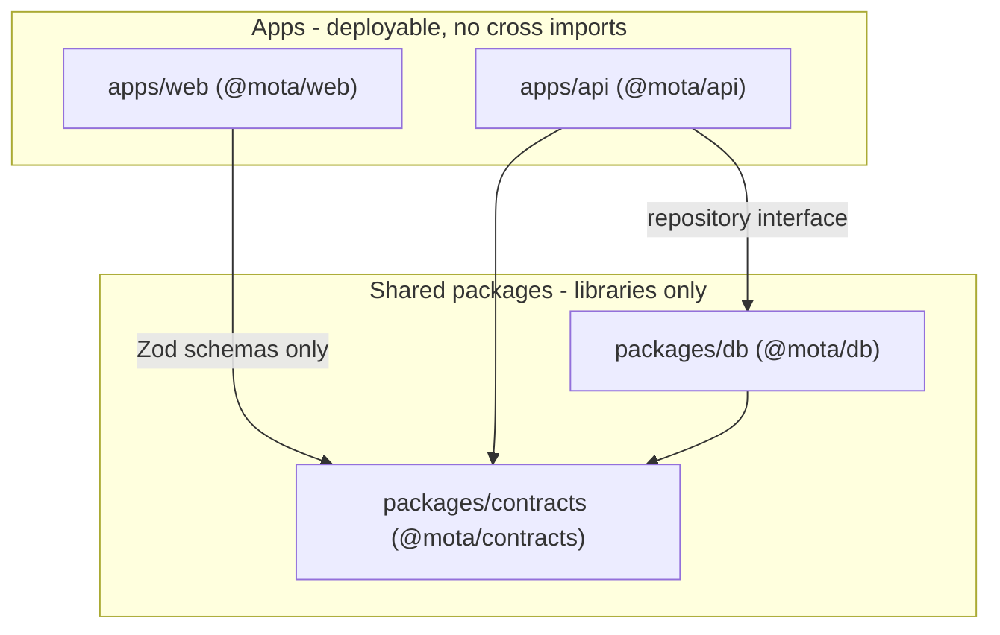
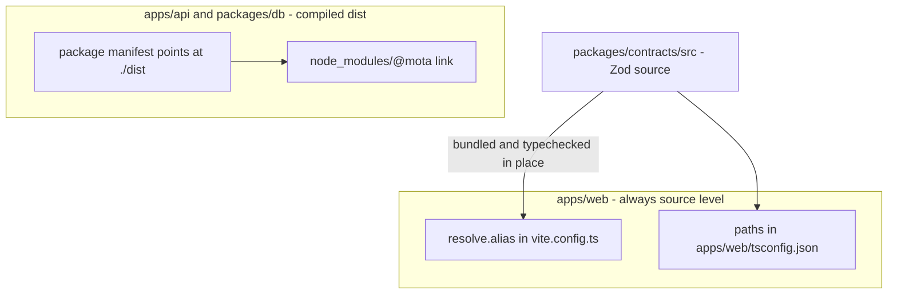

# Repository Topology and Boundaries

Mota is a single pnpm workspace managed by Turborepo. Two deployable apps and
two shared libraries live side by side, and the whole system is held together
by a small set of deliberately one-directional dependency edges. This page maps
that topology: which workspace may import which, how the shared
`@mota/contracts` package is resolved differently in a browser and a Node
process, and how the build, lint, and typecheck toolchain is shared across all
four workspaces. Per-system detail lives on the linked pages.

## The four workspaces

`pnpm-workspace.yaml` declares two glob roots — `apps/*` and `packages/*` —
which yield exactly four workspaces:

| Workspace | Package | Role |
|---|---|---|
| `apps/web` | `@mota/web` | React 19 + Vite PWA: UI, browser adapters, anonymous `localStorage` storage |
| `apps/api` | `@mota/api` | NestJS 11 on Fastify: `/api/*` controllers, Seoul upstream adapters, Supabase PKCE login, serves the built SPA |
| `packages/contracts` | `@mota/contracts` | Shared Zod schemas and types — the only code both apps share |
| `packages/db` | `@mota/db` | Drizzle ORM: PostgreSQL schema, migrations, the `user_settings` repository |

Only `apps/api` is ever started in production (`node apps/api/dist/main.js`);
`apps/web` exists as a Vite source tree that is built to static assets and
served by the API. The two apps never import each other — they meet only at
the HTTP boundary: in development the Vite dev server proxies `/api` to
`http://127.0.0.1:3000` (`apps/web/vite.config.ts`), and in production the
Nest app serves both `/api/*` and the built SPA from one container.

## Allowed dependency edges

*The entire allowed import graph: everything points down toward contracts, and
no edge exists between the two apps.*

The rules in `AGENTS.md` are hard boundaries, and the `package.json` manifests
enforce them mechanically because pnpm only links what a workspace declares:

- `packages/contracts` imports only Zod and its own modules. Its sole runtime
  dependency is `zod`; each source file imports `zod` or a sibling module such
  as `./bus` and `./subway`.
- `packages/db` imports `@mota/contracts` and Drizzle (`drizzle-orm`,
  `postgres`). It never imports Nest or React — the API consumes the database
  exclusively through the `UserSettingsRepository` interface that `@mota/db`
  exports.
- Apps do not import each other. `@mota/web` depends on `@mota/contracts` but
  **not** on `@mota/db`; the browser bundle therefore cannot reach Drizzle,
  Postgres credentials, or any server-side module even transitively.

`@mota/contracts` is consequently the only shared code in the repository and
the single choke point for cross-system types. Inside the web app it is
re-exported once more through `apps/web/src/domain/bus.ts` and
`apps/web/src/domain/subway.ts` (`export * from "@mota/contracts/bus"`), so
component code never names the package directly.

## How the workspace packages link

`pnpm-workspace.yaml` sets two properties that shape every install:

- `injectWorkspacePackages: true` plus `workspace:*` specifiers make pnpm link
  the shared packages into each dependent's `node_modules` (the lockfile
  records them as `link:../../packages/contracts` and `link:../contracts`).
- `nodeLinker: hoisted` produces a flat root `node_modules`, which is what
  lets the Docker runtime image get away with copying one `node_modules`
  tree and adding two symlinks (below) instead of reinstalling.

`allowBuilds` / `onlyBuiltDependencies` gate native postinstall scripts to
exactly four packages — `@nestjs/core`, `@scarf/scarf`, `@swc/core`, and
`esbuild` — so nothing else runs install-time code.

## Two ways `@mota/contracts` is resolved

This is the most consequential asymmetry in the repository. The contracts
package's `exports` map points at **compiled output** (`./dist/bus.js`,
`./dist/transitSettings.js`, …), which is what Node consumers see. The web app
bypasses that entirely and reads the TypeScript source.

*Two resolution lanes: the browser lane reads source, the Node lane reads the
tsc output that the `exports` map points to.*

**Browser lane.** `apps/web/vite.config.ts` installs two aliases — the more
specific `@mota/contracts/transit-settings` first, mapping to
`../../packages/contracts/src/transitSettings.ts`, then `@mota/contracts` to
`../../packages/contracts/src`. The web bundle therefore contains the
contracts **source compiled inline** rather than the package's `dist`, so a
schema change is visible to the web app without building
`packages/contracts` first.
`apps/web/tsconfig.json` mirrors the same mapping as `compilerOptions.paths`
so `tsc --noEmit` typechecks web code against the identical source files —
the alias pair and the `paths` pair must stay in sync.

**Node lane.** `apps/api` and `packages/db` have no path mappings. They resolve
`@mota/contracts` through the `node_modules` symlink and the package's
`exports` map, which points at `./dist`. That is why the `build` task of the
packages must run before `apps/api` can typecheck or test: turbo's `^build`
dependency guarantees `packages/contracts/dist` exists before any Node-side
consumer looks at it.

**The Docker build.** The image builds every workspace explicitly and then
reconstructs the workspace links by hand (`Dockerfile`):

1. `pnpm install --frozen-lockfile`.
2. `tsc -p packages/contracts/tsconfig.build.json` and
   `tsc -p packages/db/tsconfig.build.json` — these build configs flip
   `noEmit` off, emit declarations and source maps, and exclude tests (plus
   `drizzle.config.ts` for db).
3. `vite build` in `apps/web` (consuming contracts source through the alias)
   and `nest build` in `apps/api`.
4. The runtime stage copies `node_modules`, the `package.json` + `dist` of
   `apps/api`, `packages/contracts`, and `packages/db`, the web bundle to
   `/app/web`, and the Drizzle SQL to `/app/drizzle`.
5. Finally `mkdir -p node_modules/@mota` followed by
   `ln -s ../../packages/contracts node_modules/@mota/contracts` and
   `ln -s ../../packages/db node_modules/@mota/db` — recreating inside the
   trimmed image exactly the two links pnpm had created in the full build
   stage. The container then runs `node apps/api/dist/main.js` as the `node`
   user.

## The turbo task graph

`turbo.json` defines six tasks. Five of them declare `"dependsOn": ["^build"]`:
the package builds always run first, so `@mota/contracts` and `@mota/db` have
fresh `dist` output before any app task starts.

| Task | `dependsOn` | Cache | Notable |
|---|---|---|---|
| `build` | `^build` | yes, `outputs: ["dist/**"]` | packages emit `dist` with declarations; apps emit the bundle and `dist/main.js` |
| `typecheck` | `^build` | yes, no outputs | `tsc --noEmit` per workspace; needs package `dist` declarations for the Node lane |
| `check` | — | yes, no outputs | Biome lint per workspace |
| `test` | `^build` | yes, `outputs: ["coverage/**"]` | Vitest unit suites |
| `test:integration` | `^build` | **`cache: false`**, `env: ["DATABASE_URL"]` | hits a real Postgres; never replayed from cache |
| `dev` | `^build` | **`cache: false`**, `persistent: true` | long-running watch processes; turbo never terminates them |

Two details are worth internalizing:

- `test:integration` is uncached because it exercises a live database. Its
  `env: ["DATABASE_URL"]` key documents (and hashes) the database the task
  depends on. The two integration entry points —
  `apps/api`'s `test/settings.postgres.integration.test.ts` and `@mota/db`'s
  `src/repository.integration.test.ts` — are wrapped in
  `describe.runIf(Boolean(process.env.DATABASE_URL))`, so the whole task is a
  silent no-op unless a database URL is exported. Nothing fails in CI for
  lack of a database.
- `dev` is `persistent: true`, so `turbo run dev` fans out to the Vite dev
  server and `nest start --watch` and stays attached. The root scripts scope
  it: `pnpm dev:web` is `turbo run dev --filter=@mota/web` and `pnpm dev:api`
  is `turbo run dev --filter=@mota/api`. `^build` still applies, so the
  packages are compiled once before either watcher starts.

Root `package.json` scripts show which commands go through turbo and which
bypass it: `dev`, `build`, `typecheck`, `check`, `test`, and
`test:integration` are `turbo run` invocations, while `db:generate`,
`db:migrate`, `db:studio`, `test:watch`, and `test:e2e` use
`pnpm --filter` directly against a single workspace.

## The shared toolchain

**TypeScript.** `tsconfig.base.json` pins the language level and strictness
for every workspace: `target: ES2022`, `strict`, `skipLibCheck`,
`noUncheckedIndexedAccess`, `exactOptionalPropertyTypes`,
`useUnknownInCatchVariables`, and `forceConsistentCasingInFileNames`. Each
workspace then extends it and picks only its module world:

| Workspace | Module / resolution | Why |
|---|---|---|
| `apps/web` | `ESNext` + `moduleResolution: Bundler`, DOM libs, JSX | resolved by Vite; `paths` to contracts source |
| `apps/api` | `Node16`, decorators on, `outDir: dist` | Nest CommonJS output for `node dist/main.js` |
| `packages/contracts` | `CommonJS` / `Node` | plain library output matching its `exports` map |
| `packages/db` | `Node16`, `types: ["node"]` | Node-only Drizzle code |

**Biome.** One root `biome.json` carries the formatting contract (2-space
indent, 100-column width, double quotes, semicolons) and the `recommended`
lint preset, scanning everything except `node_modules`, `dist`, `coverage`,
and `.omo`. Each workspace's `check` script invokes `biome lint` with an
explicit path list rather than a repo-wide run. `apps/api/biome.json` is the
one override: `"root": false`, extends the root config, enables
`unsafeParameterDecoratorsEnabled` for Nest's constructor-parameter
decorators, and turns off `noUnusedFunctionParameters`. There is no ESLint,
Prettier, or Jest anywhere in the repository — Biome and Vitest cover linting
and testing for all four workspaces.

**Vitest everywhere.** All three test-bearing workspaces use Vitest with
plain per-file configuration. The API and db suites run in the default `node`
environment (`apps/api/vitest.config.mts` includes `src/**` and `test/**`),
while every web test file opts into `jsdom` individually with a
`// @vitest-environment jsdom` pragma, and `apps/web/vitest.setup.ts` wires
Testing Library cleanup and jest-dom matchers.

## Where to go next

- `/openwiki/architecture/web-app.md` — the React app's component and state
  structure.
- `/openwiki/architecture/api-service.md` — `AppModule.register`, the DI
  tokens, and the controller surface.
- `/openwiki/architecture/database.md` — the `user_settings` table and the
  compare-and-swap repository behind the `@mota/db` boundary.
- `/openwiki/operations/deployment.md` — Compose, networks, and the runtime
  environment the Docker build produces.
- `/openwiki/testing/overview.md` — the unit/e2e/integration test layers.
