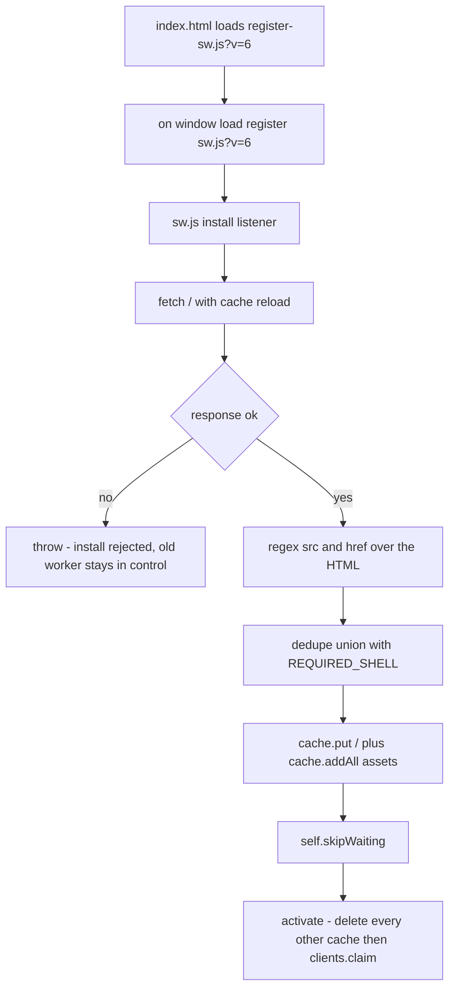
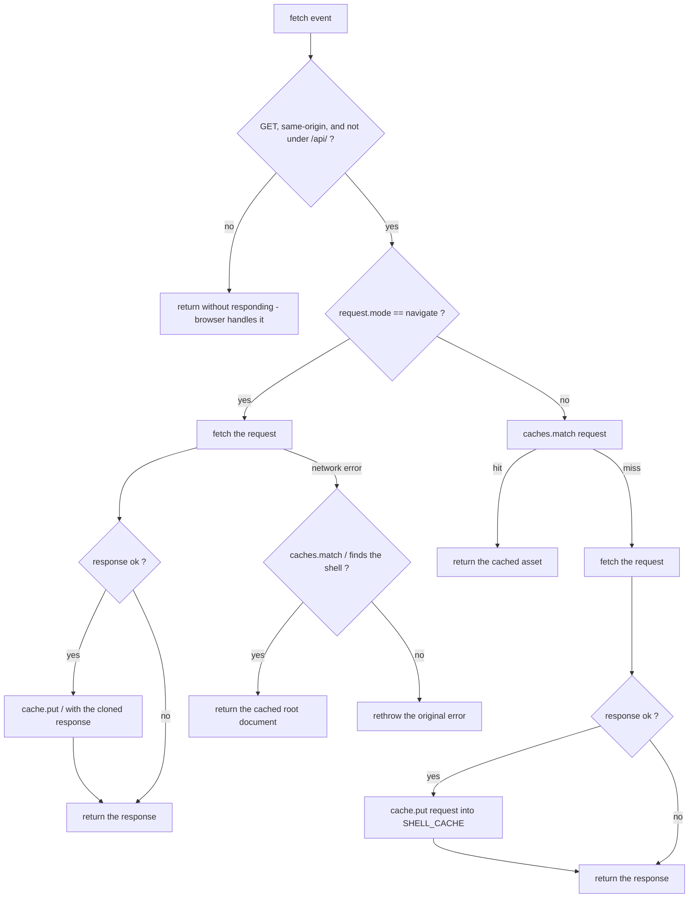

# PWA Service Worker and App Shell

Mota's offline story is deliberately small and hand-written. There is no
Workbox, no precache manifest generator, and no build-time plugin: the worker is
93 lines of plain JavaScript in `apps/web/public/sw.js`, and Vite ships it
verbatim — `apps/web/vite.config.ts` defines no `publicDir` override, so the
default `public/` directory (`sw.js`, `register-sw.js`,
`manifest.webmanifest`, `pwa-icon.svg`, and the two raster PNG icons) is copied
unchanged into the build output. The tested artifacts are the shipped ones:
`apps/web/src/pwa.test.ts` reads and executes the committed `public/` files
directly rather than any build output. The worker does exactly three things:
precache an app shell at install, delete every other cache at activate, and
answer fetches with a two-branch strategy — network-first for navigations,
cache-first for same-origin assets — while never touching `/api/*`.

The worker never produces offline *data*. It guarantees that the shell boots
offline; arrival and settings requests still fail when the network is down, and
the anonymous transit selections survive only because they live in
`localStorage` (`mota:transit-selections:v1`), not because anything under
`/api/` is cached. That split is the whole design.



*Install-to-activate lifecycle: the new shell must be fully cached before the
worker is allowed to take over, and takeover immediately discards the previous
generation.*

## Registration chain

`apps/web/index.html` carries the registration script in `<head>`:

```html
<script src="/register-sw.js?v=6"></script>
```

`apps/web/public/register-sw.js` is four statements: if `serviceWorker` exists
in `navigator`, add a one-shot `load` listener that calls
`navigator.serviceWorker.register("/sw.js?v=6")` and logs failures to the
console. Registration therefore happens after first paint, never blocks the
initial render, and a registration failure degrades silently to a non-PWA page —
the app itself does not depend on the worker. The `?v=6` suffix matters twice
over: it makes the registration URL distinct per shell generation (so the
browser fetches the current script rather than a stale HTTP-cache copy), and it
is one of the four version markers the consistency test pins (below).

The manifest completes the installable-app surface. `manifest.webmanifest`
declares `id`, `start_url`, and `scope` all equal to `/`, `display:
"standalone"`, `lang: "ko-KR"`, `theme_color: "#0b0b0b"`,
`background_color: "#f7f7f3"`, and four icon entries — `192x192` PNG
(`purpose: any`), `512x512` PNG (`any`), the same `512x512` PNG again with
`purpose: maskable`, and `/pwa-icon.svg` (`any`). Two of those choices are
load-bearing and tested: Samsung Internet will not install the app without real
raster PNGs, and the manifest deliberately omits `orientation`, because a
manifest orientation value overrides the OS rotation lock (tracked as Chromium
issue 40880635) and mota should follow the device setting.

### One icon everywhere

The brand identity rule: `/pwa-icon.svg` — the lime stroke path on a black
rounded square — is simultaneously the browser tab favicon
(`<link rel="icon" href="/pwa-icon.svg">` in `index.html`), a manifest icon, and
the in-app brand mark rendered at 48×48 in `BrandHeader.tsx`. `index.html` also
points `apple-touch-icon` at the rasterized `/pwa-icon-192.png` for iOS home
screens. The effect is that the installed icon, the tab icon, and the header
mark can never drift apart, because they are one file — a property the tests
assert directly rather than assume.

## Install: discover the shell from the document itself

The install handler opens `SHELL_CACHE` — currently `"mota-shell-v6"` — and
fetches `/` with `{ cache: "reload" }`, which bypasses the HTTP cache so the
worker always inspects the shell as currently deployed, not a stale copy. Two
outcomes are possible:

- **Non-OK root response** → `throw new Error(...)`. A rejected `install` means
  the browser keeps the previous worker in control. Nothing broken is cached.
- **OK root response** → the HTML text is scanned by `appAssetsFrom`, which runs
  `(?:src|href)="([^"]+)"` over the document and keeps only root-relative paths
  (those starting with `/`). Relative and absolute-URL references are ignored.

The discovered set is unioned with `REQUIRED_SHELL` — the fixed list
`/manifest.webmanifest`, `/pwa-icon-192.png`, `/pwa-icon-512.png`,
`/pwa-icon.svg`, and `/register-sw.js?v=6` — deduplicated through a `Set`, then
written with `cache.put("/", rootResponse)` followed by
`cache.addAll(shellAssets)`.

The discovery regex is the mechanism that makes this a *shell* precache rather
than a hardcoded asset list. The committed `index.html` references its entry as
`<script type="module" src="/src/main.tsx">`; a Vite production build rewrites
those tags to content-hashed `/assets/*` bundles (the build config in
`vite.config.ts` adds no naming overrides). The worker never learns that scheme:
it scans whatever `src`/`href` attributes the document it just fetched carries,
so each deployment precaches its own current hashed bundles.
`REQUIRED_SHELL` exists for exactly the assets the HTML does not self-describe:
the manifest, the icons, and the registration script.

Two invariants fall out of this code:

1. **A failing root fetch aborts installation.** The throw happens before any
   `cache.put`, and `event.waitUntil` propagates it. The alternative — caching
   a 404 or error page as `/` — would brick offline startup, so installation
   is all-or-nothing. `cache.addAll` has the same semantics: it rejects if any
   listed asset fails, so a missing icon or a broken hashed asset aborts the
   whole install rather than leaving a half-populated shell.
2. **The worker script itself is never precached.** `sw.js?v=6` is absent from
   `REQUIRED_SHELL` on purpose; the browser's service-worker machinery fetches
   and updates the worker file through its own byte-comparison path. What *is*
   precached is `register-sw.js?v=6` — the page-side registration script.

After the cache is fully populated, `self.skipWaiting()` runs *inside* the same
`waitUntil`, so the new worker only jumps the queue once the new shell is
complete.

## Activate: version bump is the takeover mechanism

Activation deletes every cache whose name is not `SHELL_CACHE`, then calls
`self.clients.claim()`. Combined with `skipWaiting()`, a deployment takes
control in one page-load cycle: the new worker installs the new cache, skips
waiting, deletes `mota-shell-v5` (and anything else under the origin), and
claims existing clients without waiting for them to reload.

Because the old cache is deleted wholesale, stale hashed assets from the
previous deployment disappear with it — there is no LRU eviction and no
cache-size management. The cost is a fresh install-time download of the whole
shell on every version bump, which is the accepted trade for a shell this
small.

This is also why the shell is *versioned by name*: the cache identity
`mota-shell-v6`, not cache invalidation, is how new deployments supersede old
ones.

### The four version markers

The `6` must agree in four places, and `apps/web/src/pwa.test.ts` enforces it
by regexing all three files:

| Marker | Location | Regex |
|---|---|---|
| HTML script src | `apps/web/index.html` | `register-sw\.js\?v=(\d+)` |
| Registered worker URL | `apps/web/public/register-sw.js` | `sw\.js\?v=(\d+)` |
| Cache name | `apps/web/public/sw.js` | `(?:commute-bus\|mota)-shell-v(\d+)` |
| Precached register script | `apps/web/public/sw.js` | `register-sw\.js\?v=(\d+)` |

A release is therefore a coordinated edit: bump `SHELL_CACHE` to
`mota-shell-v7` and the `/register-sw.js?v=7` string in both `index.html` and
`sw.js`, and update the `/sw.js?v=7` URL inside `register-sw.js`. The test's
`commute-bus|mota` alternative is a tolerance for the cache name's earlier
prefix, not a second live name. Miss any of the four and the test fails with
"shell version must match in index.html, register-sw.js, and sw.js" — the
failure mode it guards against is a browser pinned to an old worker URL while
the shell cache has moved on.

## The fetch handler



*Fetch decision flow: the three-clause guard short-circuits first; navigations
then go network-first with a cached-root fallback, and every other same-origin
GET goes cache-first with network fill.*

### The bail-out invariant

Every fetch event first passes a three-clause guard:

```js
if (
  request.method !== "GET" ||
  url.origin !== self.location.origin ||
  url.pathname.startsWith("/api/")
) {
  return;
}
```

Any request that is non-GET, cross-origin, or under `/api/` is left entirely to
the network — the worker neither serves nor caches it. `AGENTS.md` states this
as a hard rule ("The service worker never caches `/api/*`"), and any change to
this handler must preserve it. The consequences are concrete:

- All transit data (`/api/arrivals/*`, `/api/stops/nearby`, `/api/subway/*`),
  settings sync (`GET`/`PUT /api/settings`), and auth probes
  (`/api/auth/session`) always hit the server or fail. Caching them would serve
  stale arrival predictions — the one thing this app must never do.
- `POST /api/auth/logout` and `PUT /api/settings` are doubly excluded (non-GET
  *and* `/api/`).
- OpenStreetMap map tiles (`https://{s}.tile.openstreetmap.org/...` from
  `MapCanvas.tsx`) are cross-origin and pass through untouched — the offline map
  has no tiles, only the shell.

### Navigations: network-first with a single cached root

`request.mode === "navigate"` gets the network-first branch:

1. `fetch(request)`; if the response is OK, `cache.put("/", response.clone())`
   refreshes the cached shell.
2. On network failure, `caches.match("/")` serves the cached shell; if there is
   none, the original error is rethrown.

Two details are easy to miss. The successful navigation is cached under the
literal key `"/"` regardless of which URL was requested, so every successful
navigation overwrites the same entry — the worker keeps exactly one shell
document, never a per-route cache. And the offline fallback serves that root
document for *any* path, so an offline deep link still boots the app. That is
correct here because the SPA has no client-side routes: it is one view whose
durable state (the anonymous transit selections) lives in `localStorage` under
`mota:transit-selections:v1`, not in the URL. A client-side router would need
this branch revisited.

### Everything else: cache-first

Remaining same-origin GETs (hashed JS/CSS, the icons, the manifest, the
registration script) get `caches.match(request)` first; on a miss, the request
goes to the network and an OK response is written back into `SHELL_CACHE`. This
is why the app starts offline at all: after one online visit, the entire shell
is served from Cache Storage without touching the network. Note that
`caches.match` here searches *all* caches rather than only `SHELL_CACHE` — a
harmless looseness, since activation has already deleted every other cache.

The branch has no offline fallback: a cache miss that also fails on the network
rejects, and the browser surfaces the error. Only navigations are guaranteed
offline.

## Where the worker comes from in production

In the deployed container the worker, the registration script, the manifest,
and the icons are static files from the Vite build. `apps/api/src/main.ts`
mounts Fastify static serving with `root: env.webDistPath` (default `/app/web`,
set to the copied `apps/web/dist` in the Dockerfile) at prefix `/` with
`wildcard: false`. `apps/api/src/web/web.controller.ts` then catches `@Get("*")`
and returns `index.html` — but only for requests that accept `text/html` and are
not under `/api/`; anything else is a 404. The split is therefore: `/` and
`/sw.js` and `/register-sw.js` come from the static bundle, `/api/*` is routed
to controllers and can never fall through to the shell — and because the shell
is served from the API origin, navigation fetches under the worker's
same-origin rule hit the API host. Development mirrors the layout: the Vite dev
server serves the same `public/` files from the project root and proxies `/api`
to `http://127.0.0.1:3000`. See `/openwiki/architecture/web-app.md` for the
client and `/openwiki/operations/deployment.md` for the container layout.

## Focused tests

`apps/web/src/pwa.test.ts` runs under plain Vitest (no jsdom) and treats the
PWA files as data, not as imported modules — which is the only way to test a
service worker and a classic registration script that have no exports:

- **Manifest schema** — the JSON is parsed with a Zod schema pinning `id`,
  `start_url`, `scope`, `display`, `lang`, and the color formats, and asserting
  at least one `maskable` icon exists.
- **Raster icons are real** — for `192x192` and `512x512` the test reads the PNG
  files, checks the magic bytes, and decodes the IHDR width/height at byte
  offsets 16 and 20, so a mis-sized or corrupt icon fails the suite ("provides
  raster icons required by Samsung Internet").
- **No orientation override** — asserts `"orientation"` is absent from the
  manifest, citing the Chromium rotation-lock issue in the assertion message.
- **Registration behavior** — `register-sw.js` is executed in
  `node:vm.runInNewContext` with a stubbed `navigator.serviceWorker.register`
  and a capturing `window.addEventListener`; the test then invokes the captured
  `load` callbacks and asserts `register` was called with exactly `"/sw.js?v=6"`
  and that `load` is the only registered event.
- **Version consistency** — the four-marker table above.
- **Lifecycle handlers** — `sw.js` is executed in a fresh VM with a stubbed
  `self` that records `addEventListener` calls, asserting exactly
  `["install", "activate", "fetch"]`.

The icon identity rule has its own guard outside this file:
`apps/web/src/components/BrandHeader.test.tsx` renders the header and asserts
the brand-mark image has `src="/pwa-icon.svg"` at 48×48, so a regression that
swaps the in-app mark away from the install icon fails the web suite. See
`/openwiki/testing/overview.md` for how these suites fit the repository's
testing conventions.

## Extension points and cautions

- **Releasing a new shell**: bump the version in the four places and rely on
  install/activate to swap generations. Do not add per-asset invalidation — the
  delete-everything-else activate step is the intended cleanup.
- **Anything `/api/` stays out of the cache** — the guard clause is the
  invariant, not a suggestion. A change that caches API responses would serve
  stale arrival predictions and break the AGENTS.md rule.
- **New shell-critical assets** that the HTML does not reference must be added
  to `REQUIRED_SHELL`; anything the HTML does reference is picked up
  automatically by the `src`/`href` scan.
- **Client-side routing** would invalidate the "cache only `/`" assumption in
  the navigation branch, because offline deep links currently resolve to the
  root document rather than a route-specific one.
