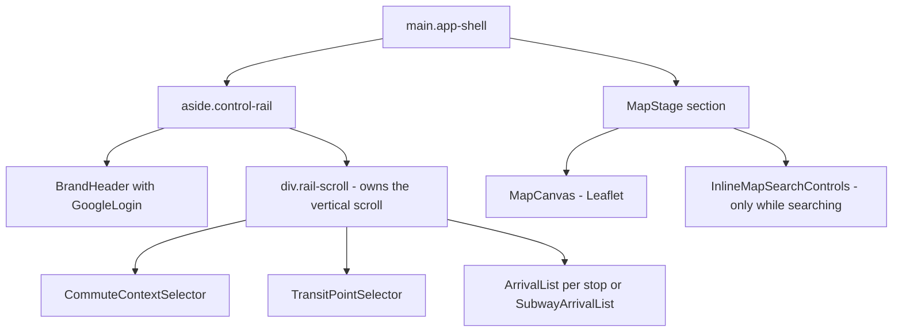
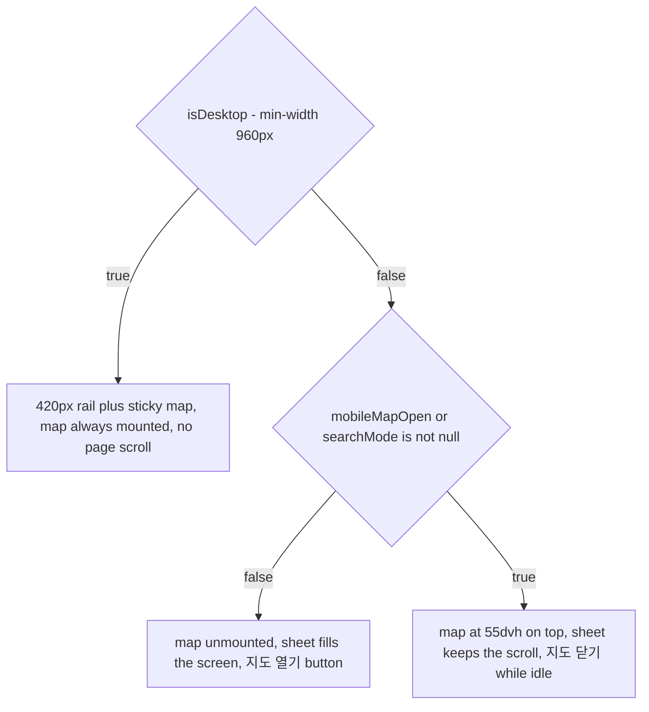

# Web App — React 19 PWA Client

`apps/web` is the browser half of mota: a React 19 + Vite single-page PWA whose
entire surface is one screen — pick a commute context (`출근`/`퇴근`), pick a
mode (`버스`/`지하철`), save and select stops or a station, and read at most
three upcoming arrivals. Everything in this page lives under `apps/web/src`.
The service worker that makes it a PWA is a separate, hand-written concern
documented in [PWA Service Worker and App Shell](/openwiki/architecture/pwa-service-worker.md);
persistence semantics for the selection document are in
[Transit selections](/openwiki/concepts/transit-selections.md).

## Mount chain and crash containment

`apps/web/src/main.tsx` is the only entry: it finds `#root`, and renders
`<StrictMode><AppErrorBoundary><App /></AppErrorBoundary></StrictMode>` with
`leaflet/dist/leaflet.css` and `./styles.css` imported globally.
`AppErrorBoundary` (`apps/web/src/components/AppErrorBoundary.tsx`) is the
single class component in the tree — deliberately, because it *is* a framework
boundary. It catches any render exception that would otherwise unmount the whole
React tree, and instead renders a `role="alert"` section with the eyebrow
`일시적 오류`, the heading `화면을 다시 불러오지 못했습니다`, the reassurance
`저장한 장소와 절차는 브라우저에 그대로 있습니다. 다시 시도하거나 새로고침해 주세요.`,
the raw `error.message` in a `<pre>`, and two buttons: `다시 시도` (clears the
boundary state and re-renders) and `새로고침` (`window.location.reload()`).

## Module boundaries and the domain re-export layer

Three rules from `AGENTS.md` shape every import in this tree:

- **Apps do not import each other.** Nothing under `apps/web/src` references
  `apps/api`. The two apps meet only at HTTP: `apps/web/vite.config.ts` proxies
  `/api` to `http://127.0.0.1:3000` in development, and in production the Nest
  app serves both `/api/*` and the built bundle.
- **Shared shapes come from `@mota/contracts` only.** `@mota/web` depends on
  `@mota/contracts` (workspace link) and *not* on `@mota/db`, so the browser
  bundle cannot reach Drizzle, Postgres, or any server module even transitively.
- **`apps/web/src/domain/*` are thin re-export shims, not a logic layer.**
  `domain/bus.ts` is exactly `export * from "@mota/contracts/bus";` and
  `domain/subway.ts` is exactly `export * from "@mota/contracts/subway";`.
  Components import `BusStop`, `SubwayArrival`, `stationDisplayLine` etc. from
  `../domain/bus` / `../domain/subway` rather than naming the package. New
  behavior does not belong in these files; if a shape is missing, it is added to
  `packages/contracts/src` and re-exported. The one file in `domain/` that is
  *not* a shim is `domain/subwayEta.ts`, a pure client-side ETA-freshness helper
  (see [Arrival display](#arrival-display)).

Resolution is source-level: `apps/web/vite.config.ts` aliases
`@mota/contracts/transit-settings` → `packages/contracts/src/transitSettings.ts`
and `@mota/contracts` → `packages/contracts/src`, mirrored by
`compilerOptions.paths` in `apps/web/tsconfig.json` so `tsc --noEmit` checks the
same files Vite bundles.

## App shell state

`App` (`apps/web/src/App.tsx`) is the only place UI-selection state lives. It
holds five `useState` values plus one derived selections object:

| State | Type | Meaning |
|---|---|---|
| `commute` | `CommuteContext` (`"toWork"` default) | Which commute document is being edited; label `출근` or `퇴근` |
| `mode` | `TransitMode` (`"bus"` default) | Bus vs subway surface; also which of the two selection sets feeds arrivals |
| `searchMode` | `TransitMode \| null` | `null` when idle; otherwise the mode currently being searched on the map |
| `mobileMapOpen` | `boolean` | Mobile only — whether the 55dvh map sheet is mounted |
| `saveAnnouncement` | `string` | Sentence fed to the polite live region after each selection action |

`useTransitSelections(session)` owns the persisted `TransitSelections` document;
`App` only reads `selections.commutes[commute]` and calls its mutators with the
current `commute`. From that slice, `App` derives `selectedStops` (the saved
stops referenced by `selectedBusStopIds`, in that order) and `selectedStation`
(the station referenced by `selectedSubwayStationId`, or `null`). These two are
then *mode-gated* before reaching the arrivals hook:
`activeStops = mode === "bus" ? selectedStops : []` and
`activeStation = mode === "subway" ? selectedStation : null`, so a subway screen
never fetches bus arrivals for stops the user cannot currently see, and vice
versa.

`isDesktop` comes from `useMediaQuery("(min-width: 960px)")` — the same
`useMediaQuery` hook that `MapCanvas` re-uses for
`(prefers-reduced-motion: reduce)`.

### Map center anchoring

The map's initial center is derived, not stored:

```ts
const firstSelectedStop = selectedStops[0] ?? null;
const mapAnchor =
  mode === "bus"
    ? (firstSelectedStop ?? selectedStation)
    : (selectedStation ?? firstSelectedStop);
const mapCenter = mapAnchor
  ? { lat: mapAnchor.lat, lng: mapAnchor.lng }
  : DEFAULT_MAP_CENTER; // { lat: 37.5366, lng: 127.1253 }
```

The active mode's selection wins (first selected bus stop in bus mode, selected
station in subway mode), the other mode's selection is the fallback, and with no
selection at all the map falls back to `DEFAULT_MAP_CENTER` near Cheonho. This
value is passed to `MapStage` as the `center` prop; see
[MapStage and MapCanvas](#mapstage-and-mapcanvas) for how the working center
relates to it.

### State transitions in App

- Changing `commute` (from `CommuteContextSelector`) sets `searchMode` to `null`
  and announces `${출근|퇴근} 설정을 보고 있어요.`
- Changing `mode` (from `TransitPointSelector`) also sets `searchMode` to `null`.
- The `정류장 찾기` / `역 찾기` button toggles:
  `setSearchMode(current => current === mode ? null : mode)` — pressing it again
  cancels the search.
- `closeSearch()` clears `searchMode` and, in a `queueMicrotask`, refocuses
  `document.getElementById("point-search-trigger")` so keyboard users land back
  on the button that opened the search.
- Saving candidates (`saveStops` / `saveStations`) commits through
  `addBusStops`/`addSubwayStations` with the current `commute`, announces
  `${commuteLabel}에 ${name} 정류장을 선택했습니다.` or
  `${commuteLabel}에 ${name}역을 선택했습니다.`, forces `mode` to match what was
  saved, and calls `closeSearch()`.
- Toggling a saved stop (`toggleStopSelection`) refuses to exceed
  `MAX_SELECTED_BUS_STOPS` (= 4, from `@mota/contracts/transit-settings`): it
  announces `정류장은 최대 4곳까지 함께 볼 수 있어요.` and returns *without*
  mutating. Otherwise it toggles and announces
  `${commuteLabel}에서 ${stopName} 정류장을 함께 보게 했어요.` /
  `${commuteLabel}의 ${stopName} 정류장 선택을 해제했어요.`, then sets
  `mode` to `"bus"`.

`saveAnnouncement` is rendered once, at the top of `<main>`, as
`<p className="sr-only" aria-live="polite">` — a visually hidden sentence, never
a re-read of the whole list.



*Composition of the shell: the rail stacks brand header, the scrolling column
(commute tabs, point selector, arrival sections), and the map stage as a sibling
of the rail.*

## Responsive structure

The layout contract from `DESIGN.md` §4 is implemented in `styles.css` with a
single breakpoint: `960px`. `useMediaQuery("(min-width: 960px)")` mirrors the
same value in JS so the React tree and the CSS agree.

### Desktop (≥ 960px)

`.app-shell` is a two-column grid — `grid-template-columns: 420px minmax(0, 1fr)`
— at `height: 100dvh` with `overflow: hidden`; the document never scrolls.
`aside.control-rail` (1px `--ink` right border, `--surface` background) is a
flex column whose only scrolling child is `.rail-scroll`
(`min-height: 0; flex: 1; overflow-y: auto; overscroll-behavior: contain`). The
brand header sits above it, outside the scroll. The map stage is always rendered
on desktop (`isDesktop || mobileMapOpen || searchMode !== null`), sticky, full
height, and unaffected by rail scrolling.

### Mobile (< 960px)

`.app-shell` becomes `flex-direction: column` at `100dvh`. The map is **not**
rendered on first paint: `App` renders `MapStage` only when
`isDesktop || mobileMapOpen || searchMode !== null`. Until then the rail shows a
`지도 열기` button (only when `!isDesktop && !mobileMapOpen && searchMode === null`).
Opening it mounts the map at `flex: 0 0 55dvh; height: 55dvh` above the sheet;
the map's own `지도 닫기` button unmounts it again. Entering a search
(`searchMode !== null`) forces the map open at the same 55dvh even if the user
had it closed, so candidate markers and the selection tools have room. The rail
becomes the bottom sheet: `border-radius: 18px 18px 0 0`,
`box-shadow: var(--shadow-sheet)`, and it owns the vertical scroll.

Two mobile-specific rules keep arrivals on screen:

- `.commute-switcher { position: sticky; top: 0 }` — the `출근`/`퇴근` tabs stay
  pinned at the top of the sheet scroll, so the current editing target is always
  visible.
- `.point-selector.has-points .point-list { max-height: 128px; overflow-y: auto;
  overscroll-behavior: contain }` — the saved-point list caps at roughly two row
  heights and scrolls internally instead of pushing arrivals off screen.

While a search is active on mobile, the candidate list is the horizontal
`.inline-map-result-reel` (`overflow-x: auto` with inline scroll snap,
`min-inline-size: 0` so it shrinks inside the panel before it scrolls) pinned to
the bottom of the map — no second vertical scroll surface is created for it.



*The mount decision for the map: desktop always renders it, mobile renders it
only while the user asked for it or while a search is active.*

The list is never the *alternative* to the map on mobile — it is always present,
and the map is the opt-in "where is this" surface. This is the concrete
realization of `DESIGN.md`'s rule that markers must never be the only way to
select.

## Component inventory

Short on purpose; behavior detail lives on the workflow pages
([stop discovery](/openwiki/workflows/stop-discovery.md),
[arrival refresh](/openwiki/workflows/arrival-refresh.md),
[settings sync](/openwiki/workflows/settings-sync.md)).

- **`BrandHeader`** — `모타`, the hook `지금, 뭐 타?`, the `/pwa-icon.svg` mark,
  and the `GoogleLogin` control. Nothing else; install/login/settings actions do
  not live in the header.
- **`GoogleLogin`** — three states: `로그인 확인 중` while the session check is
  in flight, an account chip with the user's email plus a `TransitSyncStatus`
  label (`이 기기에 저장` / `설정 불러오는 중` / `서버 저장 중` / `서버에 저장됨` /
  `저장 확인 필요`) and a `로그아웃` button, or a `Google로 로그인` link to
  `/api/auth/google?return_to=…` that round-trips the current path.
- **`CommuteContextSelector`** — a `role="tablist"` labeled `출퇴근 선택` with
  exactly two `role="tab"` buttons (`출근`/`집 → 회사`, `퇴근`/`회사 → 집`),
  `aria-selected`, roving `tabIndex`, and ArrowLeft/ArrowRight handling that
  both switches the context and moves focus to the other tab. Each tab carries a
  summary line `버스 N곳 · 지하철 {미설정|설정}` describing its **own** commute
  document (the counts come from `commutes[context]`), so the user can see what
  each context holds before switching — and switching never merges or mutates
  either document.
- **`TransitPointSelector`** — the `교통수단 선택` tablist (`버스`/`지하철`, same
  arrow-key + `aria-selected` pattern), the section heading
  (`어디서 탈까요?` eyebrow, `버스 정류장`/`지하철역` title), and the
  `정류장 찾기`/`역 찾기` trigger (`id="point-search-trigger"`,
  `aria-pressed`, `MapPinPlus`, flipping to `찾기 취소` while active). Saved rows
  are `aria-pressed` selection buttons showing stop name + `ARS {arsId}` or
  station name + `stationDisplayLine(station)`; the active row additionally
  shows `<CheckCircle2 /> 지금 보는 곳`. Deletion is a sibling `point-remove`
  button with `aria-label` (`{name} 정류장 삭제` / `{name}역 삭제`), never nested
  inside the selection button. The empty state is the mode icon plus
  `정류장을 저장해 보세요` / `역을 저장해 보세요` and the three-arrival utility
  sentence.
- **`MapStage`** — the map section (`aria-label="선택한 정류장과 역 지도"`), the
  `MapCanvas`, the `InlineMapSearchControls` overlay while `searchMode !== null`,
  and the mobile `지도 닫기` button while `!isDesktop && !searching`. It also owns
  the working map center (below).
- **`InlineMapSearchControls`** — a focusable region
  (`버스 정류장 지도 찾기` / `지하철역 지도 찾기`) that grabs focus on mount. The
  toolbar shows `현재 지도에서 찾기` / `버스 정류장 고르기`|`지하철역 고르기`, a
  `취소` button, and a `저장` button labeled `{n}곳 저장` that stays `disabled`
  until at least one candidate is chosen. The status line is a polite
  `aria-live` paragraph (`지도 중심 주변을 찾는 중…`, the error text, or
  `가까운 {정류장|역} N곳`) next to the explicit `이 위치 다시 찾기` retry button.
  Candidates render as an `inline-map-result-reel` fieldset whose buttons share
  the same `aria-pressed` state as the map markers.
- **`ArrivalList` / `SubwayArrivalList`** — see
  [Arrival display](#arrival-display).
- **`AppErrorBoundary`** — see [Mount chain](#mount-chain-and-crash-containment).
- **`components/locate.ts`** — a geolocation boundary
  (`requestCurrentPosition`, `locateCoarseNotice`, `locateFailureNotice`) that
  accepts coarse fixes and flags them in Korean notices. It currently has **no
  callers** in the tree, and the `.locate-button` CSS is equally dormant; do not
  assume a locate control exists in the UI.

## Hooks inventory

- **`useAuthSession`** — fetches `/api/auth/session` once with
  `credentials: "include"` and an 8-second `AbortSignal.timeout`, parses the
  response with `authSessionResponseSchema`, and yields
  `{authenticated, checked, user, error}`. Failure collapses to an anonymous
  session with the error string `로그인 상태를 확인하지 못했습니다.` — the app
  always boots into a usable local state. `logout()` flips the session to
  anonymous *optimistically* before the `POST /api/auth/logout` round trip, so
  the UI never waits seconds for the cookie clear.
- **`useTransitSelections(session)`** — the selection-document owner. See below.
- **`useArrivalDetail({selectedStops, selectedStation})`** — the arrivals owner.
  See [Arrival display](#arrival-display).
- **`useInlineMapSearch({mode, center, savedStops, savedStations})`** — the
  candidate-search owner. See
  [Inline map search](#inline-map-search-on-the-existing-map).
- **`useMediaQuery(query)`** — `matchMedia` with a change listener; SSR-safe
  (`typeof window === "undefined"` returns `false`).
- **`useElapsedSeconds(updatedAt)`** — a 1-second interval that only runs while
  `updatedAt !== null`, returning seconds since the last successful refresh.

### useTransitSelections: one document, two persistence lanes

The hook owns a `TransitSelections` document (`{commutes: {toWork, toHome}}`,
each with `busStops`, `subwayStations`, `selectedBusStopIds`,
`selectedSubwayStationId`) and exposes `syncStatus` plus six mutators
(`addBusStops`, `addSubwayStations`, `toggleBusStop`, `selectSubwayStation`,
`removeBusStop`, `removeSubwayStation`), each parameterized by
`CommuteContext`. Pure transitions live in
`hooks/transitSelectionMutations.ts`; storage in
`hooks/transitSelectionStorage.ts`.

**Anonymous lane.** `mutate()` applies the transition through a ref (so
consecutive calls see the freshest document), bumps a mutation counter, sets
state, and — when `!session.authenticated` — writes
`saveTransitSelections(next)` to `window.localStorage` under the key
`mota:transit-selections:v1` immediately. Reads go through
`loadTransitSelections()`, which JSON-parses and validates with
`transitSelectionsSchema.safeParse`, then **normalizes**: deduplicates by id,
drops `selectedBusStopIds` pointing at unknown stops, caps the watched set at
`MAX_SELECTED_BUS_STOPS` (4), falls back to the first saved stop when the
selection list ends up empty, and falls back to the first saved station when the
selected station is missing. A parse failure degrades to the empty document —
corrupt storage never blocks the app.

**Authenticated lane.** An effect keyed on the session re-hydrates whenever the
checked/authenticated/`user.sub` tuple changes, guarded by a `generation`
counter and the active user id so stale responses from a previous user or a
previous generation are discarded:

1. `GET /api/settings`; if the server has selections **and** no local mutation
   happened during the fetch, the server snapshot replaces local state and its
   `version` is recorded (status `synced`).
2. If the server snapshot is empty but the user mutated locally during the
   fetch, the local document wins and is **pushed** to the server
   (`saveTransitSettings({version: snapshot.version, …})`) — the anonymous
   document bootstraps a fresh account.
3. Failures set `syncStatus` to `"error"` and leave the current state alone.

A second effect then watches `selections`: once hydrated, every change (except
the hydration snapshot itself) enqueues a `PUT /api/settings` with the last known
`version` onto a **promise chain** (`saveChainRef`) so concurrent edits are
serialized in order rather than racing, and each success updates `versionRef`
for the next compare-and-swap. Logging out (session flips to anonymous) makes
the first effect reload `loadTransitSelections()`, restoring the anonymous
document without exposing the previous user's data.

The Zod schemas in `packages/contracts/src/transitSettings.ts` do one more thing
worth knowing: `transitSelectionsSchema` is a union of the modern
`{commutes: …}` shape and the legacy flat single-selection shape
(`selectedBusStopId`), and the transform migrates the legacy form into the same
selections duplicated across `toWork` and `toHome`. `App.test.tsx` pins this:
seeding `mota:transit-selections:v1` with a `selectedBusStopId` document yields
an active selection in *both* commute contexts on the next render.

## MapStage and MapCanvas

`MapStage` keeps the *working* map center in its own state, seeded from the
`center` prop. Two flows keep it coherent:

- **Anchor → map.** A `useEffect` on the `center` prop calls
  `setMapCenter(center)` whenever `App`'s anchor changes (a new selection).
  Inside `MapCanvas`, `CenterObserver` compares the prop center to
  `map.getCenter()` and calls `map.setView(center, zoom, {animate: false})` when
  they differ by more than 0.0001° — so a programmatic anchor change re-pans the
  map without animation.
- **Map → working center.** Leaflet `moveend` events report the new center to
  `MapStage` through `onCenterChange`, coalesced through `requestAnimationFrame`
  and skipped when the change is below 1e-7°. The inline search then reads this
  working center, not the anchor.

While `searchMode !== null`, `MapStage` renders `InlineMapSearchControls` over
the *same* map — there is no dialog, no scrim, and no second map instance, and
the map keeps whatever center the user left it at. This is asserted in
`MapStage.test.tsx` (`expect(screen.queryByRole("dialog")).not.toBeInTheDocument()`).

`MapCanvas` wraps `react-leaflet`'s `MapContainer` with the constraints that make
the map behave inside the design system:

- **Seoul bounds clamp.** `maxBounds` is `[[37.2, 126.6], [37.95, 127.45]]` with
  `maxBoundsViscosity: 1.0` — drags cannot leave the service area, which matches
  the API's `INVALID_LOCATION` window. Zoom is clamped to 11–19, and the tile
  layer stops at 19 (the last level OSM serves).
- **Reduced motion.** `useMediaQuery("(prefers-reduced-motion: reduce)")` turns
  off `inertia`, `zoomAnimation`, `fadeAnimation`, and `markerZoomAnimation`
  individually; `inertiaMaxSpeed` is capped at 2.0 px/ms in the normal case.
  The container also writes these resolved options into `dataset` attributes
  (`leafletZoomAnimation`, …) so QA can prove the settings without trusting CSS.
- **Accessible markers.** Each point is two `CircleMarker`s: a visible 9-radius
  circle and an invisible 22-radius (44px-diameter) hit circle that carries
  `role="button"`, `tabindex="0"`, an `aria-label` (for example
  `천호역 정류장, ARS 25014, 중심에서 151미터` or `… 눌러서 추가` for candidates),
  and a **current** `aria-pressed` kept in sync by an effect (Leaflet fires
  `add` once, so a stale closure would freeze the pressed state). Enter and
  Space select and re-open the popup; Escape closes it.
- **Popup Escape.** Leaflet's `popupopen`/`popupclose` are re-dispatched as
  bubbling custom events on the container so a frame-level Escape handler can
  close whichever popup is open; it clicks the popup's close button and restores
  focus to the owning marker **only** when focus was inside the popup content.
- **Attribution safety.** A capture-phase click handler on the frame calls
  `preventDefault()` + `stopPropagation()` for any click inside
  `.leaflet-control-attribution a` — a finger grazing the OSM link during a drag
  otherwise navigates away and blanks the app.
- **Size sync.** `ContainerSizeObserver` attaches a `ResizeObserver` calling
  `map.invalidateSize({animate: false})`, because Leaflet only tracks window
  resizes by default and the stage's height changes (55dvh sheet, dvh shifts)
  would otherwise leave stale bounds and gray edges.

Marker classes distinguish saved bus (`map-marker-bus`), saved subway
(`map-marker-subway`), and pending candidates (`map-marker-pending`,
`map-marker-pending-subway`, visually dashed/dotted), with `is-active` toggled
on the element because Leaflet only applies `pathOptions.className` at creation.

## Inline map search on the existing map

`useInlineMapSearch` owns candidate state for the overlay. Its contract:

- Entering search mode (the `mode` prop becoming non-null) clears all candidate
  and selection state and **searches once** at the current map center.
- Map movement does **not** trigger requests. Re-searching happens only when the
  user presses `이 위치 다시 찾기`, which calls `search()` against the latest
  `centerRef`.
- Results are filtered against the already-saved ids, so a saved stop never
  appears as its own candidate. An empty result sets the error sentence
  `이 주변에서 새 정류장을 찾지 못했습니다.` /
  `이 주변에서 새 지하철역을 찾지 못했습니다.`
- Transport failures map to mode-specific Korean retry sentences, except
  `isServiceAreaError` (`ApiError` with `code === "INVALID_LOCATION"`), which
  maps to `서울 서비스 범위 밖이에요. 지도를 서울 근처로 옮겨 주세요.`
- Candidate toggling (`toggleBusStop` / `toggleStation`) only mutates the
  *pending* selection arrays — nothing is written to the saved document until
  `저장` is pressed, and `취소` discards the candidates while leaving both the
  saved document and the map center untouched.
- A request counter (`requestRef`) discards responses from superseded searches.

All HTTP goes through `apps/web/src/api/client.ts`, which validates every
response body with Zod (`busStopSchema`, `subwayStationSchema`, the inline
arrivals schema, `transitSettingsSnapshotSchema`) and throws a structured
`ApiError(status, code)` on non-2xx. Endpoints: `/api/stops/nearby`,
`/api/arrivals/{arsId}`, `/api/subway/nearby`, `/api/subway/arrivals`,
`GET/PUT /api/settings`.

## Arrival display

`useArrivalDetail` keys bus detail state per stop id in a `Map` (so multiple
watched stops each keep their own arrivals, loading flag, error, and
`updatedAt`), and keeps one subway detail object. Effects reconcile the map with
the current selection: entries for stops no longer selected are deleted, missing
ones are fetched, and the subway detail is cleared when the station is null.
Every fetch bumps a per-target request counter; a response is only committed if
its counter is still current, which makes rapid selection changes race-free.
A refresh starts from `…loading: true, error: null` spread **over the previous
state**, so a refresh in progress never erases the last successful rows. There
is no polling — data is fetched on selection change and on explicit refresh
only. The full refresh behavior is on
[arrival refresh](/openwiki/workflows/arrival-refresh.md).

Rendering caps the list at the presentation boundary, exactly as `AGENTS.md`
requires:

- `ArrivalList` renders `arrivals.slice(0, 3)` with a visible rank digit
  (`1`, `2`, `3`) plus an sr-only `{n}번째로 빠른 버스`. The heading is
  `곧 오는 순서` / `{stopName} 다음 버스`; the refresh button is
  `RefreshCw` + the text `새로고침` with `aria-label`
  `{stopName} 버스 도착정보 새로고침`. A polite `aria-live` status paragraph
  reports `도착 정보를 새로 받고 있어요.` or
  `{HH:mm}에 새로 받았어요.`; errors render in a `role="alert"` block with a
  `다시 시도` button; the no-data state reads
  `지금 도착 예정인 버스가 없어요. 잠시 후 다시 확인해 주세요.`; the pre-selection
  empty state reads `정류장을 고르면 가장 빠른 버스 3대를 보여드려요.`
- `SubwayArrivalList` derives direction tabs **from the arrivals actually
  observed** (`{subwayId}:{updnLine}` keys), groups them by line, and defaults to
  the first direction in arrival order — which satisfies `DESIGN.md`'s "가장 이른
  도착이 속한 방향을 기본 선택한다" because the server normalizes arrivals
  sorted by ETA before they reach the client. ArrowLeft/Right/Up/Down plus Home/End move
  both selection and focus through the `지하철 방향 선택` tablist; each tab pairs
  an arrow icon (`ArrowUp` for `상행`, `ArrowDown` for `하행`, `ArrowRight`
  otherwise) with the text label. Rows are filtered to the active direction and
  sliced to three; `막차` is a text flag, not a color.
- ETA freshness is client-side: `useElapsedSeconds` ticks every second, and
  `subwayEtaDisplay` (in `domain/subwayEta.ts`) treats a row as expired once
  `elapsed > seconds + 90` grace, returning `null` seconds and the message
  `새로고침 필요`. A relative upstream message (`N분 후`) is relabeled
  `도착 예상`. Sub-minute values render `곧 도착`; a null renders `정보 없음`.
  Timestamps format as `HH:mm` in `Asia/Seoul`.

## Design-system constraints the code must preserve

`DESIGN.md` is a contract, and `AGENTS.md` repeats the enforcement points.
Anything adding gradients, glass, decorative illustration, favorites, commute
procedures, or journey ETAs is out of scope by definition.

- **Tokens.** `:root` in `styles.css` defines the palette as CSS custom
  properties: `--ink #0b0b0b`, `--paper #f7f7f3`, `--surface #ffffff`,
  `--line #d9d9d2`, `--muted #62625d`, the lime signal pair
  `--signal #c7f000` / `--signal-soft #f4fbd6` / `--signal-ink #182000`,
  `--route-blue #155eef` (bus and map focus), `--subway #7c3aed` (subway
  identity only), the `--danger*` triple, `--map-base`, the `--skeleton-*` pair,
  and `--scrim rgb(11 11 11 / 48%)`. Color never carries state alone: active
  state is `aria-selected`/`aria-pressed` **plus** weight, border, and the 3px
  lime signal strip (`point-row.is-active::before`,
  `commute-tab[aria-selected="true"]::after`).
- **No gradients, glass, or decorative illustration.** `styles.css` contains no
  `gradient` at all; shadows exist only for the floating map controls and the
  mobile sheet (`--shadow-control`, `--shadow-sheet`, `--shadow-card`,
  `--shadow-pin`, `--shadow-overlay`).
- **44px controls.** Every interactive control carries `min-height: 44px`
  (`min-height: 64px` for the point rows, which are whole-row select buttons).
  Map hit targets are 22-radius circles — real SVG geometry, not a CSS box.
- **Text labels next to icons.** No icon-only controls: refresh is
  `RefreshCw` + `새로고침`, find is `MapPinPlus` + `정류장 찾기`, save is
  `Check` + `{n}곳 저장`. Icons are `aria-hidden` and the meaning lives in text.
- **Keyboard tabs.** All three tablists (commute, transit mode, subway
  direction) use `role="tablist"`/`role="tab"`, `aria-selected`, roving
  `tabIndex`, and arrow-key handlers that both change the value and move focus
  to the target tab's DOM id.
- **Focus visibility.** `button:focus-visible, a:focus-visible` get a `3px`
  `--route-blue` outline with a 2px offset — comfortably above the 2px minimum
  in `DESIGN.md` §7 — and Leaflet's stock popup close button is re-styled to the
  same ring.
- **Motion.** Buttons use only `transform: scale(0.98)` on `:active`; state
  transitions are 160ms color/opacity only; layout heights and positions are
  never animated. Under `prefers-reduced-motion: reduce` the CSS collapses
  `transition-duration` to `1ms` for every interactive class and disables the
  skeleton pulse animation, and `MapCanvas` independently disables Leaflet
  inertia and all three animation flags.
- **Landmarks and live regions.** `main.app-shell`, `header.brand-header`,
  `aside.control-rail`, and `section` regions throughout; errors use
  `role="alert"`; live regions announce single status sentences (`saveAnnouncement`,
  the arrival refresh status, the search status) rather than re-reading lists.
- **Out-of-scope guard is tested.** `App.test.tsx` asserts on first visit that
  the only primary controls are the two tab pairs and the find button, and that
  no text matching `절차` (procedure) or `즐겨찾기` (favorites) exists.

## Tests that pin this structure

- `App.test.tsx` — first-visit control surface and the scope exclusions; the
  mobile map stays closed until `지도 열기` and closes with `지도 닫기`; the map
  is present on desktop with no open button; find opens on the current map with
  `data-search-mode` and no dialog; bus and subway selections are independent
  per commute and restored after switching back; the watched selection survives
  a remount via localStorage; a legacy `selectedBusStopId` document migrates;
  two stops can be watched at once with per-stop refresh buttons and one can be
  dropped by toggling; subway exposes the direction tablist.
- `hooks/useTransitSelections.test.tsx` — server selections replace state
  without touching anonymous storage; an empty server account bootstraps from
  the local document; authenticated mutations PUT with the current version and
  are serialized; the watched set toggles up to the cap of four; logout restores
  the anonymous document.
- `components/MapStage.test.tsx` — the mobile close control exists and desktop
  has none; bus and subway searches run against the current center and save
  without a dialog; the search region takes focus and the stage gains
  `is-searching`; the result reel keeps `min-inline-size: 0` so it shrinks
  before scrolling.
- `components/MapCanvas.test.tsx` — zoom gestures anchor to the center; tile
  zoom caps at 19; marker refs stay stable across a center re-render; Escape
  closes a popup and restores focus to the owner marker only when focus was
  inside it; all Leaflet animations run normally and are all disabled under
  reduced motion.
- `components/ArrivalList.test.tsx` — at most three rows; both first and second
  estimates render; refresh fires from the labeled control; retry stays
  available after a failed refresh.
- `components/AppErrorBoundary.test.tsx` — the boundary renders the recovery
  surface instead of a blank tree.

## Related pages

- [PWA Service Worker and App Shell](/openwiki/architecture/pwa-service-worker.md)
  — the offline shell, cache versioning, and the never-cache-`/api/*` invariant.
- [Transit selections](/openwiki/concepts/transit-selections.md) — the document
  shape, the commute split, and the compare-and-swap sync model.
- [Stop discovery](/openwiki/workflows/stop-discovery.md) — the nearby search
  flow behind `useInlineMapSearch`.
- [Arrival refresh](/openwiki/workflows/arrival-refresh.md) — the arrival fetch
  and display lifecycle.
- [Settings sync](/openwiki/workflows/settings-sync.md) — the authenticated
  `GET/PUT /api/settings` flow this client drives.
