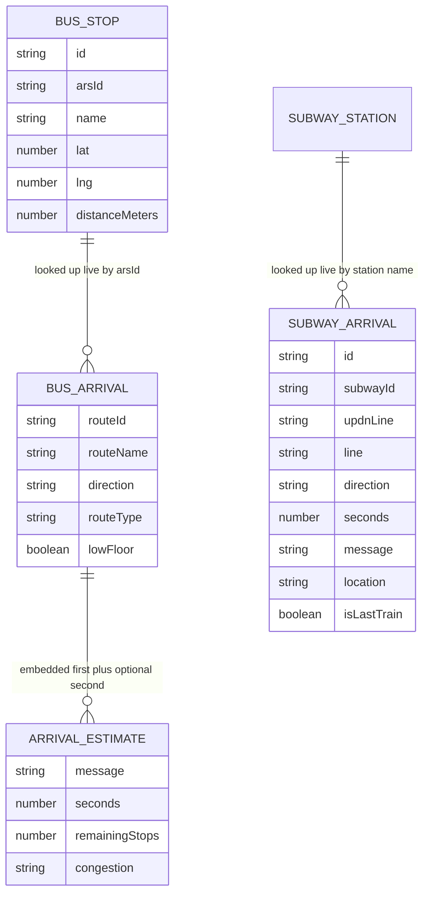
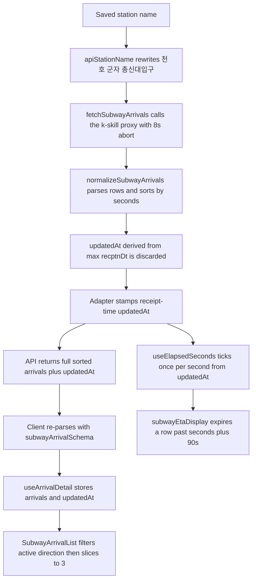

# Transit Arrival Domain Models

Everything the two apps know about a bus stop, a subway station, or an upcoming
arrival is shaped by `packages/contracts/src/bus.ts` and
`packages/contracts/src/subway.ts`. Those two modules are the **Zod edge** for
Seoul data: `AGENTS.md` requires that untrusted HTTP payloads are parsed with
Zod at the edge, and the `normalize*` functions here are that edge. The API
adapters in `apps/api/src/upstream/*` call them on raw upstream JSON before
anything else touches it, both apps consume only the normalized types
(`BusStop`, `BusArrival`, `SubwayStation`, `SubwayArrival`), and the package
imports nothing but Zod and its own modules. The browser then re-parses the
API's own JSON with the exported schemas, because an HTTP response is untrusted
from the client's side too.

This page covers the model itself: branded IDs, the field-by-field mapping off
Seoul's quirky payloads, ETA message parsing, station aliasing and line-name
mapping, the freshness rule that keeps countdowns honest, and the hard rule
that arrival lists are capped at three rows **only** at the presentation
boundary.

## The model at a glance

*The arrival domain: two station/stop anchors, one row type per mode. The
lookup relations are query-time, not foreign keys — both arrival endpoints hit
their live upstream on every request.*

### Branded IDs and the upstream field map

The contracts use Zod brands so a stop id can never be silently passed where an
ARS id is expected. The non-obvious part is what each branded schema does to
its upstream field:

| Branded type | Schema | Upstream field | Normalized field | Behavior |
|---|---|---|---|---|
| `StopId` | `z.coerce.string().min(1).brand<"StopId">()` | `strid` (arrives as a JSON number, e.g. `124000454`) | `id` | coerced to a string; must be non-empty |
| `ArsId` | `z.preprocess(v => String(v).padStart(5, "0"), z.string().regex(/^\d{5}$/).brand<"ArsId">())` | `strno` | `arsId` | zero-padded to exactly five digits; a catalog row with `strno: "-"` fails and is dropped |
| `RouteId` | `z.coerce.string().min(1).brand<"RouteId">()` | `busRouteId` | `routeId` | coerced to a string |
| `SubwayStationId` | `z.string().min(1).brand<"SubwayStationId">()` | station-master CSV code | `id` | no coercion; the catalog prefixes `seoul-<code>` |

Coordinates swap axes on the way in — `toBusStop` maps `posX` → `lng` and
`posY` → `lat` (Seoul's endpoint is X/Y, the domain is lng/lat), and
`diffMeter` → `distanceMeters`. Getting this backwards silently mirrors the
map, which is why the mapping lives in exactly one function shared by both the
nearby and catalog paths.

## Bus side: stops and arrival messages

`normalizeNearbyStops` strictly parses the whole `ResponseVO.data.resultList`
envelope and maps each row with `toBusStop`. `normalizeStopCatalog` parses the
same envelope but then runs a **per-row `safeParse`** and keeps only rows that
pass: bulk location catalogs contain isolated unpublished rows (an ARS of `-`,
a missing name), and one bad row must not discard thousands of good stops.

`normalizeArrivals` receives the Hermes BIS response
(`{ resultList: [...] }`; the sibling `error` envelope key is tolerated because
the object is non-strict). Each row schema applies defaults so a sparse row
still normalizes — `adirection` defaults to `방향 정보 없음`, `arrmsg1` to
`운행 정보 없음`, `arrmsg2` to `""`, `busType1`/`congetion1` to `"0"` — and is
`.passthrough()`, so unknown upstream fields are retained rather than rejected.

The interesting work is message parsing, because Seoul delivers ETAs as
Korean free text:

- **`parseArrivalSeconds(message)`** — `곧 도착` (and `도착 임박`) maps to
  **30 seconds**, not 0: the row must stay sorted ahead of a one-minute train
  while still rendering as imminent. Otherwise `N분` and `M초` are extracted
  independently and combined (`3분1초후[1번째 전]` → `181`). Anything else
  (`출발대기`, `운행종료`) returns `null`, and a `null` ETA means the row is
  display-only — it sorts last and renders with the raw message as fallback.
- **`parseRemainingStops(message)`** — `\[(\d+)번째\s*전\]` extracts "stops
  away" into `remainingStops` (`[5번째 전]` → `5`).
- **`parseCongestion(congetion1)`** — codes `"3"`/`"4"`/`"5"`/`"6"` map to
  `여유`/`보통`/`혼잡`/`매우 혼잡`; anything else (including the `"0"` default)
  yields `null` and the UI omits the badge. Note the upstream typo
  (`congetion1`, not `congestion1`) is part of the contract.
- **`arrmsg2 === "운행종료"` (or empty)** suppresses the second estimate:
  `second` becomes `null` instead of an estimate that says service ended.
  Congestion is attached to the **first** estimate only; the second estimate is
  always normalized with `congestion: null`.
- `lowFloor` is `busType1 === "1"`.

The result is sorted by `first.seconds` ascending with `null` ETAs pushed to
`Number.POSITIVE_INFINITY` (so inactive routes sink), tie-broken by
`routeName.localeCompare(..., "ko")` for a stable, Korean-collation order.

## Subway side: rows, seconds quirks, and the data timestamp

`upstreamSubwayArrivalSchema` is deliberately strict about the **stable
identity keys**: `subwayId`, `updnLine`, `trainLineNm`, and `recptnDt` must be
present and non-empty. A row missing any of them throws, which the controller
maps to HTTP 502 `UPSTREAM_UNAVAILABLE` — a payload the client cannot group or
key is treated as an upstream failure, not as garbage rows. Everything
volatile (`barvlDt`, `arvlMsg3`, `lstcarAt`, `btrainSttus`) is defaulted or
nullable so normal variance never throws.

`normalizeSubwayArrivals` maps each row:

- `id` is `${subwayId}-${updnLine}-${trainLineNm}` — a stable React key. Two
  rows with identical display labels but different `subwayId`/`updnLine`
  remain distinct (pinned by test), and the same tuple collapsing means the
  upstream itself deduplicated.
- `line` comes from `SUBWAY_LINE_NAMES` (`1001`–`1009` → `1호선`–`9호선`,
  plus `1063` 경의중앙선, `1065` 공항철도, `1067` 경춘선, `1075` 수인분당선,
  `1077` 신분당선); an unknown `subwayId` falls back to `기타` rather than
  failing the response.
- `direction` and `trainLineNm` both carry the destination string (e.g.
  `강남방면`); `trainStatus` defaults to `일반` when `btrainSttus` is empty;
  `location` is `arvlMsg3` trimmed, or `null`; `isLastTrain` is
  `lstcarAt === "1"` (rendered as the text flag `막차`).

### The `barvlDt` zero quirk

`barvlDt` is a numeric **string**. A row has a numeric ETA only when it is
present, non-empty, and finite. On top of that, Seoul reports
`barvlDt: "0"` for two very different situations:

- a train **arriving now** (`arvlMsg2: "천호 도착"`) — keep `seconds: 0`;
- a train whose position is known but whose ETA is **unavailable**
  (`arvlMsg2: "[7]번째 전역 (별내)"`) — must become `seconds: null`.

The discriminator is the message shape: `parsedSeconds === 0 &&
/^\[\d+\]번째 전역/.test(arvlMsg2)` forces `null`. Without this, "no ETA"
would be sorted and counted down as "arriving now", which is the worst
possible lie for a countdown UI.

Rows sort by `seconds` ascending (null last), tie-broken by Korean
`direction`. The function also returns `updatedAt`: the **max `recptnDt`**
across rows, converted from Seoul local time to an ISO instant by
`parseSeoulTimestamp` (trim, replace the space with `T`, append `+09:00`;
an unparseable value falls back to "now"). Comparing the fixed-width
`"YYYY-MM-DD HH:MM:SS"` strings lexicographically is what makes the max cheap.

## Station aliasing and line-name mapping

Two name-mapping tables exist because the arrival API and OpenStreetMap
disagree about station names:

- `apiStationName(station)` rewrites the three known mismatches — `천호` →
  `천호(풍납토성)`, `군자` → `군자(능동)`, `총신대입구` →
  `총신대입구(이수)` — and passes everything else through. The subway adapter
  applies it **before** building the upstream query, so the saved short OSM
  name never reaches Seoul's API. (The e2e test asserts the exact encoded URL
  for `천호`.)
- `stationDisplayLine(station)` repairs **legacy persisted `line` values**
  (`지하철`, `수도권 전철`, or a bare numeric ref code) by looking the station
  up in `STATION_NAME_LINES`, a name → display-line table covering the Seoul
  network. Stations saved before the OSM line mapping keep rendering a real
  line badge. The related `officialLineName` normalizes the station-master
  CSV's line names on ingest (`분당선` → `수인분당선`,
  `수도권 광역철도` → `GTX-A`, trailing parentheticals stripped).

The station catalog itself is parsed by
`normalizeOfficialSubwayStationCatalog`: BOM stripped, header validated as a
literal five-column tuple, then per-row `safeParse` drops malformed CSV rows
while keeping valid ones.

## The receipt-time freshness chain

This is the most easily broken invariant in the arrival feature. Subway
countdowns are computed **client-side** from a receipt timestamp, and that
timestamp must be when *mota received the data*, not when *Seoul measured it*:

*End-to-end subway arrival path: identity-stable normalization at the edge,
receipt-time stamping, client-side countdown, presentation-boundary capping.*

1. **The adapter, not the normalizer, owns `updatedAt`.**
   `fetchSubwayArrivals` calls `normalizeSubwayArrivals`, then throws away the
   normalized `updatedAt` and returns `new Date().toISOString()`. The comment
   in the adapter records why: upstream `recptnDt` can lag receipt by minutes,
   and because both the 90-second freshness rule and the countdown key on
   `updatedAt`, a lagging data timestamp would immediately mark genuinely
   fresh data as stale and drop imminent trains. The bus route does the same
   thing — `TransitController.busArrivals` stamps
   `updatedAt: new Date().toISOString()` around the normalized list.
2. **`useElapsedSeconds(updatedAt)`** re-syncs on every `updatedAt` change,
   then ticks a 1-second interval. It returns `0` while `updatedAt` is `null`
   (nothing can expire before a receipt exists) and clamps elapsed to
   non-negative.
3. **`subwayEtaDisplay(seconds, message, elapsedSeconds)`** computes
   `expired = seconds !== null && elapsedSeconds > seconds + 90` — a 90-second
   grace beyond the promised ETA. An expired row returns
   `remainingSeconds: null` and the message `새로고침 필요`; a still-live row
   returns `Math.max(0, seconds - elapsedSeconds)` so the countdown never goes
   negative. A relative upstream message matching `\d+\s*(?:분|초).*후` is
   relabeled `도착 예상` (the raw text would disagree with the ticking number
   next to it). Note expiry only ever fires for rows that *had* a numeric ETA;
   a row that arrived as `seconds: null` (`운행 종료`, `[N]번째 전역`) shows
   `정보 없음` plus its original message indefinitely.

Both lists format a live value as `곧 도착` under 60 seconds and `N분`
otherwise; the bus list falls back to the raw message text when `seconds` is
`null`, the subway list shows `정보 없음`. Timestamps render as `HH:mm` in
`Asia/Seoul`. There is no polling anywhere in this chain — data is fetched on
selection change and on explicit `새로고침` only, which is precisely why the
grace-based expiry exists: it is the only thing that tells the user the number
on screen has stopped being a promise.

## Three rows, and only at the presentation boundary

`AGENTS.md` states it as a hard boundary rule: *"Transit rows are limited to
three only at the presentation boundary."* Concretely:

- The API returns the **full** normalized and sorted list. Neither
  `normalizeArrivals` nor `normalizeSubwayArrivals` truncates, and no
  controller or adapter slices.
- `ArrivalList` renders `arrivals.slice(0, 3)`.
- `SubwayArrivalList` first filters to the active direction
  (`directionKey` = `` `${subwayId}:${updnLine}` ``) and *then*
  `.slice(0, 3)` — the cap is per direction, not per station.

Adding the limit upstream would break this silently: the subway direction
tabs are **derived from the arrivals actually observed**, so a truncated list
would hide entire directions, and the default tab is `directions[0]` — the
direction of the earliest train — which only works because the server already
sorted by ETA before the client ever sees the data.

## Request-side validation lives here too

The same two modules own the input schemas, so the whole transit HTTP surface
is contract-defined: `nearbySearchSchema` and `subwaySearchSchema` bound
coordinates to the Seoul service area (lat 37.3–37.8, lng 126.7–127.3) with
radius limits, `arrivalLookupSchema` reuses the branded `ArsIdSchema` for the
path parameter, and `subwayArrivalLookupSchema` accepts a trimmed station name
of 1–20 characters. A failed parse becomes a fixed 400 (`INVALID_LOCATION`,
`INVALID_ARS_ID`, `INVALID_STATION`) **before** any upstream call, and any
adapter failure (`UpstreamError`, timeout, Zod throw) becomes 502
`UPSTREAM_UNAVAILABLE` with `errorDetail` in the body. On the client,
`apps/web/src/api/client.ts` re-parses every successful response —
`busStopSchema`/`subwayStationSchema` for searches,
`subwayArrivalSchema` for arrival rows, and `z.string().datetime()` for
`updatedAt` — so a malformed API body fails loudly at the boundary instead of
poisoning React state.

## Tests that pin this behavior

- `apps/web/src/domain/bus.test.ts` — the `strid` number → `StopId` string
  coercion and the full stop field mapping; `normalizeArrivals` ordering
  (ETA asc, `운행종료` last), `181`-second parsing, `remainingStops`,
  `congetion1: "3"` → `여유`, `lowFloor`; the `parseArrivalSeconds` table
  including `곧 도착` → `30` and `출발대기` → `null`.
- `apps/web/src/domain/subway.test.ts` — alias mapping; line/status/location/
  last-train mapping; `기타` fallback for unknown `subwayId`; sort order
  `[45, 300, null]`; `recptnDt` → ISO conversion; the `barvlDt: "0"`
  distinction (`천호 도착` → `0`, `[7]번째 전역 (별내)` → `null`); stable
  identity keys and the rejection of rows missing `subwayId`/`updnLine`.
- `apps/web/src/components/SubwayArrivalList.test.tsx` — with fake timers, a
  180-second ETA counts down to `1분`, then flips to `정보 없음` +
  `새로고침 필요` after the grace window; direction filtering with the
  three-row cap per direction; arrow-key tab navigation; `막차` rendering.
- `apps/web/src/components/ArrivalList.test.tsx` — a fourth bus row never
  renders.
- `apps/api/test/app.e2e.test.ts` — the subway response's `updatedAt` is
  within ±10 s of now (not the 2026 fixture `recptnDt`); the upstream URL
  carries the aliased station name; a row missing `updnLine` yields 502; bus
  arrivals POST to `m.bus.go.kr` with `arsId=…` on **every** request (arrivals
  are never catalog-cached).
- `apps/web/src/api/client.test.ts` — the client-side re-parse of arrival
  payloads and `updatedAt`.

## Related pages

- [Web App](/openwiki/architecture/web-app.md) — where these components mount,
  the `domain/*` re-export shims, and the design constraints the rows obey.
- [Transit selections](/openwiki/concepts/transit-selections.md) — the saved
  document that decides *which* stop/station feeds these models.
- [Seoul upstream data sources](/openwiki/integrations/seoul-upstreams.md) —
  the endpoints, timeouts, byte caps, and `UpstreamError` taxonomy behind
  these adapters.
- [Arrival refresh](/openwiki/workflows/arrival-refresh.md) — the fetch,
  race-guard, and refresh lifecycle that produces the `updatedAt` this page
  keys on.
