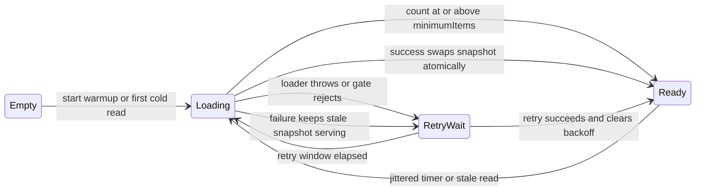
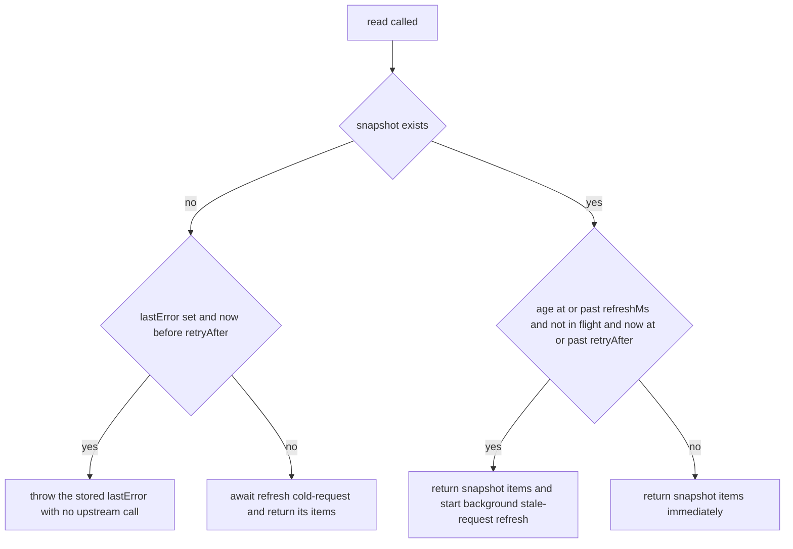

# In-Memory Transit Catalogs

`/api/stops/nearby` and `/api/subway/nearby` never ask Seoul for "stops near me".
They ask an in-process cache for *the whole city* and do the geometry locally.
`TransitCatalogService` (`apps/api/src/transit/transitCatalog.service.ts`) owns
two instances of a small generic state machine, `ManagedCatalog<T>`
(`apps/api/src/transit/managedCatalog.ts`):

- **bus** — `ManagedCatalog<BusStopPoint>`, loaded once from the Seoul BIS
  `selectNearStops.do` endpoint queried with a fixed 45 km radius centered on
  the city (`BUS_CATALOG_LOCATION`), then deduplicated by stop id.
- **subway** — `ManagedCatalog<SubwayStationPoint>`, loaded from the quarterly
  official T-Data station-master CSV.

Each `read()` returns every stop or station, and the service filters by
haversine distance at query time. This is the whole point: one upstream call
amortized across unlimited location searches, with an upstream failure
degrading to *stale-but-complete* data rather than an error. Arrivals are the
deliberate exception — `/api/arrivals/:arsId` and `/api/subway/arrivals` hit
their live upstream on every request and are never catalog-cached.

See `/openwiki/integrations/seoul-upstreams.md` for the upstream endpoints
themselves and `/openwiki/architecture/api-service.md` for how the knobs reach
this service through `AppModule.register`.

## Composition and lifecycle wiring

`TransitCatalogService` is the only class provider in the API module. Its
constructor reads the injected `API_OPTIONS` and turns the `transitCatalog`
sub-object into two catalogs that share everything except `source` and
`minimumItems`:

| Shared option | Bus-specific | Subway-specific |
|---|---|---|
| `now`, `random`, `refreshMs`, `retryMs`, `schedule` (= `warmup`), `onEvent` | `source: "bus"`, `minimumItems: minimumBusItems`, loader = `fetchStopCatalog` + id dedupe | `source: "subway"`, `minimumItems: minimumSubwayItems`, loader = `fetchSubwayStationCatalog` |

The bus loader strips the upstream `diffMeter` (a distance from the fixed
catalog center, meaningless for a user query) and dedupes through a
`Map` keyed by `String(stop.id)` — the citywide response contains repeated
stops. The subway loader returns `SubwayStationPoint` rows straight from the
CSV normalizer.

Nest lifecycle hooks drive the machine:

- `onModuleInit()` calls `bus.start()` and `subway.start()`. `start()` is a
  no-op unless `options.schedule` (i.e. `warmup`) is enabled; when enabled it
  fires a `warmup` refresh immediately and swallows its error.
- `onModuleDestroy()` calls `stop()`, which clears the pending `setTimeout`
  and nulls `nextRefreshAt`. It does not abort a load already in flight — the
  timers are `unref()`-ed, so a shutdown is never blocked by either.

With `warmup: false` (the `AppModule.register` default, used by every test)
nothing loads and no timer exists until the first request.

## The catalog state machine



*The `ManagedCatalog` lifecycle. `Ready` is the steady state — reads are served
from the immutable snapshot even while a refresh is `Loading` or while the
catalog sits in `RetryWait` with a previous error recorded.*

The private state is deliberately tiny: `snapshot` (items + `updatedAt`),
`inFlight` (the shared load promise), `timer`, `retryAfter`, `lastError`,
`lastErrorAt`, `nextRefreshAt`. Snapshots are never mutated — a successful
load builds a fresh `{ items, updatedAt: now()` object and assigns it, so any
reader already holding the old array keeps a consistent view. That atomic swap
is the only way `snapshot` ever changes.

## `read()`, traced precisely



*The two halves of `read()`: a blocking cold path when no snapshot exists, and
a never-blocking stale path once one does.*

**No snapshot.** If the last load failed *and* `now() < retryAfter`, the stored
`lastError` is rethrown immediately — no upstream call, no timer wait. This is
the bounded backoff on the cold path: a dead upstream produces one error per
`retryMs` window instead of one error per request. Once the window has elapsed
(or there is no prior error), `read()` awaits a `cold-request` refresh and
returns its items; that refresh may of course fail again.

**With a snapshot.** The current items are returned synchronously — a reader
never waits on the network once any snapshot exists, no matter how old. Before
returning, all three conditions are checked: the snapshot age
(`now() - updatedAt`) is at or past `refreshMs`, there is no load `inFlight`,
and `now() >= retryAfter`. Only when all three hold does `read()` kick off a
fire-and-forget `stale-request` refresh whose rejection is swallowed
(`void this.refresh("stale-request").catch(() => undefined)`). Readers get the
old data regardless of the refresh outcome.

## Single-flight refresh and its two exit paths

Every load goes through one choke point:

```ts
private refresh(trigger: string): Promise<Snapshot<T>> {
  this.inFlight ??= this.load(trigger).finally(() => {
    this.inFlight = null;
  });
  return this.inFlight;
}
```

Concurrent callers — a burst of cold requests, a scheduled timer racing a
stale read — share one `loader()` invocation, and the promise is cleared in
`finally` so the *next* refresh can start. `apps/api/src/transit/managedCatalog.test.ts`
pins this: two simultaneous `read()` calls produce exactly one loader call.

`load()` has two exits:

- **Success** (only if the item count clears `minimumItems`, below): swap the
  snapshot, reset `retryAfter = 0` and `lastError = null`, schedule the next
  refresh with jitter, and emit a success event.
- **Failure** (loader throw, count gate, or parse error): store `lastError`
  and `lastErrorAt`, set `retryAfter = now + retryMs`, schedule a retry timer,
  emit a failure event (whose `itemCount` reports the *surviving* snapshot's
  size, not zero), and rethrow. Crucially the previous `snapshot` is left
  untouched — this is what makes stale-serving work.

## Two rejection gates

A truncated or corrupted upstream response must never become the cached
catalog. Two independent gates enforce that, and both raise
`UpstreamError` (from `apps/api/src/upstream/upstreamError.ts`), which is the
error type the controller layer maps to `502 UPSTREAM_UNAVAILABLE` and the
type `nearbyStops` keys its fallback on.

**1. Minimum item count — inside `ManagedCatalog.load()`.** After the loader
resolves, `items.length < minimumItems` throws
`UpstreamError(\`${source} catalog rejected\`, \`${source} catalog contained N items\`)`.
The threshold is a constructor option:

| Setting | `minimumBusItems` | `minimumSubwayItems` |
|---|---|---|
| `AppModule.register` default (tests) | `1` | `1` |
| Production (`apps/api/src/main.ts`) | `10_000` | `100` |

In production a bus payload with 500 stops is treated as a broken upstream —
rejected, retried on the backoff schedule, and (for stops) answered from the
live fallback endpoint. In tests the default of `1` lets a single-row fixture
pass the gate.

**2. Response byte cap — inside the adapters.** Before parsing, each catalog
adapter measures the raw body:

| Adapter | Endpoint | Timeout | Cap | Failure message |
|---|---|---|---|---|
| `fetchStopCatalog` | `selectNearStops.do` with `kiloMeter=45`, center 37.55/127 | 30 s | 10 MiB (`BUS_CATALOG_MAX_RESPONSE_BYTES`) | `Stop catalog upstream response exceeded 10 MiB` |
| `fetchSubwayStationCatalog` | `t-data.seoul.go.kr/dataprovide/download.do?id=10229` | 15 s | 1 MiB (`SUBWAY_CATALOG_MAX_RESPONSE_BYTES`) | `Subway catalog upstream response exceeded 1 MiB` |

The caps bound memory and reject a misrouted or HTML error page posing as a
catalog. Non-2xx statuses raise `UpstreamError` from the same adapters. Note
the asymmetry with row-level hygiene: the normalizers in `@mota/contracts`
*drop* isolated malformed rows (`normalizeStopCatalog` per-row `safeParse`,
`normalizeOfficialSubwayStationCatalog` skipping bad CSV lines), while the two
gates above reject wholesale truncation or bloat. Dropping a few bad rows
shrinks the count slightly; the minimum-count gate is set far enough below the
true catalog size that normal row loss cannot trip it.

## Refresh scheduling, jitter, and backoff

`schedule(delayMs)` is the only place a timer is created: it clears any prior
timer, records `nextRefreshAt = now + delayMs`, and sets an `unref()`-ed
`setTimeout` that calls `refreshIfDue()`. It does nothing at all when
`options.schedule` is false, which is why a test-built catalog never holds a
timer.

The two delays differ:

- **After success:** `jitteredRefreshDelay()` returns
  `refreshMs * (1 + random() * 0.1)` — the nominal 24 h refresh actually lands
  uniformly in `[24 h, 26.4 h]`. `random` is injected (`options.random`,
  defaulting to `Math.random`), so tests pin the schedule deterministically.
- **After failure:** a plain `retryMs` delay. Because `retryAfter` was set to
  `now + retryMs` in the same breath, the retry timer fires exactly as the
  backoff window expires, and the subsequent `refreshIfDue()` passes its
  `now < retryAfter` check. There is no jitter on retries.

`refreshIfDue(trigger = "scheduled")` is the gate the timer routes through: it
returns `false` without loading when the snapshot is still fresh **or** when
`now < retryAfter`. A timer firing mid-backoff therefore does nothing rather
than hammering a dead upstream. `refreshNow(trigger = "manual")` bypasses the
gates and awaits a refresh directly — an administrative escape hatch with no
current caller in the repository. `TransitCatalogService.refreshDueCatalogs()`
(`Promise.allSettled` over both catalogs' `refreshIfDue`) is likewise exposed
but not wired to any route.

The trigger string flows into every emitted event, so the log is
self-describing: `warmup` (from `start()`), `cold-request` (first read with no
snapshot), `stale-request` (background refresh from a stale read), `scheduled`
(the timer), `manual` (`refreshNow`).

## Configuration

All knobs arrive through `AppModule.register` and are resolved into
`ApiOptions.transitCatalog` (`apps/api/src/app.module.ts`,
`apps/api/src/app.tokens.ts`):

| Knob | `AppModule` default | Production (`main.ts` / env) |
|---|---|---|
| `refreshMs` | `24 * 60 * 60 * 1000` (`DEFAULT_CATALOG_REFRESH_MS`) | `TRANSIT_CATALOG_REFRESH_MS`, clamped by `loadEnv` to 60 s–7 d, default 24 h |
| `retryMs` | `15 * 60 * 1000` (`DEFAULT_CATALOG_RETRY_MS`) | same 15 min (not env-configurable) |
| `warmup` / `schedule` | `false` | `true` (`warmTransitCatalogs: true`) |
| `minimumBusItems` | `1` | `10_000` |
| `minimumSubwayItems` | `1` | `100` |
| `random` | `Math.random` | `Math.random` |
| `now` | `undefined` → `Date.now` in the service | `undefined` |

The `now` and `random` injections are what make the whole machine unit-testable
without fake global clocks beyond `vi.useFakeTimers` in the timer test.

## The bus-only degraded path

The two catalogs fail differently at the HTTP boundary, and this is pinned by
`apps/api/test/transit-catalog-fallback.e2e.test.ts`:

- **`GET /api/stops/nearby`** wraps `bus.read()` in a `try`/`catch`. If the
  catalog throws an `UpstreamError` — cold load failed, count gate rejected
  the payload, byte cap tripped — the service falls back to
  `fetchLiveNearbyStops`, the *same* `selectNearStops.do` endpoint but scoped
  to the user's location (`kiloMeter = radius / 1000`, 8 s timeout). The e2e
  test configures `minimumBusCatalogItems: 2` against a one-stop payload and
  asserts the 200 response came from exactly two upstream calls: first
  `kiloMeter=45` (the rejected catalog attempt), then `kiloMeter=0.8` (the
  live fallback for `radius=800`). Non-`UpstreamError` failures (e.g. a bug)
  are rethrown, not masked.
- **`GET /api/subway/nearby`** has no fallback: `subway.read()` errors
  propagate to `TransitController`, which converts them into
  `502 UPSTREAM_UNAVAILABLE` with the Korean user message and
  `detail: errorDetail(error)`. There is no location-scoped subway-catalog
  upstream to fall back to — the T-Data CSV is the only source.

Once a bus snapshot exists, the fallback never triggers: a failing *refresh*
keeps serving stale items from `read()` rather than throwing, so the fallback
is effectively a cold-start and total-catalog-rejection path.

## What a served query does with the snapshot

Both query paths compute haversine distance against every catalog entry
(`2 * 6_371_000 * asin(sqrt(haversine))`):

- **Bus:** annotate each point with its distance, filter to
  `distanceMeters <= radius`, sort by distance then `String(id).localeCompare`
  (a stable tiebreak), and round distances for output.
- **Subway:** filter to radius, then dedupe **by station name**, keeping the
  nearest point per name — the CSV has one row per line, so transfer stations
  appear several times — and sort by distance then Korean-name `localeCompare`.

The radius bounds come from the request schemas in `@mota/contracts` (bus
100–1500 m default 800, subway 300–5000 m default 3000), validated before any
catalog access.

## Observability

Every load — success or failure — emits a `CatalogEvent` through the shared
`onEvent` callback, which `TransitCatalogService` serializes into one JSON log
line:

```json
{"event":"transit_catalog_refresh","source":"bus","trigger":"stale-request",
 "outcome":"failure","durationMs":8412,"itemCount":31245,
 "nextRefreshAt":"2026-08-30T09:14:02.000Z","detail":"Stop catalog upstream returned 503"}
```

Failures log at `warn`, successes at `log`. `durationMs` is measured with
`performance.now()` around the loader call, and `nextRefreshAt` is the
post-event schedule (retry deadline after a failure, jittered refresh time
after a success).

`GET /api/health` surfaces liveness without gating on it:
`HealthController` returns `transitCatalogs: this.catalogs.status()` — one
`CatalogStatus` per catalog with `ready` (a snapshot exists), `count`,
`updatedAt`, `lastErrorAt`, and `nextRefreshAt`, all null-safe ISO strings.
The endpoint always returns 200 `status: "ok"`, and the Compose healthcheck
probes it — so a catalog that has never loaded (or is stuck in backoff)
reports `ready: false` rather than failing the container. The e2e suite pins
exactly that: `bus: { ready: false, count: 0 }` before any request, `ready: true, count: 1`
after one `/api/stops/nearby`.

## Tests that pin the semantics

- `apps/api/src/transit/managedCatalog.test.ts` — unit pins: concurrent cold
  readers share one loader call; a due `refreshIfDue` atomically swaps the
  snapshot; a failed refresh leaves stale items readable; with `schedule` on,
  `start()` warms, the timer fires a second load, and `stop()` leaves zero
  timers.
- `apps/api/test/transit-catalog-fallback.e2e.test.ts` — the bus-only live
  fallback, asserting both upstream URLs and the 200 result.
- `apps/api/test/app.e2e.test.ts` — different locations served from one cached
  catalog with a single `kiloMeter=45` upstream call (bus and subway variants),
  concurrent cold subway requests sharing one pending load, malformed catalog
  rows dropped without failing the request, and the non-gating health
  readiness transition.

## Related pages

- `/openwiki/architecture/api-service.md` — the composition root that injects
  these knobs, the controller surface, and the error-code convention.
- `/openwiki/integrations/seoul-upstreams.md` — the Seoul endpoints, headers,
  and timeouts behind the two loaders.
- `/openwiki/workflows/stop-discovery.md` — the user-facing flow that ends at
  these catalogs, including the web client's 35 s allowance for slow cold
  subway searches.
- `/openwiki/concepts/transit-arrivals.md` — the domain types normalized at
  the catalog boundary, including the per-row tolerance the count gate
  complements.
- `/openwiki/operations/deployment.md` — `TRANSIT_CATALOG_REFRESH_MS` and the
  healthcheck wiring in Compose.
