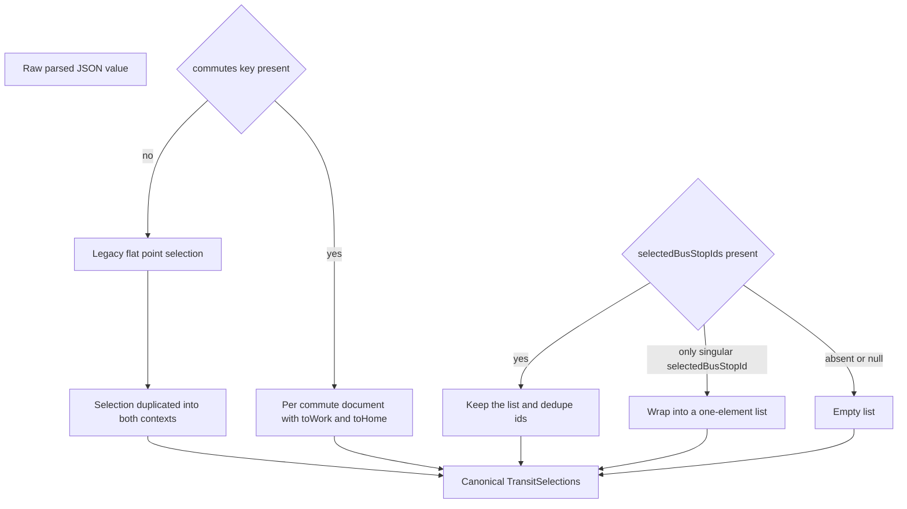
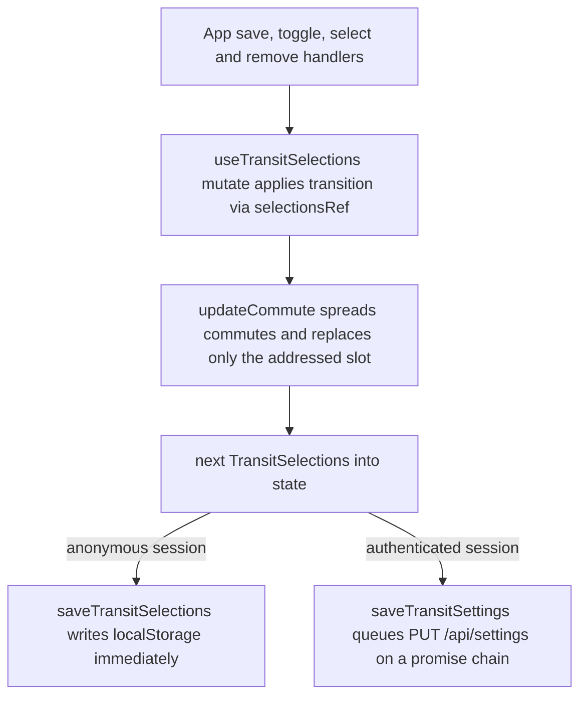
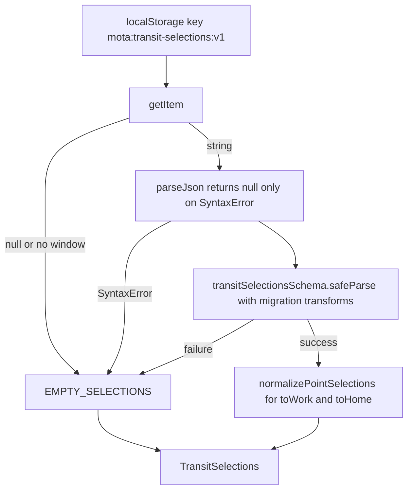

# Saved Selections Document Model

Everything a user has *saved* in mota — the bus stops and subway stations they
picked and which of them they are currently watching — is one JSON document.
This page is about that document: its shape, how it migrates from older
shapes, how it is mutated, and how it is repaired on read.

Three files own it:

- `packages/contracts/src/transitSettings.ts` — the Zod definition, the cap
  constant, and the migration transforms. This is the **single shared
  definition**: the React app, the Nest API, and `@mota/db` all parse the same
  document with the same schema, so a document written by the browser is
  readable by the server and vice versa.
- `apps/web/src/hooks/transitSelectionMutations.ts` — pure, synchronous
  transitions. No I/O, no React.
- `apps/web/src/hooks/transitSelectionStorage.ts` — the localStorage adapter
  for the anonymous lane, plus the read-time normalizer.

The React state owner (`useTransitSelections`) and the server lane are covered
on the web-app and settings-sync pages in `openwiki/`; this page stops at the
document itself and the two browser-side modules that shape it.

## The document

```ts
type TransitSelections = {
  commutes: {
    toWork: TransitPointSelections;
    toHome: TransitPointSelections;
  };
};

type TransitPointSelections = {
  busStops: BusStop[];               // everything saved in this context
  subwayStations: SubwayStation[];   // everything saved in this context
  selectedBusStopIds: BusStop["id"][]; // subset being watched, max 4
  selectedSubwayStationId: SubwayStation["id"] | null;
};
```

`COMMUTE_CONTEXTS = ["toWork", "toHome"]` is a closed Zod enum, so
`commutes[commute]` indexing in the app is exhaustive by construction — there
is no third context to forget.

The two contexts are **completely independent documents**. Neither is derived
from the other, neither has a parent, and no field crosses between them. The
only operation that ever writes to both at once is the one-time legacy
promotion described below.

### The two selection kinds behave differently

A commute context stores a *set* of saved points and, separately, *which of
them the user is watching*:

- **Bus stops are multi-watch.** `busStops` is an unbounded saved list, and
  `selectedBusStopIds` is a bounded (≤ `MAX_SELECTED_BUS_STOPS` = 4) subset.
  Every selected stop gets its own arrival section.
- **Subway stations are single-watch.** `subwayStations` is unbounded, but
  `selectedSubwayStationId` is one id or `null`. One station, one direction
  tab group, one arrival list.

That asymmetry is deliberate product scope (DESIGN.md §1: "정류장은 최대 네 곳까지
동시에 선택해 함께 볼 수 있다" — stops up to four, watched together), and it is
why the bus path needed a v2 migration and the subway path did not.



*The migration ladder: two independent upgrades — flat→per-commute at the outer
schema, singular→list at the point schema — compose so that any historical
document shape parses to the canonical one.*

## The migration ladder in `transitSelectionsSchema`

`transitSelectionsSchema` is not a plain object schema. It is a
`z.union([...])` over two inputs followed by a `.transform`, and both halves do
migration work.

**Rung 1 — flat document → both commutes.** The union accepts either
`commuteSelectionsInputSchema` (`{commutes: {toWork, toHome}}`) or a bare
`transitPointSelectionsSchema` (the old single-selection shape). The outer
transform checks `"commutes" in selections`; when absent it wraps the point
selection into `{commutes: {toWork: selections, toHome: selections}}` — the
*same object* placed in both slots. This implements DESIGN.md's rule that "기존
단일 저장 데이터의 정류장과 역은 출근·퇴근 양쪽에 복제해 보존한다" (existing
single-storage data is duplicated into both commute contexts to be preserved).
The shared reference is safe because the document is treated as immutable from
that point on; the first mutation to either context replaces its slot with a
fresh object.

**Rung 2 — `selectedBusStopId` → `selectedBusStopIds` (v2 multi-watch).**
Inside `transitPointSelectionsSchema`, the input schema declares *both* fields
as optional:

- `selectedBusStopIds: z.array(id).max(MAX_SELECTED_BUS_STOPS).optional()`
- `selectedBusStopId: z.string().nullable().optional()`

The transform then produces the canonical `selectedBusStopIds` list by taking
`selectedBusStopIds` when present, otherwise wrapping a non-null
`selectedBusStopId` in a one-element list, otherwise `[]` — and deduplicating
through a `Set` either way. `selectedSubwayStationId` is normalized with
`?? null`. So the output type always has exactly the four canonical fields;
the legacy field simply disappears.

Because rung 2 runs before rung 1 in the parse pipeline (the point schema is
the union member, the outer transform runs after it), the oldest shape — a
flat document carrying only `selectedBusStopId` — migrates through both rungs
in one `safeParse` call.

`packages/contracts/src/transitSettings.test.ts` pins every rung: the
canonical empty document parses to itself, a flat document lands in both
commutes, a `selectedBusStopId: "124000454"` document yields
`selectedBusStopIds: ["124000454"]` in *both* `toWork` and `toHome`, and
duplicate ids collapse during the migration.

### The cap rejects at the schema, truncates at the storage layer

`MAX_SELECTED_BUS_STOPS = 4` is applied in two places with two different
semantics, and the difference matters:

- **Schema:** `.max(MAX_SELECTED_BUS_STOPS)` on `selectedBusStopIds` makes a
  document with five ids *fail to parse*. The contract test
  ("rejects watching more stops than the product cap") asserts
  `safeParse(...).success === false`. The schema is a validator, not a repair
  tool — an over-cap document is a bug, not a shrug.
- **Storage:** `normalizePointSelections` applies
  `.slice(0, MAX_SELECTED_BUS_STOPS)`. localStorage is untrusted and often
  hand-edited or stale, so the read path repairs rather than rejects.

Keep this split in mind when changing the cap: raising or lowering the number
changes what the schema *rejects* from the server, so previously-valid stored
documents can start failing `safeParse` in `packages/db`'s `toStored` and in
the browser client. Lowering it is a data-compat break.

## Mutations: one context at a time

`transitSelectionMutations.ts` exports six pure transitions. All six route
through one private helper:

```ts
function updateCommute(selections, commute, transition) {
  return {
    commutes: {
      ...selections.commutes,
      [commute]: transition(selections.commutes[commute]),
    },
  };
}
```

The other context is spread through untouched by reference. This is the whole
enforcement of DESIGN.md's success criterion 7 — "출근과 퇴근의 버스
정류장·지하철역 선택은 서로 변경하지 않고 독립 저장된다" (the two contexts never
modify each other) — and of the QA criterion "한쪽 삭제 시 다른 쪽 보존" (deleting
on one side preserves the other). There is no code path in this module that can
reach the sibling context, and because the functions are pure and take the
whole document, that property is trivially testable:



*Control flow of a mutation: the UI never touches the document directly; every
write goes through a pure per-commute transition, and persistence is chosen by
session state, not by the transition.*

### Bus stop semantics

- **`addBusStopsToCommute(selections, commute, stops)`** — no-op on an empty
  batch. Saved stops are deduped by id through a `Map`, so re-adding an
  already-saved stop *updates its record in place* (coordinates, name, ARS id)
  without reordering the list. Selection ids are then unioned
  (`[...new Set([...existing, ...new])]`) and sliced to 4 — existing ids
  first, new ids appended. Consequence: **if the context is already at 4
  watched stops, the newly saved stop is silently dropped from the selection**
  (it is still saved in `busStops`, just not watched). `App`'s list-row toggle
  guards this in the UI with an announcement, but the batch-add path from the
  inline map search (`saveStops` → `addBusStops`) does not, so the slice is
  the real guard there.
- **`toggleBusStopForCommute(selections, commute, stopId)`** — a strict
  no-op if the id is not in the saved `busStops` list; you cannot watch an
  unsaved stop. Otherwise it removes the id when present, or appends it and
  slices to 4 when absent.
- **`removeBusStopFromCommute`** — filters the stop out of `busStops` *and*
  prunes its id from `selectedBusStopIds`. Deleting a stop never leaves a
  dangling selection behind.

### Subway station semantics

- **`addSubwayStationsToCommute`** — no-op on an empty batch. Stations dedupe
  by id the same way, and `selectedSubwayStationId` becomes
  `stations[0]?.id ?? previous`: **the first station of the newly added batch
  wins**, so saving a new station immediately switches the watch to it.
- **`selectSubwayStationForCommute`** — a no-op unless the id exists in
  `subwayStations`; selection can only point at saved stations.
- **`removeSubwayStationFromCommute`** — if the removed station was the
  selected one, the selection falls back to `subwayStations[0]?.id ?? null`;
  otherwise it is preserved.

## The storage adapter and its invariants

`transitSelectionStorage.ts` is the anonymous lane's persistence and the
document's repair layer.

### Untrusted input, Zod edge, never throws

`AGENTS.md` requires that "Untrusted HTTP, database JSON, and localStorage
values are parsed with Zod." `loadTransitSelections` is the localStorage
instance of that boundary rule:

1. Resolve the store: an injected `TransitSelectionStorage`
   (`Pick<Storage, "getItem" | "setItem">`, so tests pass a stub) or
   `window.localStorage`. When `typeof window === "undefined"` the store is
   `null` and the function returns `EMPTY_SELECTIONS` immediately — the module
   is safe to import in SSR/Node.
2. `store.getItem("mota:transit-selections:v1")`; `null` short-circuits to
   `EMPTY_SELECTIONS`.
3. `parseJson` swallows **only** `SyntaxError` (returning `null`) and rethrows
   anything else, so a genuine browser bug is not silently masked as corrupt
   data.
4. `transitSelectionsSchema.safeParse(...)` — the same schema the server uses,
   migrations included.
5. On success, `normalize(...)` runs. On *any* failure above, the function
   returns `EMPTY_SELECTIONS`. It never throws: corrupt storage degrades to a
   fresh app rather than a crash, which is what lets `useTransitSelections`
   seed state with `useState<TransitSelections>(loadTransitSelections)` as a
   lazy initializer on the very first render.

`saveTransitSelections` is the mirror image and deliberately dumber: it
`JSON.stringify`s the document and writes it under the same key, with no
validation and no normalization. **The invariants are enforced on read, not on
write** — writers may be sloppy, readers are strict, and every successful read
re-establishes the contract.



*The read path: five ways to fall back to the empty document, one way to get a
real one, and normalization always applied to the real one.*

### The normalization invariants

`normalizePointSelections` runs on **both** contexts on **every** successful
read, in this order:

1. **Dedupe `busStops` and `subwayStations` by id** (`uniqueById`, a `Map`, so
   the *last* occurrence wins on duplicate ids).
2. **Drop dangling bus selections.** `selectedBusStopIds` is deduped and then
   filtered to ids that exist in the deduped `busStops` list, using a `Set` of
   known ids.
3. **Cap at 4.** If the surviving list is non-empty it is sliced to
   `MAX_SELECTED_BUS_STOPS`.
4. **Fall back to the first saved stop.** If the list ended up empty — either
   because it was stored empty or because every id was dangling — the
   selection becomes `[busStops[0].id]` when any stop is saved, otherwise
   `[]`. A user with saved stops always has at least one watched stop, so the
   arrivals panel is never blank for a non-empty commute.
5. **Fall back to the first station.** `selectedSubwayStationId` survives only
   if it matches a saved station; otherwise it becomes
   `subwayStations[0]?.id ?? null`. Again: saved-but-unselected stations
   auto-select the first one.

Together these mean the *stored* document is allowed to be ragged (duplicate
rows, stale ids from a removed stop, an over-cap list) while the *in-memory*
document never is. `App` can therefore index straight into
`selectedBusStopIds` and resolve it against a `Map` of saved stops, dropping
unknowns with a `flatMap` — belt and braces, since normalization already
guaranteed there are none.

## Where the document travels

The same schema governs both persistence lanes, but **only the localStorage
lane runs the normalizer**:

- **Anonymous:** `useTransitSelections.mutate()` writes through
  `saveTransitSelections` immediately; reads go through
  `loadTransitSelections`, migrations + normalization.
- **Authenticated:** the browser re-parses `GET /api/settings` with
  `transitSettingsSnapshotSchema` (`{version: number ≥ 0, selections:
  TransitSelections | null}`) in `apps/web/src/api/client.ts`, and the server
  re-parses the `jsonb` column with `transitSelectionsSchema` in
  `packages/db/src/repository.ts`'s `toStored` (throwing
  `InvalidStoredSettingsError` on a bad row rather than repairing it). A
  server snapshot is migrated by the schema but is **not** re-run through
  `normalizePointSelections` — the server is assumed to be the authority, and
  `version` is the compare-and-swap token that decides who wins, not a
  normalizer pass. See the database and settings-sync pages in `openwiki/`
  for the table and the sync state machine.

`transitSettingsUpdateSchema` requires a non-null `selections` plus the
expected `version`; `SettingsController` rejects a body that fails it with
`INVALID_SETTINGS` (400) and maps the repository's
`SettingsVersionConflictError` to `SETTINGS_VERSION_CONFLICT` (409). A fresh
account reads as `{version: 0, selections: null}`, which is the signal the
client uses to bootstrap from the anonymous document.

## Tests that pin this model

- `packages/contracts/src/transitSettings.test.ts` — the migration ladder
  (flat→both commutes, singular→one-element list), dedupe during migration,
  over-cap rejection, malformed-array rejection, and the canonical empty
  document.
- `apps/web/src/App.test.tsx` — end-to-end independence for both modes
  ("keeps bus stop settings independent between commute contexts",
  "keeps subway stations independent between commute contexts"), the legacy
  migration visible in the UI (a seeded `selectedBusStopId` document yields an
  active selection in *both* tabs), multi-watch with two stops and toggle-off,
  and persistence across visits.
- `apps/web/src/hooks/useTransitSelections.test.tsx` — hook-level independence
  plus the cap: adding three stops to `toHome` while asserting `toWork` is
  untouched, toggling one out, and adding a fourth without exceeding four
  watched ids.
- `packages/db/src/repository.integration.test.ts` — the `jsonb` round trip
  and compare-and-swap version enforcement behind the authenticated lane.

## Related pages

- `openwiki/workflows/settings-sync.md` — the two persistence lanes,
  hydration guards, and the save promise chain (planned).
- `openwiki/architecture/database.md` — the `user_settings` table that stores
  this document as `jsonb`.
- `openwiki/architecture/web-app.md` — the UI that consumes
  `selections.commutes[commute]` and derives the arrival list.
- `openwiki/concepts/transit-arrivals.md` — the `BusStop` / `SubwayStation`
  values embedded in this document.
