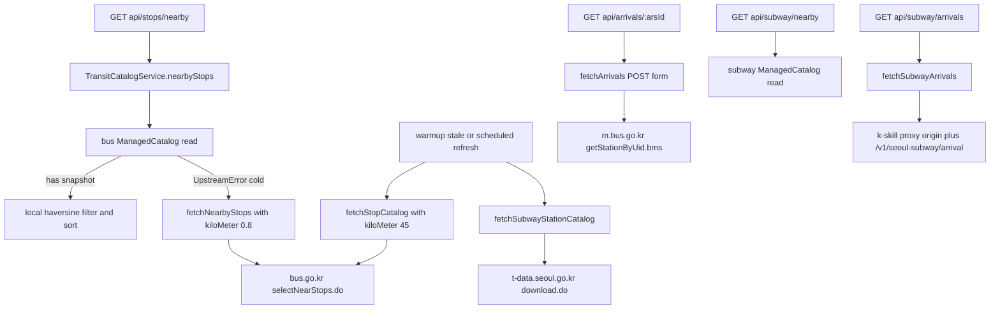
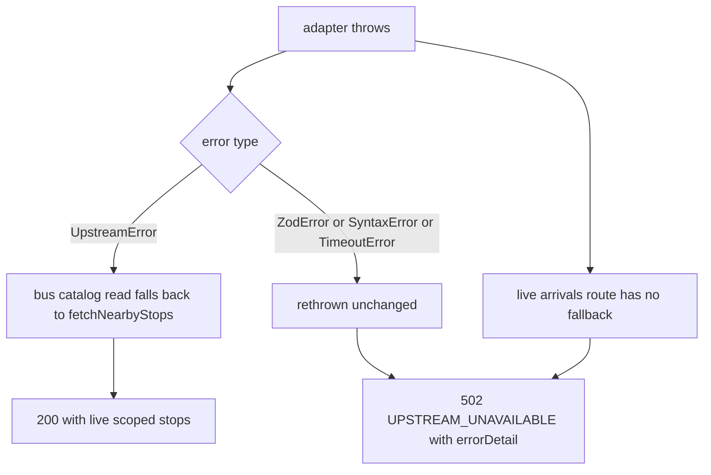

# Seoul Upstream Data Sources

Everything the API knows about Seoul transit comes from three external systems,
and `apps/api/src/upstream/` is the only code in the repository that talks to
them. Four files, five exported fetch functions:

| File | Exports |
|---|---|
| `apps/api/src/upstream/seoulBus.ts` | `fetchNearbyStops`, `fetchStopCatalog`, `fetchArrivals`, plus `UPSTREAM_HEADERS` and `BUS_CATALOG_LOCATION` |
| `apps/api/src/upstream/subwayArrivals.ts` | `fetchSubwayArrivals`, `SUBWAY_ARRIVAL_UPSTREAM_BASE` |
| `apps/api/src/upstream/officialSubwayStations.ts` | `fetchSubwayStationCatalog` |
| `apps/api/src/upstream/upstreamError.ts` | `UpstreamError`, `errorDetail` |

Nothing here knows about Nest, caches, or HTTP responses. Each function takes a
fetcher as its **first argument** and returns normalized domain types from
`@mota/contracts`. Every call site — `TransitController` for the live
arrival routes, `TransitCatalogService` for the two catalog loaders — passes
`this.options.upstreamFetch`, the fetch-shaped function injected through
`API_OPTIONS` (`apps/api/src/app.tokens.ts`, defaulted to the global `fetch` in
`AppModule.register`). That one seam is what lets
`apps/api/test/app.e2e.test.ts` drive the whole HTTP surface against a `vi.fn()`
returning `Response.json(...)`.

## Endpoint reference

| Adapter | Purpose | URL | Method | Timeout | Response cap | Zod schema (in `packages/contracts`) |
|---|---|---|---|---|---|---|
| `fetchStopCatalog` | Complete citywide bus-stop catalog for the in-memory cache | `https://bus.go.kr/sbus/bus/selectNearStops.do?kiloMeter=45&lati=37.55&longi=127` | GET | 30 s | 10 MiB | `stopCatalogResponseSchema` + per-row `nearbyStopSchema` → `normalizeStopCatalog` (`src/bus.ts`) |
| `fetchNearbyStops` | Location-scoped **live fallback** when the bus catalog read fails | same `selectNearStops.do`, with `kiloMeter=radius/1000&lati=<lat>&longi=<lng>` | GET | 8 s | none (`response.json()` directly) | `nearbyResponseSchema` → `normalizeNearbyStops` (`src/bus.ts`) |
| `fetchArrivals` | Realtime bus arrivals for one ARS stop | `http://m.bus.go.kr/mBus/bus/getStationByUid.bms` | POST, body `arsId=<id>` form-encoded | 8 s | none | `arrivalResponseSchema` / `rawArrivalSchema` → `normalizeArrivals` (`src/bus.ts`) |
| `fetchSubwayArrivals` | Realtime subway arrivals for one station | `${SUBWAY_ARRIVAL_UPSTREAM}/v1/seoul-subway/arrival?station=<name>` | GET | 8 s | none | `upstreamSubwayArrivalSchema` → `normalizeSubwayArrivals` (`src/subway.ts`) |
| `fetchSubwayStationCatalog` | Quarterly official station-master catalog | `https://t-data.seoul.go.kr/dataprovide/download.do?id=10229` | GET | 15 s | 1 MiB | `normalizeOfficialSubwayStationCatalog` (`src/subway.ts`) |

Two routes serve *live* upstream data on every request and are never
catalog-cached: `GET /api/arrivals/:arsId` and `GET /api/subway/arrivals`. Two
routes are served from the in-memory catalogs and only touch an upstream on
refresh: `GET /api/stops/nearby` and `GET /api/subway/nearby`
(see `/openwiki/concepts/transit-catalogs.md`).



*Which adapter each route reaches, and how the two bus paths converge on the
single `selectNearStops.do` endpoint with different `kiloMeter` values.*

## Shared transport conventions

Every adapter call passes the same three things to the injected fetcher:

- **`headers: UPSTREAM_HEADERS`** — `{ Accept: "application/json", "User-Agent": "mota/0.1 (+https://mota.m16khb.xyz)" }`, defined once in `seoulBus.ts` and imported by both subway adapters. `fetchArrivals` spreads it and adds `Content-Type: application/x-www-form-urlencoded;charset=UTF-8`. No adapter sends credentials of any kind — none of these Seoul sources require an API key, so there is no key rotation or secret management for this integration.
- **`signal: AbortSignal.timeout(...)`** — the *only* latency bound in the
  system. There is no `AbortController` wrapper, no retry, no circuit breaker,
  and no per-adapter backoff. A hung upstream surfaces as a rejected promise
  (`TimeoutError`) at the deadline. The catalog *retry* schedule lives entirely
  in `ManagedCatalog`, which treats any loader rejection identically.
- **`if (!response.ok) throw new UpstreamError(...)`** — a non-2xx status never
  reaches the Zod layer; it becomes `UpstreamError("<what> upstream failed",
  "<what> upstream returned ${response.status}")` immediately.

The two byte caps are measured **after** the body has been read, not streamed:
`const body = await response.text(); if (new TextEncoder().encode(body).byteLength > CAP) throw ...`. They are validation gates against a misrouted or HTML error page posing as a catalog — and a cheap way to bound the parse — but they do not prevent an oversized body from being buffered first.

## The failure taxonomy and its HTTP mapping

`UpstreamError` (`apps/api/src/upstream/upstreamError.ts`) carries a short
stable `message` plus a `readonly detail` string. Adapters never format
user-facing copy; they only classify. `errorDetail(error)` returns
`error.detail` for an `UpstreamError`, `error.message` for any other `Error`,
and `"Unknown upstream failure"` otherwise.

`TransitController.upstreamError()` converts **any** thrown error from any
adapter into the same shape:

```ts
new BadGatewayException({
  error: "UPSTREAM_UNAVAILABLE",
  message: "<Korean user-facing string>",
  detail: errorDetail(error),
})
```

So an HTTP 502 with body `{ error: "UPSTREAM_UNAVAILABLE", message, detail }` is
the single observable outcome for: a non-2xx status, an abort at the deadline, a
network refusal, an over-cap catalog body, a Zod envelope rejection, or the
`ManagedCatalog` minimum-count gate. The web client (`apps/web/src/api/client.ts`)
turns that into an `ApiError` keyed on the `error` code string.

The `UpstreamError` *type* still matters at exactly one place: the bus live
fallback.



*Every adapter failure reaches the client as 502 `UPSTREAM_UNAVAILABLE`; only an
`instanceof UpstreamError` from the bus **catalog** read additionally triggers
the location-scoped fallback.*

Concretely, `fetchStopCatalog` can fail in three ways with three different
types: non-2xx or over-cap → `UpstreamError`; `JSON.parse(body)` on a non-JSON
body under 10 MiB → `SyntaxError`; `stopCatalogResponseSchema.parse` on a
malformed envelope → `ZodError`. Only the first triggers the fallback. The same
is true on the subway side, which has no fallback at all — the T-Data CSV is
the only station source, so a subway catalog failure is always a 502.

## The bus upstream: one endpoint, two modes

`BUS_CATALOG_LOCATION = { lat: 37.55, lng: 127, radius: 45_000 }` — roughly the
geographic centre of Seoul and a 45 km radius that covers the whole service
area. `fetchStopCatalog` sends `kiloMeter=45`; `fetchNearbyStops` sends
`kiloMeter = location.radius / 1000` (so a request with `radius=800` becomes
`kiloMeter=0.8`). Both use `lati`/`longi` (not `lat`/`lng`) and both hit the
identical URL `https://bus.go.kr/sbus/bus/selectNearStops.do` — only the query
string, the timeout (30 s vs 8 s), and the byte cap (10 MiB vs none) differ.

The two modes also normalize differently, and that asymmetry is deliberate:

- `normalizeNearbyStops` uses a **strict** `parse` of the whole
  `ResponseVO.data.resultList` envelope. A single bad row fails the whole live
  response — acceptable, because the live path is a per-request fallback for a
  small radius where a partial answer is worse than a 502.
- `normalizeStopCatalog` parses a looser envelope (`resultList: z.array(z.unknown())`)
  and then runs a **per-row `safeParse`**, keeping only complete rows. The 45 km
  bulk response contains isolated unpublished stops (an ARS of `-`, a blank
  name), and one bad row must not discard tens of thousands of good ones.

`apps/api/test/transit-catalog-fallback.e2e.test.ts` pins the whole split on one
mocked fetch. It configures `minimumBusCatalogItems: 2` against a one-stop
payload so the count gate rejects the catalog attempt, then asserts the request
still returned 200 with the live stop, and that the fetcher was called exactly
twice on the *same* `selectNearStops.do` URL — first
`expect.stringContaining("kiloMeter=45")`, then
`expect.stringContaining("kiloMeter=0.8")`.

## The station catalog: quarterly T-Data CSV

`fetchSubwayStationCatalog` downloads
`https://t-data.seoul.go.kr/dataprovide/download.do?id=10229` — Seoul's official
transport-data portal dataset, republished quarterly. It is plain text, so the
adapter reads `response.text()` and hands the string to
`normalizeOfficialSubwayStationCatalog` in `packages/contracts/src/subway.ts`.

Parsing happens in four steps, each with a distinct failure mode:

1. **BOM strip and split** — `input.replace(/^\uFEFF/, "").trim().split(/\r?\n/)`.
   Excel-exported CSVs from this portal arrive with a UTF-8 BOM; without the
   strip, the first header literal would never match.
2. **Strict header check** — the first row must be *exactly* the five-column
   tuple `외구간_역_수,역한글명칭,호선명칭,환승역X좌표,환승역Y좌표`, validated with
   `z.tuple([...z.literal(...)])` using a throwing `parse`. A renamed,
   reordered, or truncated column set fails the entire load — this is the
   contract with an upstream that can silently change its export shape between
   quarterly releases.
3. **Per-row `safeParse`** — `officialStationRowSchema` is a tuple of
   `[code, name, line, lng, lat]` (two non-empty trimmed strings, a non-empty
   line, two finite coerced numbers). Malformed rows are dropped, not fatal.
   `apps/api/test/app.e2e.test.ts` pins this: a CSV containing a valid `천호`
   row plus an `invalid,row` line still yields the one valid station.
4. **Identity and line naming** — the id becomes
   `SubwayStationIdSchema.parse("seoul-" + code)`, and the coordinate columns
   swap: `환승역X좌표` → `lng`, `환승역Y좌표` → `lat` (the CSV is X/Y, the domain is
   lng/lat — the same axis swap `toBusStop` performs for bus stops).

`officialLineName` normalizes the line on ingest. It first strips a trailing
parenthetical (`수도권 광역급행철도(A)` → `수도권 광역급행철도`), then applies the
rename table: `분당선` → `수인분당선` and `수도권 광역급행철도` → `GTX-A`. These two
are load-bearing: the display-line badge, the arrival `line` field (which comes
from `SUBWAY_LINE_NAMES`, keyed by `subwayId` `1075` → `수인분당선`), and any
station-matching logic all assume the modern names. Everything else passes
through unchanged.

Surviving rows become `SubwayStationPoint[]` and are handed to the subway
`ManagedCatalog`, whose production gate (`minimumSubwayItems: 100` in
`apps/api/src/main.ts`) rejects a wholesale truncation before it can become the
cached catalog. The nominal refresh interval is 24 h
(`TRANSIT_CATALOG_REFRESH_MS`), which is far more frequent than the quarterly
upstream actually changes — a harmless refresh of identical bytes.

## The subway arrivals proxy

Unlike the other two sources, this one is **not** a Seoul public endpoint. It is
an external proxy — `https://k-skill-proxy.nomadamas.org` by default — that
forwards Seoul's subway arrival API. Mota deliberately does not call Seoul's
API directly here.

The origin is overridable and **only** the origin:

```ts
export const SUBWAY_ARRIVAL_UPSTREAM_BASE =
  process.env.SUBWAY_ARRIVAL_UPSTREAM ?? "https://k-skill-proxy.nomadamas.org";
// ...
const upstreamUrl = new URL("/v1/seoul-subway/arrival", upstreamBase);
```

Setting `SUBWAY_ARRIVAL_UPSTREAM` to a value containing a path is a mistake:
`new URL(path, base)` discards the base's path, so the path component of the
override is silently ignored. Configuration flow:

- `loadEnv` (`apps/api/src/config/env.ts`) validates `SUBWAY_ARRIVAL_UPSTREAM`
  with `z.string().url()`, defaulting to `SUBWAY_ARRIVAL_UPSTREAM_BASE`.
- `main.ts` passes `env.subwayArrivalUpstream` into
  `AppModule.register({... subwayArrivalUpstream ...})`, which lands in
  `ApiOptions.subwayArrivalUpstream` and is forwarded by
  `TransitController.subwayArrivals` as the adapter's third argument.
- `compose.yaml` does not set it, so production uses the default shared proxy
  origin unless the operator adds it.
- `.env.example` documents the same rule: *"override only the origin — the
  adapter appends /v1/seoul-subway/arrival"*.

### Station-name aliasing

Seoul's arrival API registers some stations under parenthesized official names
while OpenStreetMap (where saved selections originate) keeps the short form.
`apiStationName()` in `packages/contracts/src/subway.ts` rewrites exactly three
known mismatches before the URL is built:

| Saved name | Upstream query |
|---|---|
| `천호` | `천호(풍납토성)` |
| `군자` | `군자(능동)` |
| `총신대입구` | `총신대입구(이수)` |

Everything else passes through unchanged. `apps/api/test/app.e2e.test.ts`
asserts the resulting URL byte-for-byte:
`https://subway-arrival.test/v1/seoul-subway/arrival?station=%EC%B2%9C%ED%98%B8%28%ED%92%8D%EB%82%A9%ED%86%A0%EC%84%B1%29`.

### `updatedAt` is receipt time, not data time

`normalizeSubwayArrivals` returns an `updatedAt` derived from the maximum
`recptnDt` across rows (Seoul local time, converted to an ISO instant). The
adapter **throws that away** and returns `new Date().toISOString()` instead. The
comment in `subwayArrivals.ts` records why: upstream data timestamps can lag
receipt by minutes, and both the client's 90-second freshness rule and the
elapsed-second countdown key on `updatedAt` — a lagging data timestamp would
immediately mark genuinely fresh data as stale and drop imminent trains. The bus
route does the same stamping in `TransitController.busArrivals`.
See `/openwiki/concepts/transit-arrivals.md` for the full countdown chain.

## Where the Zod boundary sits

The adapters contain **no** Zod of their own. Every schema and normalizer lives
in `packages/contracts` (`src/bus.ts`, `src/subway.ts`), which imports only Zod
and its own modules — the boundary rule from `AGENTS.md`. Three distinct parse
strategies, chosen per source:

| Source | Envelope | Rows | Rationale |
|---|---|---|---|
| Bus nearby (live) | strict `parse` | strict (via envelope) | small radius, one request — a partial answer is worse than 502 |
| Bus stop catalog (45 km) | loose `z.array(z.unknown())` | per-row `safeParse`, drop bad | one bad row must not discard the city |
| Bus arrivals | `resultList: z.array(rawArrivalSchema)` where each row is `.passthrough()` with defaults | tolerant defaults (`adirection` → `방향 정보 없음`, `arrmsg1` → `운행 정보 없음`, `busType1`/`congetion1` → `"0"`) | sparse Hermes rows are normal variance, not failures |
| Subway arrivals | `errorMessage` nullable/optional | strict on **identity keys** (`subwayId`, `updnLine`, `trainLineNm`, `recptnDt` must be present and non-empty); volatile fields (`barvlDt`, `arvlMsg3`, `lstcarAt`, `btrainSttus`) defaulted/nullable | a row the client cannot key or sort is an upstream failure; normal variance never throws |
| Station CSV | strict header `z.tuple` of `z.literal` | per-row `safeParse`, drop bad | quarterly export shape must be pinned; isolated bad rows are noise |

The subway-arrivals row strictness is observable at the HTTP boundary:
`apps/api/test/app.e2e.test.ts` feeds a row missing `updnLine` and asserts the
route returns 502 `UPSTREAM_UNAVAILABLE` rather than a partially-keyed list.

## Operations

- **No auth, no rate-limit handling.** None of the five calls carries a token or
  API key. There is no client-side rate limiting; the 24 h catalog refresh and
  the per-request live arrivals are the entire traffic profile.
- **Timeouts are the whole SLA.** 8 s for live lookups, 30 s for the 45 km bus
  catalog, 15 s for the T-Data CSV. The Fastify `requestTimeout` of 65 s in
  `main.ts` sits above all of them, so an adapter deadline always fires first.
- **Cleartext on one leg.** `http://m.bus.go.kr/mBus/bus/getStationByUid.bms` is
  plain HTTP while the other four are HTTPS — a property of the Hermes BIS
  mobile endpoint, not a mota choice.
- **One overridable knob.** `SUBWAY_ARRIVAL_UPSTREAM` is the only
  environment variable that touches this layer. `TRANSIT_CATALOG_REFRESH_MS`
  affects how often the two catalog adapters run, not how they behave.
- **Observability.** Catalog load failures log a
  `transit_catalog_refresh` JSON line with `detail: errorDetail(error)` and
  surface in `GET /api/health` under `transitCatalogs` as `lastErrorAt` and
  `nextRefreshAt`. The live arrival adapters log nothing themselves — a failure
  is only visible in the 502 response body.

## Tests that pin this integration

- `apps/api/test/app.e2e.test.ts` — asserts the exact upstream URL and the
  presence of an `AbortSignal` for the two bus-catalog modes, the T-Data CSV,
  and the subway arrivals proxy; asserts the arrivals call's `method: "POST"`
  and `body: "arsId=25162"`; the malformed-CSV-row and malformed-catalog-row
  drop semantics; the receipt-time `updatedAt`; and the 502
  `UPSTREAM_UNAVAILABLE` mapping for both a rejected fetch and a
  Zod-rejected subway row.
- `apps/api/test/transit-catalog-fallback.e2e.test.ts` — the
  `kiloMeter=45` → `kiloMeter=0.8` fallback sequence on one mocked fetch.
- `apps/api/src/config/env.test.ts` — `SUBWAY_ARRIVAL_UPSTREAM` defaulting to
  `SUBWAY_ARRIVAL_UPSTREAM_BASE`.

## Related pages

- `/openwiki/concepts/transit-catalogs.md` — the caching, gating, and scheduling
  that surround the two catalog adapters.
- `/openwiki/concepts/transit-arrivals.md` — the Zod edge and domain models the
  normalizers produce.
- `/openwiki/architecture/api-service.md` — how `upstreamFetch` and
  `subwayArrivalUpstream` reach the adapters through DI.
- `/openwiki/workflows/arrival-refresh.md` — the client-side consumption of the
  two live arrival endpoints.
