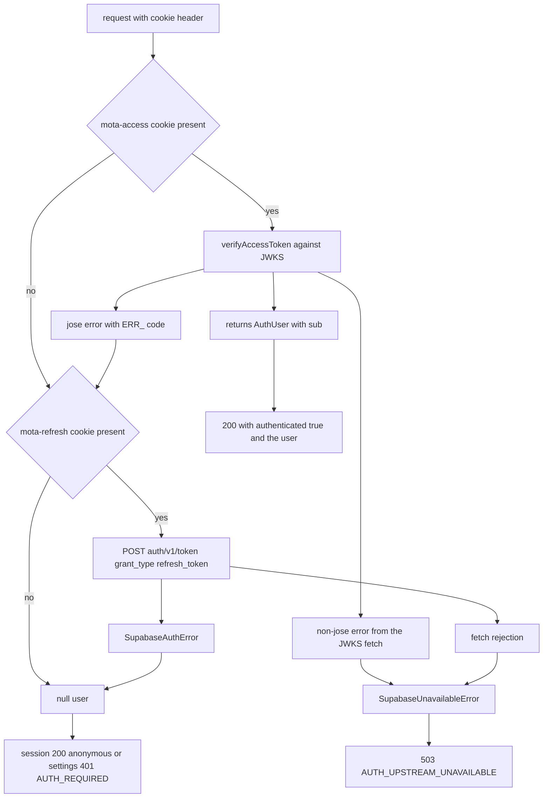
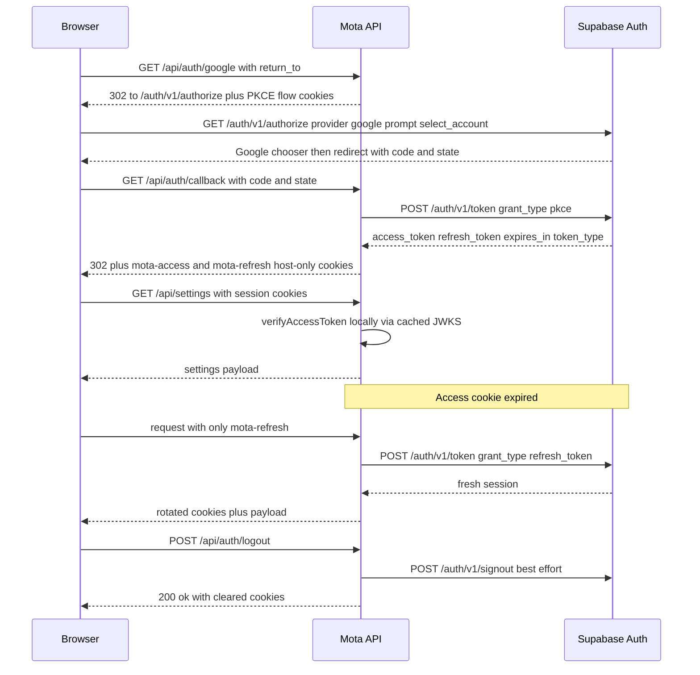

# Supabase Auth Integration

Mota does not run its own identity provider and it does not proxy another
service's session. It talks to **one** external auth system — the shared
Supabase project (the same project the auth-gateway uses, per the comment at the
top of `.env.example`) — through a deliberately small surface: four endpoints,
two Zod schemas, and one local JWT verifier. Everything else in
`apps/api/src/auth/` is mota's own cookie and PKCE bookkeeping, documented in
`/openwiki/workflows/authentication.md`.

Two invariants from `AGENTS.md` shape this whole page:

1. **Verification is local.** No per-request gateway call. A request with a
   valid access cookie costs zero network round trips; the only thing fetched
   over the network for verification is the project's public JWKS document, and
   that resolver is created once per process per JWKS URL.
2. **No duplicate user record.** The only identity mota ever stores is the
   Supabase `sub` claim. There is no `users` table; the `user_settings` primary
   key `auth_user_id` is the raw `sub` string.

The integration splits cleanly into two modules:

| Module | Talks to Supabase? | Responsibility |
|---|---|---|
| `apps/api/src/auth/supabaseClient.ts` | Yes — token exchange, refresh, signout | `SupabaseAuthClient`, the session schema, and the two error classes |
| `apps/api/src/auth/supabaseJwt.ts` | Indirectly — JWKS via `jose` | `verifyAccessToken`, the claim schema, and the per-URL JWKS cache |

`SupabaseAuthClient` is stateless and constructed inline at each call site
(`new SupabaseAuthClient(config)` in `oauth.controller.ts` and `session.ts`); it
holds no session state, because the browser cookies *are* the session store.

## The endpoint surface — exactly four

Nothing else on the Supabase project is called. The `anonKey` (`SUPABASE_ANON_KEY`)
travels as the `apikey` header on all three client calls and nowhere else; the
access token is sent as `Authorization: Bearer …` only on signout.

| # | Endpoint | Method | Called by | Body / params | Timeout |
|---|---|---|---|---|---|
| 1 | `${SUPABASE_URL}/auth/v1/authorize` | GET (browser redirect, not fetched) | `OAuthController.startLogin` builds the URL | `provider=google`, `prompt=select_account`, `redirect_to=${PUBLIC_URL}/api/auth/callback?state=<state>`, `code_challenge`, `code_challenge_method=S256` | n/a |
| 2 | `${SUPABASE_URL}/auth/v1/token?grant_type=pkce` | POST | `SupabaseAuthClient.exchangeCode` | `{ auth_code, code_verifier }` | 10 s |
| 3 | `${SUPABASE_URL}/auth/v1/token?grant_type=refresh_token` | POST | `SupabaseAuthClient.refresh` | `{ refresh_token }` | 10 s |
| 4 | `${SUPABASE_URL}/auth/v1/signout` | POST | `SupabaseAuthClient.revokeSession` | `{ refresh_token }` | 10 s |
| — | `${SUPABASE_URL}/auth/v1/.well-known/jwks.json` | GET | `jose`'s remote JWKS resolver inside `verifyAccessToken` | none | jose default (5 s) |

Two consequences of this exact surface:

- **`/auth/v1/authorize` is a redirect, not a fetch.** Mota's API builds the URL
  and hands it back as a 302 `Location`; the browser (and Google behind Supabase)
  does the rest. That is why `test/fake-supabase.ts` implements only three
  endpoints — JWKS, both token grants, and signout — and never `authorize`.
- **The `redirect_to` callback must be allow-listed in the Supabase URL
  configuration** for the shared project. The callback origin comes from
  `PUBLIC_URL`, so changing the deployment origin without updating the Supabase
  allow-list breaks login at the provider step, not inside mota's code.

Every `SupabaseAuthClient` call passes `signal: AbortSignal.timeout(10_000)`.
There is no retry, no backoff, and no circuit breaker: a hung Supabase surfaces
as a fetch rejection at the 10 s deadline, which `requestSession` and
`revokeSession` convert straight into `SupabaseUnavailableError`.

## The session contract

`supabaseClient.ts` parses every token response with a strict Zod schema:

```ts
const supabaseSessionSchema = z.object({
  access_token: z.string().min(1),
  refresh_token: z.string().min(1),
  expires_in: z.number().int().positive(),
  token_type: z.string().min(1),
});
```

Anything else — a missing field, an empty string, a non-positive `expires_in` —
is a `SupabaseAuthError`, not an outage. Mota never reads `token_type` beyond
requiring its presence, and it discards every other claim Supabase might return;
only these four fields cross the boundary. The session is immediately handed to
`serializeSessionCookies` in `sessionCookies.ts`, where `expires_in` becomes the
access cookie's `Max-Age` and the refresh cookie gets a fixed 30-day
`Max-Age` — so the browser cookie lifetime and the JWT expiry track each other
without any server-side session table.

## Local verification rules (`supabaseJwt.ts`)

`verifyAccessToken(token, { issuer, jwksUrl })` is the single choke point every
authenticated request passes through. It enforces:

- **Algorithm: ES256 only.** `algorithms: ["ES256"]` is passed to `jwtVerify`,
  so a token signed with any other algorithm is rejected rather than
  negotiated.
- **Issuer: `${supabaseUrl}/auth/v1`**, derived in `session.ts` from the same
  base URL the client uses, so the two can never disagree.
- **Audience: `authenticated`.**
- **`role` claim must equal the literal `"authenticated"`** — enforced by
  `claimsSchema` (`z.literal(SUPABASE_USER_ROLE)`), *after* the signature
  check, so it applies to the verified payload.
- **`sub` is required** (`z.string().min(1)`); **`email` is optional** but must
  be a valid email when present. No other claim is read.
- **5 seconds of clock tolerance** (`clockTolerance: 5`) to absorb skew between
  the API host and Supabase's signing host.

The return value is `AuthUser | null` — `{ sub, email? }` from
`packages/contracts/src/auth.ts`. That type is the *entire* identity object in
mota; controllers never see the raw token or any other Supabase claim.

**JWKS caching.** `jwksFor(jwksUrl)` keeps a module-level `Map` from URL string
to one `createRemoteJWKSet(new URL(jwksUrl))` resolver. The resolver is created
once per URL for the lifetime of the process — mota never evicts it and never
recreates it. Re-fetching is entirely jose's concern: mota passes no options, so
jose uses its defaults (5 s fetch timeout, 30 s cooldown, 10 min cache age). A
request therefore triggers at most one JWKS fetch per 10 minutes per process,
plus an immediate re-fetch when a token's `kid` is unknown and jose is outside
its cooldown window — which is what makes Supabase key rotation work without a
mota restart or deploy.

## Error taxonomy — the point of the design

Two error classes, defined in `supabaseClient.ts`, and the difference between
them is a user-visible product decision:

- **`SupabaseAuthError`** — "the provider answered, and the answer is no."
  Raised when a token/signout endpoint returns a non-OK response, or when a 200
  response body fails the session schema. This is a *definitive rejection*.
- **`SupabaseUnavailableError`** — "mota could not reach the provider." Raised
  when the `fetch` itself rejects: DNS failure, connection refused, or the 10 s
  timeout. Also raised from `verifyAccessToken` when a JWKS failure is *not* a
  jose error.

The subtle rule lives in `isJoseError`: any error whose `code` is a string
starting with `ERR_` is treated as **an invalid token, not an outage**, and
returns `null`. Every `jose` `JOSEError` subclass carries such a code
(`ERR_JWT_EXPIRED`, `ERR_JWS_SIGNATURE_VERIFICATION_FAILED`,
`ERR_JWT_CLAIM_VALIDATION_FAILED`, `ERR_JWKS_NO_MATCHING_KEY`,
`ERR_JWKS_TIMEOUT`, …), so a forged token, an expired token, a
wrong-audience token, and even a JWKS that times out inside jose all collapse to
"this user is not authenticated." Only errors *outside* jose's taxonomy — a
Node network error such as a refused connection, which carries a non-`ERR_`
code — become `SupabaseUnavailableError`.

The downstream mapping, in both `AuthController.session` and
`SettingsController.requireUser`:



*Which failure becomes which HTTP response. The `null` path is shared by
definitive rejections and absent cookies; only unreachable infrastructure
reaches the 503.*

So the same `null` means different things per caller: `/api/auth/session`
answers `200 { authenticated: false }` (an anonymous user is a normal state),
while `/api/settings` turns it into `401 AUTH_REQUIRED` (settings genuinely
require a user). `SupabaseUnavailableError` is always a
`503` with `error: "AUTH_UPSTREAM_UNAVAILABLE"` and the Korean message
`로그인 상태를 확인하지 못했습니다.` — mota deliberately refuses to report an
outage as "logged out," because silently degrading an authenticated user to
anonymous risks overwriting their server settings with local ones.

Two edge cases worth knowing before touching this code:

- **In `verifySupabaseSession`, a freshly refreshed token that fails local
  verification throws `SupabaseUnavailableError`, not `null`.** A token minted
  seconds ago should verify; if it doesn't, something is wrong with the
  infrastructure or the key set, and mota says so.
- **Logout is best-effort.** `OAuthController.logout` clears mota's cookies
  *first*, then calls `revokeSession` only when both access and refresh cookies
  were present, swallowing every failure. A Supabase outage cannot make logout
  fail; the worst case is a Supabase-side session that outlives the cookies.

## Full lifecycle



*The complete Supabase interaction set across login, authenticated requests,
server-side refresh rotation, and logout.*

Note that the authenticated request leg performs **no** call to Supabase. The
only per-request network work is the JWKS fetch, which happens at most once
per process and again on key rotation.

## Identity ownership and persistence

`AuthUser` flows from `packages/contracts/src/auth.ts` into
`@mota/db`: the `user_settings` table is keyed by
`auth_user_id text primary key`, and that column receives `user.sub` verbatim
from `SettingsController` (`this.repository.find(user.sub)` /
`this.repository.save(user.sub, …)`). Because there is no local user record:

- deleting the Supabase user orphans the settings row rather than violating any
  constraint;
- email changes in Supabase never need a sync step, since email is display-only
  (`GoogleLogin` falls back to `로그인됨` when it is absent);
- no credential, token, or Supabase claim other than `sub` is ever persisted.

See `/openwiki/workflows/settings-sync.md` for the compare-and-swap semantics
built on top of this key.

## Configuration and operations

From `apps/api/src/config/env.ts` — `SUPABASE_URL` (a valid URL) and
`SUPABASE_ANON_KEY` (non-empty) are **required**; `PUBLIC_URL` defaults to
`http://localhost:5173`. Trailing slashes are stripped from both
`supabaseUrl` and `publicUrl`, so the issuer and the `redirect_to` callback are
canonical regardless of how the env var is written. Startup without the
Supabase variables fails Zod validation in `loadEnv` before anything binds.

`PUBLIC_URL` is also the security switch for this integration:
`secureCookies(publicUrl)` returns true only for `https:` origins, which selects
the `__Host-` prefix for all five auth cookies (`__Host-mota-access`,
`__Host-mota-refresh`, and the three flow cookies). Local development over
plain HTTP uses unprefixed names — the exact behavior asserted in
`sessionCookies.test.ts`. Both variants are host-only, `HttpOnly`,
`SameSite=Lax`, `Path=/`, and never carry a `Domain` attribute, which is why
mota exchanges the one-time login code for *its own* cookies instead of
forwarding gateway cookies.

Production wiring (`compose.yaml` → `main.ts` → `AppModule.register`) injects
`oauthConfig: { supabaseUrl, anonKey, publicUrl, fetcher: fetch }` as the
`AUTH_CONFIG` token and derives `SESSION_VERIFIER` from it as
`(cookie, onSetCookie) => verifySupabaseSession(...)`. When no `oauthConfig` is
supplied, the fallback session verifier throws `"Supabase auth is not
configured."` and `requireConfig` turns any login attempt into `503
AUTH_NOT_CONFIGURED` — so tests that don't care about auth never see a half-
working login. Deployment specifics are in
`/openwiki/operations/deployment.md`.

## Test reference: `test/fake-supabase.ts`

`startFakeSupabase()` is the authoritative reference for this integration's
observable behavior. It does not mock the verifier — it stands up a real
`generateKeyPair("ES256")` keypair on a loopback HTTP server and serves the
three endpoints the code actually calls:

- **`GET /auth/v1/.well-known/jwks.json`** — the exported public JWK with
  `kid: "test-key"`, `alg: "ES256"`, `use: "sig"`.
- **`POST /auth/v1/token`** (both grants) — returns a session whose
  `access_token` is signed by the private key with `sub: "user-${grant}"`
  (i.e. `user-pkce` or `user-refresh_token`), `expires_in: 3600`,
  `token_type: "bearer"`, and a random refresh token.
- **`POST /auth/v1/signout`** — responds `200 {}` and records the received
  `refresh_token` in the exported `signoutRequests` array, which is how tests
  assert that logout actually revoked (and that anonymous logout did not call
  Supabase at all).

`supabase.signAccessToken({ sub, email?, expiresIn? })` lets a test mint
arbitrary tokens — including expired ones via a negative `expiresIn` — signed
with the correct `issuer` (`${url}/auth/v1`), `aud` (`authenticated`), and
`role` (`authenticated`) claims. Because `verifyAccessToken` keys its JWKS cache
by URL, each fake instance gets its own resolver and its own keypair; no state
leaks between test files.

The suites built on it:

- `apps/api/src/auth/supabaseJwt.test.ts` — a signed token resolves to
  `{ sub, email }`; a garbage string resolves to `null` (anonymous), not a
  throw.
- `apps/api/test/auth.e2e.test.ts` — the full contract through the real Nest
  module: anonymous probes; local JWKS verification of the `mota-access`
  cookie; a fetch that always throws produces `503
  AUTH_UPSTREAM_UNAVAILABLE` rather than an anonymous response; an expired
  access token is anonymous; the authorize redirect carries
  `provider`/`prompt`/`code_challenge_method`/`redirect_to` and three flow
  cookies; cross-site `return_to` is a 400; the callback exchanges the code and
  sets session cookies with the right lifetimes; a forged `state` is a 401;
  logout clears cookies and records the signout; and an expired access cookie
  is rotated server-side with fresh `set-cookie` headers.

## Related pages

- [Authentication workflow](/openwiki/workflows/authentication.md) — the
  browser-side flow, cookies, and route-by-route auth behavior.
- [API service](/openwiki/architecture/api-service.md) — the DI tokens
  (`AUTH_CONFIG`, `SESSION_VERIFIER`) and the shared error-code convention.
- [Settings sync](/openwiki/workflows/settings-sync.md) — what
  `AUTH_REQUIRED` and `AUTH_UPSTREAM_UNAVAILABLE` mean for the sync loop.
- [Deployment and configuration](/openwiki/operations/deployment.md) — env
  wiring, Compose, and the `PUBLIC_URL` cookie-prefix switch.
