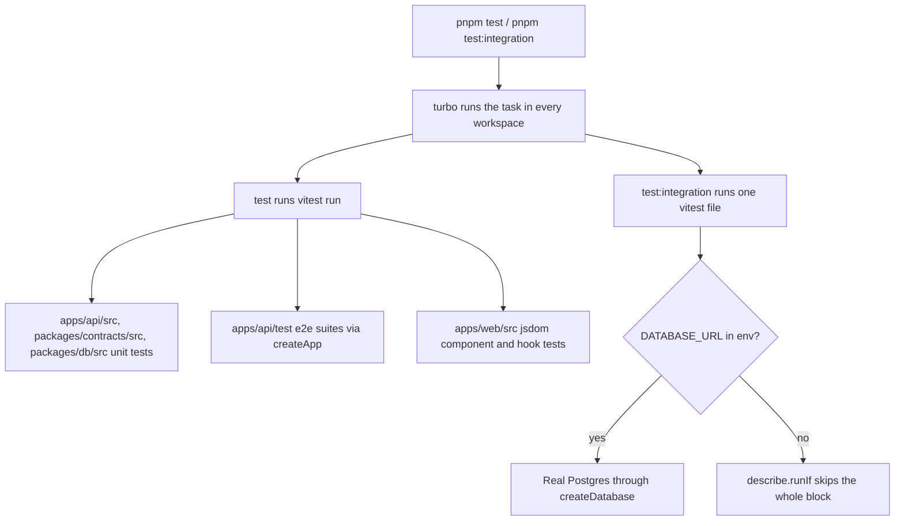
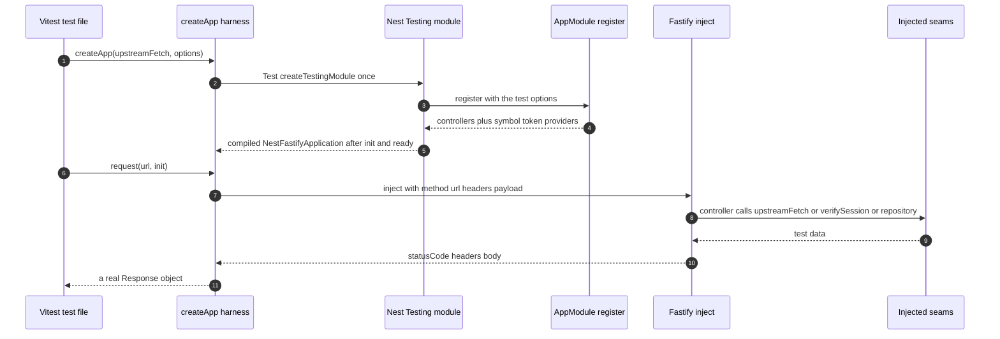

# Testing and Verification Stack

Everything in mota is verified by vitest, and vitest appears in exactly three
postures. The same runner executes a colocated unit test next to a pure module,
an end-to-end HTTP test that boots the real Nest module graph, and an
integration test that talks to a live PostgreSQL server. What separates the
postures is not the runner but the **seams**: the API's `AppModule.register`
accepts every external collaborator as an option, so a test can swap an
`upstreamFetch` mock, a `verifySession` stub, an in-memory repository, or a fake
clock without touching production code.

This page documents the stack itself. For what a specific suite asserts about
behavior, see [API Service](/openwiki/architecture/api-service.md),
[Database](/openwiki/architecture/database.md), and the workflow pages.



*The three postures: unit and e2e run unconditionally in `pnpm test`; the
Postgres layer is the same runner pointed at one file and gated on an
environment variable.*

## Task wiring and build ordering

The root `package.json` forwards to Turbo, which fans the task out to whichever
workspaces define it: `test` → `turbo run test`, `test:integration` →
`turbo run test:integration`. Three properties of `turbo.json` shape every run:

| Task | `dependsOn` | Cache / env |
|---|---|---|
| `build` | `^build` | outputs `dist/**` |
| `typecheck` | `^build` | no outputs |
| `check` | — | no outputs |
| `test` | `^build` | outputs `coverage/**` |
| `test:integration` | `^build` | `cache: false`, `env: ["DATABASE_URL"]` |

**`^build` is a hard prerequisite, not an optimization.** `apps/api` and
`packages/db` resolve `@mota/contracts` (and `apps/api` resolves `@mota/db`)
through the workspace symlink and the package manifest's `exports` map, which
points at `./dist`. Neither has a `paths` mapping. Until
`packages/contracts/dist` and `packages/db/dist` exist, a Node-side test cannot
even import the shared Zod schemas. The web app is the exception: its Vite alias
and `tsconfig.json` `paths` point straight at `packages/contracts/src`, so web
tests read contracts source regardless. The same ordering is reproduced by hand
in the `Dockerfile`, which compiles both packages with `tsc` before building
either app.

**`test:integration` is deliberately uncached.** `cache: false` means the task's
result is never stored in or replayed from `.turbo/cache` — a database round
trip happens every time the task is invoked, so a green hit can never stand in
for a fresh run. Declaring `env: ["DATABASE_URL"]` also folds the variable into
the task's hash, making explicit that this task's outcome is a function of which
database it pointed at. Every `test:integration` script in the repo still
depends on `^build` for the same `dist` reason.

Two neighboring tasks complete local verification: `pnpm typecheck`
(`tsc --noEmit` per workspace — `apps/api/tsconfig.json` includes `test/`, so
the e2e suites are typechecked too, and `packages/*/tsconfig.build.json` exclude
`*.test.ts` from `dist`) and `pnpm check` (per-workspace `biome lint`, which in
`apps/api` also covers `test` and `vitest.config.mts`).

## Layer 1 — colocated unit tests

`pnpm test` runs in all four workspaces. Each suite sits next to the module it
constrains and needs no harness:

| Suite | Pins down |
|---|---|
| `apps/api/src/auth/pkce.test.ts` | base64url verifier/state shape and the RFC 7636 appendix B `S256` vector |
| `apps/api/src/auth/sessionCookies.test.ts` | `__Host-` prefixing only for https origins, `Max-Age`/`HttpOnly`/`SameSite=Lax` serialization, never a `Domain` attribute, cookie header parsing |
| `apps/api/src/auth/supabaseJwt.test.ts` | local JWKS verification of a real signed token plus garbage-token rejection (see the fake below) |
| `apps/api/src/config/env.test.ts` | `loadEnv` defaults, the `DATABASE_*` → URL encoding, and that startup fails without database or Supabase credentials |
| `apps/api/src/transit/managedCatalog.test.ts` | single-flight cold load, atomic snapshot swap on refresh, stale-keep on refresh failure, and — with `vi.useFakeTimers()` — that the proactive refresh timer runs and is cleared by `stop()` |
| `packages/contracts/src/transitSettings.test.ts` | legacy selection-document migration (flat → two commute contexts, singular id → one-element list, dedupe) and the `MAX_SELECTED_BUS_STOPS` cap |
| `packages/db/src/schema.test.ts` | `user_settings` table name, the exact four-column order, and `auth_user_id` as the inline primary key |

`apps/api/vitest.config.mts` is the only API-side config and does two things:
`environment: "node"` and `include: ["src/**/*.test.ts", "test/**/*.test.ts"]`.
That include is why the e2e files and the Postgres integration file all belong
to the same `pnpm test` run — which is exactly what makes the
`describe.runIf` gate (below) load-bearing.

## Layer 2 — API e2e tests through the real Nest module

The e2e suites live in `apps/api/test/` and all go through one helper,
`createApp` in `apps/api/test/create-test-app.ts`.

### The harness



*One harness call compiles the actual `AppModule` graph and returns a fetch-like
`request()` that wraps Fastify's `inject` result in a standard `Response`.*

Three details matter when writing or debugging these tests:

1. **The application is real and lazily memoized.** `Test.createTestingModule`
   imports `AppModule.register({ ...options, upstreamFetch })`, compiles it,
   creates a `NestFastifyApplication` on a plain `FastifyAdapter`, calls
   `app.init()`, and awaits `app.getHttpAdapter().getInstance().ready()`. The
   resulting promise is stored in a closure and reused, so a test that issues
   five `request()` calls against one `createApp()` value is talking to **one**
   application instance — which is what lets the catalog-caching tests observe
   `upstream` being called exactly once across separate HTTP requests. Creating
   two `createApp()` values yields two independent applications.
2. **`request()` returns a real `Response`, not a Fastify payload.** The inject
   result's headers are copied into a `Headers` (array values are appended one
   by one, preserving repeated headers), and the body, `statusCode`, and merged
   headers are used to construct `new Response(...)`. That is why the tests can
   call `response.json()`, `response.status`, and crucially
   `response.headers.getSetCookie()` — the multi-cookie assertions in the auth
   suite depend on this fidelity.
3. **Request bodies are limited to `string` or `Buffer`.** Anything else is
   dropped rather than serialized, so JSON bodies are always passed as
   `JSON.stringify(...)` strings.

### The seams

The harness works only because `AppModuleOptions` is the composition root. Every
option a test needs is a first-class parameter of `AppModule.register`
(`apps/api/src/app.module.ts`): `upstreamFetch`, `verifySession`,
`settingsRepository`, `oauthConfig`, `now`, `subwayArrivalUpstream`, and the
`transitCatalog` knobs (`refreshMs`, `retryMs`, warmup, minimum item counts,
`random`). The defaults are chosen so a bare registration boots quiet and fails
loudly: `warmup` defaults to `false` (no timers, no warmup network), minimum
catalog items default to `1` (a one-row fixture passes the completeness gate),
and a missing repository or verifier throws a descriptive error instead of
returning empty data. Production `main.ts` passes the opposite values — warmup
on, 10,000 bus / 100 subway minimums, a real Drizzle repository — so the e2e
suites are exercising the same code paths under different knobs rather than a
special test build.

The three seams in practice:

- **`upstreamFetch`** — a `vi.fn()` standing in for `globalThis.fetch`. The
  transit suites assert on it *as an argument contract*: which URL was called,
  that `signal: expect.any(AbortSignal)` was passed (the adapters' timeout), and
  how many times.
- **`verifySession`** — the settings suite stubs it by regexing the user id out
  of the `mota-access` cookie, which keeps the HTTP boundary and the controller
  logic real while removing JWT/JWKS entirely. When it *throws*
  `SupabaseUnavailableError`, the suite proves the route maps that to `503
  AUTH_UPSTREAM_UNAVAILABLE` rather than treating the user as anonymous; when it
  calls `onSetCookie`, it proves rotated cookies are relayed on a `GET
  /api/settings`.
- **`settingsRepository`** — `MemorySettingsRepository` implements
  `@mota/db`'s `UserSettingsRepository` interface over a `Map`, throwing
  `SettingsVersionConflictError` when `expectedVersion` does not match. The
  suite can then assert per-user isolation, `409 SETTINGS_VERSION_CONFLICT`, and
  `400 INVALID_SETTINGS` with zero Postgres.

### The fake Supabase

`apps/api/test/fake-supabase.ts` is the reason the auth e2e suite is not a mock
of authentication. `startFakeSupabase()` starts a real `node:http` server on
`127.0.0.1` on an ephemeral port and:

- generates a **real ES256 keypair** with `jose`'s `generateKeyPair` and exports
  the public half as a JWK;
- serves `GET /auth/v1/.well-known/jwks.json` with that key under `kid:
  "test-key"`, `alg: "ES256"`, `use: "sig"`;
- serves `POST /auth/v1/token` for **both grants** the app uses — reading
  `grant_type` from the query (`pkce` and `refresh_token`) and returning a
  signed `access_token`, a random `refresh_token`, `expires_in: 3600`;
- records `POST /auth/v1/signout` bodies into a `signoutRequests` array, so the
  logout test can assert the exact refresh token that was revoked and that an
  anonymous logout calls nothing;
- exposes `signAccessToken({ sub, email?, expiresIn? })`, which signs with the
  private key, `iss` `${url}/auth/v1`, `aud` and `role` `authenticated`,
  matching what `verifyAccessToken` enforces.

Because the keys are real, the tests exercise **actual JWT semantics**: the app
fetches the JWKS over HTTP, performs real ES256 signature verification against
the real issuer/audience/role claims, and a token minted with
`expiresIn: -60` is genuinely expired and therefore reported as anonymous —
there is no stubbed verifier to drift from the production one. The same fake is
reused by the unit-level `src/auth/supabaseJwt.test.ts`, which targets
`verifyAccessToken` directly. Tests inject the fake via
`oauthConfig.supabaseUrl`, so the app builds its JWKS URL, its issuer, and its
token endpoint from the fake's address — nothing about Supabase is hardcoded in
the test.

### What the e2e suites pin down

- `app.e2e.test.ts` — the transit adapter boundary: normalization of Seoul BIS
  and subway proxy payloads, that nearby searches are served from **one cached
  complete catalog** while arrival lookups stay realtime, that a single pending
  catalog load is shared across concurrent requests (the test releases a manual
  promise to prove single-flight), that malformed upstream rows are dropped
  while valid ones survive, that stale cached stations are still served after
  the upstream fails, and the error taxonomy (`400 INVALID_LOCATION` /
  `INVALID_STATION`, `502 UPSTREAM_UNAVAILABLE`) plus `/api/health`'s
  non-gating `transitCatalogs` readiness report. It also pins the invariant that
  `updatedAt` is the adapter receipt time, not upstream `recptnDt`.
- `transit-catalog-fallback.e2e.test.ts` — the completeness gate. With
  `minimumBusCatalogItems: 2` and a one-row upstream payload, the complete
  catalog is rejected and the controller falls back to the location-scoped live
  lookup (`kiloMeter=0.8`). This is the only place the fallback is observable,
  because production sets the threshold to 10,000.
- `auth.e2e.test.ts` — anonymous probes, local cookie verification against the
  JWKS, expired-token rejection, the PKCE redirect URL and the three host-only
  flow cookies (`Max-Age=600`, `HttpOnly`, `SameSite=Lax`, no `Domain`), the
  full callback exchange setting five cookies (two session, three cleared
  flow), state-mismatch rejection, logout cookie clearing plus server-side
  revocation, refresh-cookie rotation, and `503 AUTH_UPSTREAM_UNAVAILABLE` when
  the auth endpoint is unreachable.
- `settings.e2e.test.ts` — the settings boundary with the in-memory repository
  and cookie stub described above.

## Layer 3 — Postgres integration tests

Two files run against a real database, and both are gated identically:

```ts
const databaseUrl = process.env.DATABASE_URL;
const integration = describe.runIf(Boolean(databaseUrl));
```

Without `DATABASE_URL`, vitest still **collects** the file — remember, the API's
`include` covers `test/**/*.test.ts` and `packages/db` uses vitest's default
discovery — but the `describe` body never runs, so it reports as skipped rather
than failing. `pnpm test` is therefore always green on a machine with no
database, and `pnpm test:integration` is the opt-in command that requires one.

`test:integration` is deliberately narrow. Each workspace's script names one
file:

- `@mota/db`: `vitest run src/repository.integration.test.ts` — repository-level:
  two uniquely-keyed users saved at version 1, `find` returning `null` for an
  unknown user, and a second `save` at a stale version rejecting with
  `SettingsVersionConflictError`.
- `@mota/api`: `vitest run test/settings.postgres.integration.test.ts` — the
  same persistence semantics but **through the HTTP boundary**, with
  `DrizzleUserSettingsRepository` injected as the `settingsRepository` and a
  stubbed `verifySession`. This is the only test that proves the controller's
  `409`/`200` behavior against the SQL the real repository emits.

Both construct the connection with `createDatabase(databaseUrl ?? "")` — the
same `postgres(..., { max: 5, prepare: false })` pool production uses — and both
clean up after themselves in `afterAll` by deleting the rows they created and
ending the client. Because rows are keyed `integration-${crypto.randomUUID()}`
and `api-integration-${crypto.randomUUID()}`, they never collide with each other
or with real users even when pointed at the shared `mota` database that
`home-server-infra` owns.

## Web tests in jsdom

`apps/web` has no `environment` in `vitest.config.ts`; it declares only
`setupFiles: ["./vitest.setup.ts"]` and `clearMocks: true`, with no `include`, so
vitest's default discovery picks up the suites. Every suite opts into the DOM
per file with a leading `// @vitest-environment jsdom` (or `/** ... */`)
docblock. The shared setup registers `@testing-library/jest-dom` matchers
(`toBeInTheDocument`, `toBeVisible`, `toHaveAttribute`, …) and unmounts the tree
in an `afterEach` cleanup.

Tests are colocated as `*.test.tsx` next to their subject: `src/App.test.tsx`,
`src/components/*.test.tsx` (`ArrivalList`, `SubwayArrivalList`, `MapStage`,
`MapCanvas`, `BrandHeader`, `GoogleLogin`, `AppErrorBoundary`), and
`src/hooks/*.test.tsx` (`useAuthSession`, `useTransitSelections`).

`src/App.test.tsx` is the integration-level suite and shows the house pattern
for the two problems jsdom cannot solve on its own:

```ts
const { mediaQueryState } = vi.hoisted(() => ({
  mediaQueryState: { matches: false },
}));
// ...
vi.mock("./hooks/useMediaQuery", () => ({
  useMediaQuery: () => mediaQueryState.matches,
}));
```

`vi.hoisted` runs before `vi.mock` is registered, so the plain object is shared
between the mock factory and the test body. Flipping
`mediaQueryState.matches = true` inside a test switches `App`'s
`useMediaQuery("(min-width: 960px)")` to the desktop layout without needing a
jsdom `matchMedia` implementation — which is how `keeps the map visible on
desktop` and `keeps the map closed on mobile until the user opens it` are both
asserted from one file. The same file replaces `MapStage` with a
`<section data-*>` stub that exposes test buttons for selecting stops and
stations (keeping Leaflet out of the DOM tree), stubs `useAuthSession` to a
static anonymous session, and **partially** mocks `./api/client` with
`importOriginal` so only `fetchArrivals`/`fetchSubwayArrivals` become spies
while the rest of the module stays real.

Deeper down the same idea repeats: `MapStage.test.tsx` stubs `MapCanvas`,
`MapCanvas.test.tsx` stubs `react-leaflet` entirely (with a hand-built fake map
object exposing `getCenter`, `setView`, `invalidateSize`), and
`useAuthSession.test.tsx` uses `vi.stubGlobal("fetch", fetchMock)` and
`vi.unstubAllGlobals()` in `afterEach` to test the hook against synthetic
`Response` objects. Assertions are made through roles and accessible names
(`getByRole("tab", { name: "출근" })`), which is what keeps the a11y contract
testable.

## What is *not* in the suite

Two gaps are worth naming so they are not assumed away:

- **No browser e2e.** `apps/web/package.json` declares `"test:e2e": "playwright
  test"` and a `@playwright/test` devDependency, and the root `package.json`
  forwards `pnpm test:e2e` to it — but the repository contains **no Playwright
  config and no spec file**. The script as written cannot pass. Browser-level
  end-to-end coverage is provided by the API e2e layer (real HTTP boundary) plus
  the jsdom component suites, not by Playwright.
- **No CI pipeline runs the tests.** The only GitHub workflow is the scheduled
  OpenWiki documentation update. `pnpm typecheck`, `pnpm check`, `pnpm test`,
  `pnpm test:integration`, and `pnpm build` (the list in `README.md`) are local
  commands, so a change is verified only by whoever runs them.

## Adding a test

The conventions fall out of the above:

- Unit-test a pure module by dropping `foo.test.ts` beside `foo.ts`; it is
  discovered and typechecked automatically in that workspace.
- For a new API route, write an e2e test under `apps/api/test/` using
  `createApp` and drive it with `app.request(...)`; inject fakes through
  `AppModuleOptions`, never by monkey-patching a controller's imports. Assert
  both the JSON `error` code and the upstream call arguments.
- To test a route against real persistence, add to
  `test/settings.postgres.integration.test.ts` or create a sibling that follows
  the `describe.runIf(Boolean(process.env.DATABASE_URL))` pattern, key test rows
  with `crypto.randomUUID()`, clean up in `afterAll`, and run it with
  `pnpm test:integration` while `DATABASE_URL` points at a disposable database.
- For a web component, colocate `*.test.tsx` with a `@vitest-environment jsdom`
  docblock, mock only the leaves (`react-leaflet`, `api/client` fetchers,
  `useMediaQuery`), and query by role.

See [Authentication](/openwiki/workflows/authentication.md) for the flows the
auth e2e suite encodes, [Settings sync](/openwiki/workflows/settings-sync.md)
for the version-conflict protocol the settings suites pin, and
[Database](/openwiki/architecture/database.md) for the repository contract both
integration files exercise.
