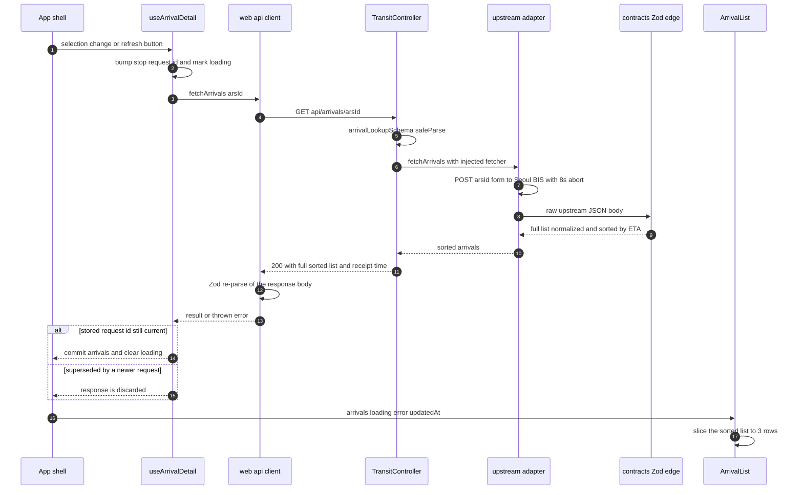
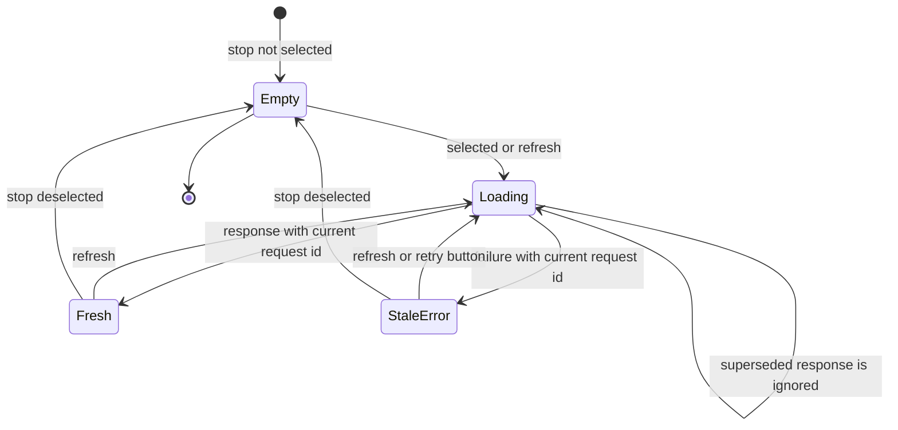

# Arrival Display and Refresh

Everything between "the user picked a stop/station" and "three rows with a
ticking number" is one lifecycle. `App` mode-gates the selection
(`activeStops = mode === "bus" ? selectedStops : []`, `activeStation =
mode === "subway" ? selectedStation : null`) and hands those two values to
`useArrivalDetail` (`apps/web/src/hooks/useArrivalDetail.ts`), the single owner
of arrival request state. The hook fetches on selection change and on explicit
refresh — **there is no polling anywhere in this chain** — and the components
only render what it committed. This page walks one refresh end to end, then the
invariants that make it safe.

## The two trigger paths

| Trigger | Bus | Subway |
|---|---|---|
| Selection change | the reconcile effect fetches only stops that have **no** entry yet (`!busDetailsRef.current.has(stop.id)`) | the station effect calls `fetchSubwayDetail` whenever `selectedStation` changes identity, and resets to `EMPTY_SUBWAY` when it is `null` |
| Manual `새로고침` | `refreshBusDetail()` re-fetches **every** currently watched stop | `refreshSubwayDetail()` re-fetches the one selected station |
| Mode switch | switching to subway passes an empty `selectedStops`, so the reconcile effect **deletes** all bus entries; switching back re-fetches from scratch | switching to bus passes `null`, which bumps the subway counter and clears the detail |

Two consequences are easy to miss. First, the per-stop refresh button in
`ArrivalList` is labeled `{stopName} 버스 도착정보 새로고침` but its handler is
`refreshBusDetail`, which loops over `stopsRef.current` — pressing any stop's
refresh refreshes all watched stops at once. Second, `App` renders
`<SubwayArrivalList key={selectedStation.id} …>`, so a station change remounts
the component and resets its local `selectedDirection` state.

## One refresh, end to end



*One bus arrival refresh: per-stop counter bump, live upstream call, Zod
normalization, race-guarded commit, and the presentation-boundary slice. The
subway path is identical in shape with `fetchSubwayArrivals` and a single
counter instead of a per-stop map.*

## Per-stop request state

Bus detail state is keyed **per stop id** in a `Map`:

```ts
interface BusDetailState {
  readonly arrivals: readonly BusArrival[];
  readonly loading: boolean;
  readonly error: string | null;
  readonly updatedAt: string | null;
}
```

The hook keeps this state twice on purpose: `busDetailsRef` (a `useRef` Map) is
the read path inside callbacks so consecutive fetches always see the freshest
entry without stale-closure bugs, and `busDetails` (a `useState` Map) is the
render path. `writeBusDetail` mutates the ref and then calls
`setBusDetails(new Map(busDetailsRef.current))` — a fresh Map object every
write, because mutating a state-held Map would not re-render. `readBusDetail`
returns the `EMPTY_BUS` constant (`{arrivals: [], loading: false, error: null,
updatedAt: null}`) for unknown ids, so a not-yet-fetched stop renders the
skeleton rather than throwing.

Subway is a single `SubwayDetailState` object with the same four fields,
because exactly one station can be selected.

## The race guards

Two counters, one shape of rule: **a response is committed only if its counter
is still the latest one issued for that target.**

- `busRequests: useRef(new Map<BusStop["id"], number>())` — per-stop,
  monotonically increasing. `fetchBusDetail` does
  `const request = (busRequests.current.get(stop.id) ?? 0) + 1;
   busRequests.current.set(stop.id, request)` before awaiting, and after the
  `await` checks `busRequests.current.get(stop.id) === request` on **both** the
  success and the `catch` branch.
- `subwayRequest: useRef(0)` — a single counter for the one station.
  `fetchSubwayDetail` does `subwayRequest.current = subwayRequest.current + 1`
  and checks `subwayRequest.current === request` after awaiting.

Because the counter is bumped *synchronously before* the request is issued and
*monotonically*, any later-started fetch for the same target makes every
earlier in-flight response unverifiable — a slow first response can never
overwrite the result of a fast second one. The guard covers the error path too:
a stale failure must not raise an error banner over newer good data.

Two lifecycle events exploit the same mechanism:

- **Deselection.** The reconcile effect deletes `busDetailsRef` **and**
  `busRequests` entries for stops no longer in `selectedStops`. A deleted
  counter makes `busRequests.current.get(stop.id)` return `undefined`, so an
  in-flight response for a just-unwatched stop is discarded rather than
  resurrecting a row the user removed.
- **Clearing the station.** The subway effect does
  `subwayRequest.current += 1` before `setSubwayDetail(EMPTY_SUBWAY)`, so the
  previous station's late response cannot repopulate a cleared screen.

`useInlineMapSearch` uses the same counter idiom for candidate searches; it is
a repo-wide pattern, not an arrival-specific trick.

## Error retention: refresh must not erase the last success

`DESIGN.md` §1 makes it a success criterion ("네트워크 실패 시 기존 선택을 지우지
않고 같은 위치에서 다시 시도할 수 있습니다") and §5 a component contract
("새로고침 중에도 직전 성공 결과가 있다면 지우지 않는다"). The hook satisfies both
by never writing a state object that omits the previous rows:

```ts
// starting a fetch — keep arrivals and updatedAt, drop only the error
writeBusDetail(stop.id, { ...readBusDetail(stop.id), loading: true, error: null });
// failing a fetch — keep arrivals and updatedAt, set only the error
writeBusDetail(stop.id, { ...readBusDetail(stop.id), loading: false, error: BUS_ERROR });
```

Only the success branch replaces the whole object (new `arrivals`, new
`updatedAt`, `error: null`, `loading: false`). `fetchSubwayDetail` is the same,
using the functional form `setSubwayDetail(current => ({ ...current, loading:
true, error: null }))`.

So during a refresh the previous three rows stay on screen under the skeleton
logic, and after a failure they stay on screen under a `role="alert"` block
with a `다시 시도` button. `updatedAt` is retained too, so the polite status
line keeps reporting `{HH:mm}에 새로 받았어요.` for the last *successful*
receipt. The components render the error block and the rows together — there
is no either/or.

Failures are deliberately untyped at this layer. `fetchBusDetail` /
`fetchSubwayDetail` use a bare `catch {}`, collapsing HTTP 502s, network
refusals, client-side aborts at the 8-second deadline, **and Zod re-parse
failures** into one fixed Korean sentence (`BUS_ERROR` /
`SUBWAY_ERROR`, both "…불러오지 못했습니다. 연결을 확인하고 다시 시도해 주세요.").
The arrival screens have no service-area nuance to surface, so the distinction
the API makes is intentionally discarded here.

## The lifecycle as a state machine



*Per-stop bus detail state. `StaleError` still holds the last successful
`arrivals` and `updatedAt`; only `error` is set. Subway uses the same states
with one object instead of a map.*

## The two live endpoints

`GET /api/arrivals/:arsId` and `GET /api/subway/arrivals` are the only transit
routes that hit an upstream on **every** request. Unlike `GET /api/stops/nearby`
and `GET /api/subway/nearby`, which are answered from `TransitCatalogService`'s
in-memory `ManagedCatalog` snapshots, neither arrival handler touches the
catalog service — they use only the injected `API_OPTIONS` fetcher and upstream
base:

- `busArrivals` validates `paramsValue` with `arrivalLookupSchema` (the branded
  five-digit `ArsIdSchema`; a failure is 400 `INVALID_ARS_ID`), calls
  `fetchArrivals(this.options.upstreamFetch, params.data.arsId)`, and wraps the
  result as `{ arrivals, updatedAt: new Date().toISOString() }`.
- `subwayArrivals` validates `queryValue` with `subwayArrivalLookupSchema`
  (station trimmed, 1–20 chars; a blank is 400 `INVALID_STATION`), and returns
  `fetchSubwayArrivals(this.options.upstreamFetch,
  query.data.station, this.options.subwayArrivalUpstream)` unchanged.

Both adapters bound the call with `signal: AbortSignal.timeout(8_000)` — the
only latency bound in the system, with no retry or circuit breaker. A non-2xx
upstream status becomes `UpstreamError`, and *anything* thrown (timeout,
refusal, Zod rejection, an upstream row missing the strict `updnLine` key)
funnels through `TransitController.upstreamError` into one shape: HTTP 502
`{ error: "UPSTREAM_UNAVAILABLE", message, detail: errorDetail(error) }`. The
e2e suite pins the never-cached property directly: two consecutive
`/api/arrivals/25162` requests produce exactly two upstream calls.

On the browser side, `apps/web/src/api/client.ts` `getJson` applies its own
8-second `AbortSignal.timeout` and re-parses every body with Zod
(`arrivalsResultSchema`, `subwayArrivalsResultSchema` — both requiring
`updatedAt` to be `z.string().datetime()`), so a malformed API response fails
loudly at the boundary and lands in the hook's `catch` instead of poisoning
React state.

## `updatedAt` is receipt time, never upstream data time

The single most fragile invariant in this feature.

`normalizeSubwayArrivals` (`packages/contracts/src/subway.ts`) already computes
an `updatedAt` from the **max `recptnDt`** across rows, converted from Seoul
local time to an ISO instant. The adapter then throws it away:

```ts
const normalized = normalizeSubwayArrivals(await response.json());
// `updatedAt` must be the adapter receipt time (like the bus route), not
// the upstream `recptnDt` data time: the 90-second freshness rule and the
// countdown `elapsed` both key on it, and upstream data timestamps can lag
// receipt by minutes, marking fresh data stale and dropping imminent trains.
return { arrivals: normalized.arrivals, updatedAt: new Date().toISOString() };
```

The reason is arithmetic, not taste. Both the 90-second expiry rule and the
countdown subtract `updatedAt` from `Date.now()` **in the browser**. Seoul's
`recptnDt` can lag the moment mota actually received the payload by minutes, so
keying on it would make a just-fetched response already look minutes old —
every imminent train would instantly read as expired and flip to
`새로고침 필요`. The bus route applies the same rule from the other side: the
**controller** stamps `updatedAt: new Date().toISOString()` around the
normalized list, because `fetchArrivals` returns only the array and has no
per-row timestamp to be tempted by.

Everything downstream — `useElapsedSeconds`, `subwayEtaDisplay`, the
`{HH:mm}에 새로 받았어요.` status line formatted in `Asia/Seoul` — is therefore
a statement about *when mota heard it*, which is the only thing the client can
count down from.

## The elapsed countdown

`useElapsedSeconds(updatedAt)` (`apps/web/src/hooks/useElapsedSeconds.ts`):

1. Holds `now` in state and re-syncs it to `Date.now()` inside the effect, so a
   new `updatedAt` immediately recomputes elapsed rather than waiting for the
   next tick.
2. Starts a 1-second `window.setInterval` **only while `updatedAt !== null`**
   and clears it on unmount or on the next `updatedAt` change — there is no
   ticking at all before the first successful receipt.
3. Returns `0` when `updatedAt === null` (nothing can expire before a receipt
   exists) and otherwise `Math.max(0, Math.floor((now - new Date(updatedAt).getTime()) / 1_000))`,
   clamped so a clock skew backwards cannot produce a negative elapsed.

`subwayEtaDisplay(seconds, message, elapsedSeconds)`
(`apps/web/src/domain/subwayEta.ts`) consumes it with a 90-second grace:

- `expired = seconds !== null && elapsedSeconds > seconds + 90`. An expired row
  returns `{ remainingSeconds: null, message: "새로고침 필요" }`.
- A live row returns `Math.max(0, seconds - elapsedSeconds)`, so the countdown
  reaches `곧 도착` and stops at zero rather than going negative.
- A relative upstream message matching `\d+\s*(?:분|초).*후` is relabeled
  `도착 예상`, because the stale literal ("3분 후") would contradict the
  ticking number beside it.

Expiry can only fire for rows that *had* a numeric ETA. A row that arrived as
`seconds: null` (`운행 종료`, `[7]번째 전역`) shows `정보 없음` plus its original
message indefinitely — it was never a promise. Because there is no polling,
this grace window is the only mechanism that tells the user the number on
screen has stopped being trustworthy.

**This countdown is subway-only.** `ArrivalList` renders
`formatEta(arrival.first.seconds, arrival.first.message)` directly from the
server value with no elapsed adjustment; bus ETAs are static text until the
next refresh.

## Direction filter, then the three-row slice

The subway list derives its direction tabs **from the arrivals actually
observed**, not from a fixed table:

```ts
const directionKey = (arrival) => `${arrival.subwayId}:${arrival.updnLine}`;
// directions: first-appearance order of distinct keys
// activeDirection: selectedDirection if it still exists, else directions[0].key
const visibleArrivals = activeDirection === null
  ? []
  : arrivals.filter((a) => directionKey(a) === activeDirection).slice(0, 3);
```

`directions[0]` is the direction of the **earliest train**, because the server
already sorted by `seconds` ascending before the client ever saw the data —
this is what satisfies `DESIGN.md`'s "가장 이른 도착이 속한 방향을 기본 선택한다"
without any client-side sorting. When the selected direction disappears from a
new response, `activeDirection` silently falls back to `directions[0]` instead
of leaving the user on an empty tab.

The tabs form a `role="tablist"` labeled `지하철 방향 선택`, grouped by line,
with `ArrowUp` for `상행`, `ArrowDown` for `하행`, `ArrowRight` otherwise.
ArrowLeft/Right/Up/Down plus Home/End both change the selection and move DOM
focus to `direction-tab-${key}`.

The cap itself lives **only** in the components, exactly as `AGENTS.md` states
("Transit rows are limited to three only at the presentation boundary"):

- `ArrivalList` renders `arrivals.slice(0, 3)`.
- `SubwayArrivalList` filters to the active direction and **then** `.slice(0, 3)`
  — the cap is per direction, not per station.

The API returns the full sorted list; no adapter, normalizer, or controller
truncates. Moving the limit upstream would break silently: the direction tabs
are derived from observed arrivals, so a truncated list would hide entire
directions, and the `directions[0]` default would become the earliest of
whatever three rows happened to survive.

## Manual refresh

Both lists render `RefreshCw` plus the text `새로고침` (never an icon alone),
`disabled={loading}`, with `aria-label` `"{stopName} 버스 도착정보 새로고침"` /
`"지하철 도착정보 새로고침"`. A polite `aria-live` paragraph reports
`도착 정보를 새로 받고 있어요.` while loading, `{HH:mm}에 새로 받았어요.` after a
success, or the mode-specific hint sentence before any selection. The error
block's `다시 시도` button calls the same `onRefresh`, so retry and refresh are
one code path. The disabled state prevents a duplicate in-flight request for
the same target from the same button, and the request counter makes even that
harmless.

## Configuration and operations

- `SUBWAY_ARRIVAL_UPSTREAM` (env, default `https://k-skill-proxy.nomadamas.org`)
  overrides **only the origin**; the adapter always appends
  `/v1/seoul-subway/arrival`. It is validated as a URL by the env schema,
  flows through `ApiOptions.subwayArrivalUpstream`, and is overridable per test
  app via `AppModuleOptions.subwayArrivalUpstream`.
- `apiStationName` aliases the three known OSM/API name mismatches
  (`천호` → `천호(풍납토성)`, `군자` → `군자(능동)`, `총신대입구` →
  `총신대입구(이수)`) **inside the adapter, before** the upstream URL is built,
  so the saved short OSM name never reaches Seoul's API.
- Timeouts: 8 s upstream abort in both adapters, 8 s client abort in `getJson`.
  No retry, no backoff, no caching — a slow or dead upstream surfaces as a 502
  and then as the Korean retry sentence.
- The service worker never caches `/api/*`, so these live endpoints stay live
  even in the installed PWA.

## Extension points

- Adding a third transit mode means a third detail state plus its own counter
  in `useArrivalDetail`, a mode gate in `App`, and a component that does its
  own filtering before the slice. The counter idiom is the part to keep.
- Adding polling would remove the need for the 90-second grace but must keep
  the counter guard and the retention spread, or rapid ticks would reintroduce
  the race the guard exists to prevent.
- Raising the three-row cap is a one-line change in each component — but only
  if it stays out of the adapters, or the subway direction derivation breaks.

## Tests that pin this behavior

- `apps/web/src/App.test.tsx` — two stops watched at once each get their own
  refresh button and their own fetch (`25014` and `25015`); toggling one off
  removes only its list; the subway selection exposes the direction tablist;
  selections are independent per commute context.
- `apps/web/src/components/ArrivalList.test.tsx` — a fourth bus row never
  renders; refresh fires from the labeled control; after a failed refresh the
  rows are still present and `다시 시도` still works.
- `apps/web/src/components/SubwayArrivalList.test.tsx` — with fake timers, a
  180-second ETA counts down to `1분`, relabels to `도착 예상`, and after the
  grace window flips to `정보 없음` + `새로고침 필요`; the active direction is
  selected by default, a fourth same-direction train is hidden, an
  opposite-direction train is excluded, and switching tabs swaps the rows;
  arrow keys move both selection and focus.
- `apps/api/test/app.e2e.test.ts` — bus arrivals POST `arsId=…` to
  `m.bus.go.kr` on **every** request (never catalog-cached); the subway
  response's `updatedAt` is within ±10 s of now rather than the fixture
  `recptnDt`; the upstream URL carries the aliased station name; a row missing
  `updnLine` and a rejected proxy both yield 502 `UPSTREAM_UNAVAILABLE`; a
  blank station yields 400 `INVALID_STATION` with no upstream call.
- `apps/web/src/api/client.test.ts` — the browser-side Zod re-parse of arrival
  payloads and `updatedAt`, including rejecting a body missing `subwayId`.

## Related pages

- [Web App](/openwiki/architecture/web-app.md) — where these components mount,
  the mode gating that feeds the hook, and the design constraints the rows obey.
- [Transit Arrival Domain Models](/openwiki/concepts/transit-arrivals.md) — the
  Zod edge, the `barvlDt: "0"` quirk, message parsing, and the receipt-time
  chain this page consumes.
- [Seoul Upstream Data Sources](/openwiki/integrations/seoul-upstreams.md) —
  the exact URLs, methods, timeouts, and `UpstreamError` → 502 taxonomy behind
  the two live adapters.
- [Stop Discovery](/openwiki/workflows/stop-discovery.md) — the catalog-served
  nearby search that produces the selection feeding this flow.
