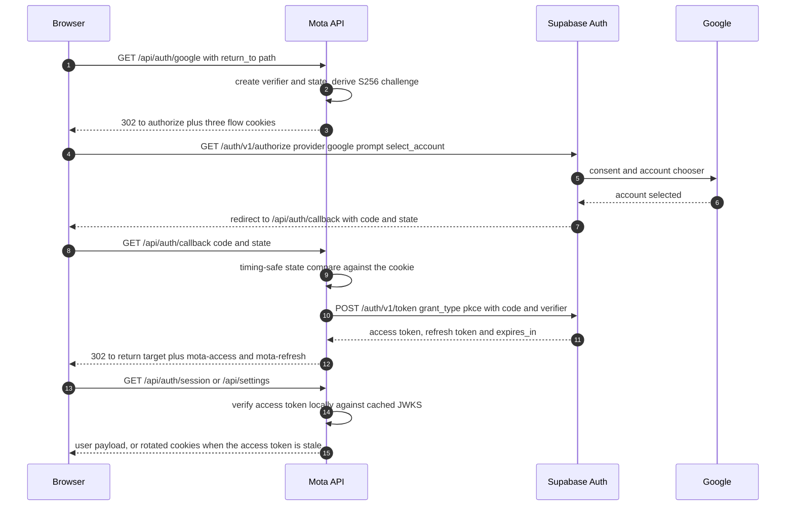
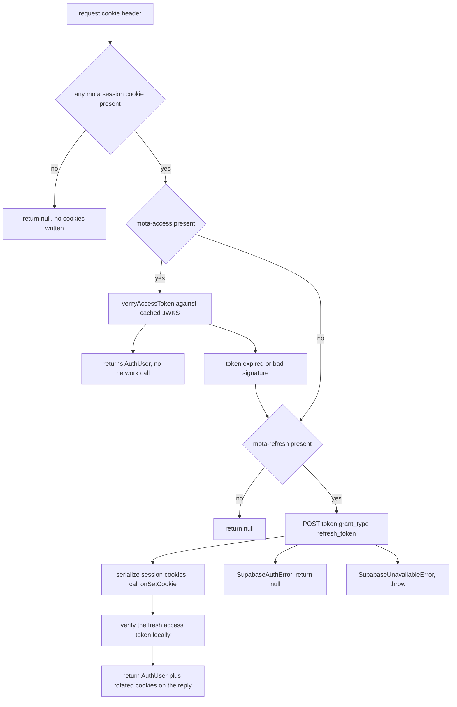

# Google Login and Session Verification

Mota runs its own Google login instead of borrowing a session from another
service. The comment at the top of `apps/api/src/auth/oauth.controller.ts`
states the reason plainly: the shared auth-gateway keeps its session cookies
host-only, so those cookies never arrive at mota's origin — there is nothing to
forward. Mota therefore starts an authorization-code + PKCE flow against the
shared Supabase project, exchanges the one-time login code for **its own**
host-only cookies, and verifies those cookies itself on every subsequent
request. The whole flow lives in `apps/api/src/auth/`:

| Concern | Module | Talks to Supabase? |
|---|---|---|
| Route surface (`google`, `callback`, `logout`) | `oauth.controller.ts` | via the client |
| PKCE material | `pkce.ts` | no |
| Cookie names, attributes, lifetimes | `sessionCookies.ts` | no |
| Session verification + refresh rotation | `session.ts` | only when rotating |
| Local JWT verification | `supabaseJwt.ts` | JWKS only |
| Token exchange / refresh / revoke | `supabaseClient.ts` | yes |

Two invariants from `AGENTS.md` govern everything below: session cookies are
host-only `__Host-mota-access` / `__Host-mota-refresh` with never a `Domain`
attribute and never forwarded to another service; and token verification is
local JWKS (ES256, issuer, audience, `role=authenticated`) with no per-request
gateway call. The identity object that survives the flow is only
`{ sub, email? }` from `packages/contracts/src/auth.ts` — no local user record
exists anywhere.

## The flow end to end

*Google login in one pass: mota mints and stores the PKCE secret itself, Supabase
(and Google behind it) only ever sees the derived challenge and the one-time
code, and the browser ends up with exactly two session cookies scoped to mota's
own origin.*

Note what mota never does: it never fetches `/auth/v1/authorize` itself — the
API builds the URL and hands it back as a 302 `Location`, so the browser carries
the redirect (and Google's cookies) through Supabase. And the authenticated
request leg at the end performs **no** Supabase call at all.

## Step 1 — `GET /api/auth/google`: PKCE material in flow cookies

`OAuthController.startLogin` does four things in order:

1. **Validates `return_to`.** `returnPath()` accepts `undefined`/`""` as `/` and
   otherwise requires a same-site path — a string starting with `/` but not with
   `//` (`isSameSitePath`). Anything else, e.g. `https://evil.example/`, is a
   `400` before any state is created, so an open redirect can never be smuggled
   into the flow.
2. **Generates the PKCE pair.** `generateCodeVerifier()` and
   `generateOAuthState()` each return `randomBytes(32).toString("base64url")` —
   43-character tokens; `computeCodeChallenge()` hashes the verifier with
   SHA-256 and base64url-encodes the digest. `apps/api/src/auth/pkce.test.ts`
   pins the derivation against the RFC 7636 appendix B test vector, so the
   challenge format is normative, not incidental.
3. **Writes three flow cookies** (`mota-oauth-verifier`, `mota-oauth-state`,
   `mota-return-url`) with a 600-second `Max-Age` — short enough that an
   abandoned login attempt cleans itself up, long enough to cover a human
   choosing an account at Google.
4. **Builds the authorize URL** at
   `${SUPABASE_URL}/auth/v1/authorize?provider=google&prompt=select_account`
   with `redirect_to=${PUBLIC_URL}/api/auth/callback?state=<state>`,
   `code_challenge=<challenge>` and `code_challenge_method=S256`, returned as a
   302.

`prompt=select_account` is deliberate: Google always shows its account chooser
instead of silently reusing the last account, which matters for a shared
Supabase project that may hold several Google identities.

The `state` travels twice — once inside `redirect_to` (Supabase echoes it back
on the callback) and once in the `mota-oauth-state` cookie. The callback treats
the cookie as the source of truth and compares.

## Step 2 — `GET /api/auth/callback`: verify, exchange, swap cookies

`completeLogin` reads `code` and `state` from the query and the verifier plus
expected state from the cookie header. If **any** of them is missing, or the
state does not match, it clears all three flow cookies and throws `401
AUTH_CALLBACK_INVALID` (`로그인을 다시 시작해 주세요.`). The comparison is
`secureEqual`, a length check followed by `crypto.timingSafeEqual`, so a forged
state is compared in constant time and unequal lengths are rejected without
throwing.

With the state proven, the controller calls
`new SupabaseAuthClient(config).exchangeCode(code, verifier)` — a `POST
${SUPABASE_URL}/auth/v1/token?grant_type=pkce` with `{ auth_code,
code_verifier }`. Two failure branches differ in an important way:

- `SupabaseAuthError` (Supabase answered "no") → clear the flow cookies and
  throw the same `401 AUTH_CALLBACK_INVALID`. The one-time code is consumed;
  the user must restart login.
- Anything else, i.e. `SupabaseUnavailableError` from a failed fetch or the
  10-second `AbortSignal.timeout`, is **rethrown untouched**. Nest maps it to a
  500 and the flow cookies are *not* cleared — a Supabase blip at this instant
  does not burn the flow.

On success the reply carries five `set-cookie` headers: three that expire the
flow cookies (`Max-Age=0`) and two that install the session. The redirect
target is the `mota-return-url` cookie value if it is still a same-site path,
otherwise `/` — the return target is re-validated here too, so a tampered
return cookie cannot redirect cross-site either.

The session handed back by Supabase is parsed by a strict Zod schema
(`access_token`, `refresh_token`, `expires_in` positive int, `token_type`);
`serializeSessionCookies` turns `expires_in` into the access cookie's `Max-Age`
and gives the refresh cookie a fixed 30-day `Max-Age`, so the browser cookie
lifetime and the JWT expiry track each other with no server-side session table.

## The five cookies

`sessionCookies.ts` is the single source of truth for names, attributes and
lifetimes:

| Cookie | Purpose | `Max-Age` |
|---|---|---|
| `__Host-mota-access` | Supabase access token (JWT) | `session.expires_in` (typically 3600 s) |
| `__Host-mota-refresh` | Supabase refresh token | 2 592 000 s (30 days) |
| `__Host-mota-oauth-verifier` | PKCE code verifier | 600 s |
| `__Host-mota-oauth-state` | CSRF state | 600 s |
| `__Host-mota-return-url` | post-login return target | 600 s |

The `__Host-` prefix is applied **only** when `secureCookies(publicUrl)` is
true, i.e. when `PUBLIC_URL` is an `https:` origin. Plain-HTTP development uses
the unprefixed names (`mota-access`, …) because the `__Host-` prefix requires
`Secure`, which requires TLS. Both variants share every other attribute:
`HttpOnly`, `SameSite=Lax`, `Path=/`, `Secure` when applicable, and — the rule
that makes them host-only — **no `Domain` attribute at all**. `Lax` is what
permits the top-level GET redirects of the OAuth round trip while still
blocking cross-site POSTs.

Production runs behind the Cloudflare tunnel with `PUBLIC_URL:
https://mota.m16khb.xyz` (`compose.yaml`), so real deployments always use the
prefixed names; the unit suite asserts both variants byte-for-byte, including
`expect(cookie).not.toContain("Domain=")`.

## Step 3 — every authenticated request: `verifySupabaseSession`

`verifySupabaseSession(cookieHeader, { config, onSetCookie })` in
`apps/api/src/auth/session.ts` is the single decision point for session state.
Its precedence is strict and order matters:

*Verification precedence: a valid access token short-circuits everything;
otherwise the refresh cookie rotates the session server-side and relays the new
cookies through the caller's `onSetCookie` callback.*

Three consequences of this ordering:

- **The hot path is free.** A request with a valid access cookie costs zero
  network round trips. The only network work ever done for verification is the
  JWKS fetch inside `jose`'s resolver, cached per URL for the process lifetime
  and refreshed on unknown `kid` — which is what makes Supabase key rotation
  work without a deploy.
- **Rotation is a side effect of verification.** The fresh cookie strings are
  handed to `options.onSetCookie?.(...)`, and the controller supplies
  `reply.header("set-cookie", [...cookies])` — in `AuthController.session` and
  in `SettingsController.requireUser`. So `/api/settings` can rotate the session
  mid-read; the caller's browser gets the new cookies along with the settings
  payload, and no separate refresh endpoint exists.
- **A refresh that mints an unverifiable token is an outage, not anonymity.**
  `session.ts` verifies the *newly minted* access token locally and throws
  `SupabaseUnavailableError` if it fails to verify — a token signed seconds ago
  should verify, so failure means broken keys or a misconfigured issuer.

Local verification rules (`verifyAccessToken` in `supabaseJwt.ts`): ES256 only,
issuer `${supabaseUrl}/auth/v1` (derived from the same base URL the client
uses, so they cannot disagree), audience `authenticated`, `role` claim
literally `"authenticated"`, `sub` required, `email` optional, 5 s clock
tolerance. Any `jose` error — whose `code` starts with `ERR_` — returns `null`;
only a non-jose failure (network) becomes `SupabaseUnavailableError`. See
`/openwiki/integrations/supabase.md` for the full taxonomy.

## From verdict to HTTP response

`AuthController` (`GET /api/auth/session`) and `SettingsController.requireUser`
translate the verdict identically, differing only in what `null` means:

| `verifySupabaseSession` result | `/api/auth/session` | `/api/settings` |
|---|---|---|
| `AuthUser` | `200 { authenticated: true, user }` (+ rotated cookies if any) | proceeds, keyed by `user.sub` |
| `null` | `200 { authenticated: false }` | `401 AUTH_REQUIRED` |
| throws `SupabaseUnavailableError` | `503 AUTH_UPSTREAM_UNAVAILABLE` | `503 AUTH_UPSTREAM_UNAVAILABLE` |

Refusing to render an outage as "logged out" is a product decision: silently
degrading an authenticated user to anonymous risks `useTransitSelections`
overwriting their server settings with the local document.

When `AppModule.register` receives no `oauthConfig`, `SESSION_VERIFIER` falls
back to a verifier that throws `"Supabase auth is not configured."` and
`AUTH_CONFIG` is `null`, so `OAuthController.requireConfig()` turns every login
attempt into `503 AUTH_NOT_CONFIGURED`. Tests that do not care about auth can
never observe a half-working login.

## Logout: clear first, revoke best-effort

`POST /api/auth/logout` reads both session cookies, **immediately** replies
with two `Max-Age=0` `set-cookie` headers, and only then — and only if *both*
access and refresh cookies were present — calls
`SupabaseAuthClient.revokeSession(accessToken, refreshToken)` (`POST
/auth/v1/signout` with `{ refresh_token }`). Every failure from that call is
swallowed; a Supabase outage cannot make logout fail. The source comment states
the trade-off: the cookies are already gone, so the worst case is a
Supabase-side session that outlives them. An anonymous logout (no cookies)
still returns `200 { status: "ok" }` with the two clearing headers and makes no
network call at all — asserted directly via the fake's `signoutRequests` array.

### The web side flips optimistically

`apps/web/src/hooks/useAuthSession.ts` exposes `{ authenticated, checked, user,
error, logout }`:

- On mount it fetches `/api/auth/session` once with `credentials: "include"`
  and an 8-second abort, parses the body with
  `authSessionResponseSchema` (the Zod discriminated union in
  `packages/contracts/src/auth.ts`), and sets `checked: true`. A rejected fetch
  or a non-OK response is recorded as `error:
  "로그인 상태를 확인하지 못했습니다."` while staying `authenticated: false` —
  the `error` field is the only thing distinguishing a genuinely anonymous
  visitor from a failed session check, and the tests pin exactly that
  difference.
- `logout()` calls `setSession(ANONYMOUS_SESSION)` **before** awaiting the
  `POST /api/auth/logout`, so the UI is anonymous immediately rather than after
  a multi-second round trip. The fetch failure is swallowed with the documented
  consequence that the session may be restored on the next load.
- `App` wires `session.logout` into `BrandHeader` → `GoogleLogin`, which
  renders one of three states: `로그인 확인 중` while `!checked`, an account
  chip with the email (falling back to `로그인됨`) plus a `로그아웃` button, or
  a `Google로 로그인` link to
  `/api/auth/google?return_to=${encodeURIComponent(window.location.pathname +
  window.location.search)}` — the current view, so login lands back where the
  user was.

The PWA service worker bypasses its cache for any `/api/` path
(`apps/web/public/sw.js`), so session probes, callbacks and logout always reach
the network.

## Configuration and operations

`loadEnv` (`apps/api/src/config/env.ts`) requires `SUPABASE_URL` and
`SUPABASE_ANON_KEY`, defaults `PUBLIC_URL` to `http://localhost:5173`, and
strips trailing slashes from both URLs — the issuer, the JWKS URL and the
`redirect_to` callback are canonical regardless of how the env vars are
written. `main.ts` injects `oauthConfig: { supabaseUrl, anonKey, publicUrl,
fetcher: fetch }` into `AppModule.register`, which re-exposes it as the
`AUTH_CONFIG` token and derives `SESSION_VERIFIER` from it.

Two operational facts that are easy to miss:

- **The callback URL must be allow-listed in the Supabase project's URL
  configuration.** The callback origin is `PUBLIC_URL`; changing the deployment
  origin without updating the Supabase allow-list breaks login at the provider
  step, outside mota's code.
- **Every `SupabaseAuthClient` call carries `AbortSignal.timeout(10_000)`.**
  There is no retry, no backoff, no circuit breaker: a hung Supabase surfaces
  as a fetch rejection at 10 s, converted to `SupabaseUnavailableError`.

## Tests that pin this contract

- `apps/api/test/auth.e2e.test.ts` — the whole flow through the real Nest
  module against `test/fake-supabase.ts` (a loopback HTTP server with a real
  ES256 keypair): anonymous probes; local JWKS verification of the
  `mota-access` cookie; a fetch that always throws produces `503
  AUTH_UPSTREAM_UNAVAILABLE` instead of an anonymous body; an expired access
  token is anonymous; the authorize redirect carries
  `provider`/`prompt`/`code_challenge_method`/`redirect_to` and three
  `Max-Age=600` `HttpOnly` `SameSite=Lax` cookies with no `Domain=`; a
  cross-site `return_to` is a `400`; the callback sets five cookies (three
  expired, two session with `Max-Age=2592000` on the refresh cookie) and the
  resulting access cookie authenticates; a forged `state` is a `401`; logout
  clears cookies, records the signout, and anonymous logout records nothing;
  and a request holding only the refresh cookie comes back authenticated with
  rotated `mota-access`/`mota-refresh` cookies.
- `apps/api/src/auth/pkce.test.ts` — the RFC 7636 appendix B S256 vector.
- `apps/api/src/auth/sessionCookies.test.ts` — the `__Host-` prefix only for
  https, the exact serialized attributes, `Domain=` absence, and cookie
  read-back.
- `apps/api/src/auth/supabaseJwt.test.ts` — a signed token yields
  `{ sub, email }`; garbage yields `null`, never a throw.
- `apps/web/src/hooks/useAuthSession.test.tsx` — verified identity, anonymous
  reset after logout, the optimistic flip completing before the POST resolves,
  and the anonymous-vs-failed distinction.
- `apps/web/src/components/GoogleLogin.test.tsx` — the login link carries
  `return_to=%2F`, the account chip replaces the login link, and the logout
  button calls the handler.

## Related pages

- `/openwiki/integrations/supabase.md` — the exact endpoint surface, session
  schema, JWKS caching and error taxonomy.
- `/openwiki/architecture/api-service.md` — `AppModule.register`, the DI tokens
  and the shared error-code convention.
- `/openwiki/workflows/settings-sync.md` — what the verified `sub` unlocks.
- `/openwiki/testing/overview.md` — the `createApp` harness and fake-supabase
  conventions.
