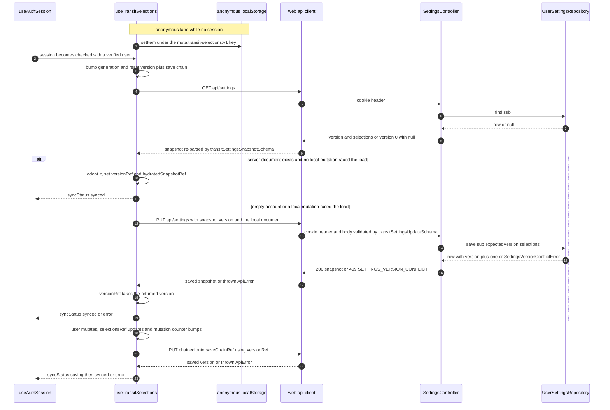

# Selections Persistence and Sync

The saved-selection document ([the document model itself is covered
elsewhere](/openwiki/concepts/transit-selections.md)) has exactly two places to
live, and a user is in exactly one of them at a time:

| Lane | Owner | Written when | `syncStatus` |
|---|---|---|---|
| Anonymous | `localStorage["mota:transit-selections:v1"]` | synchronously, inside `mutate()` | `local` |
| Authenticated | `user_settings` row keyed by the Supabase `sub`, reached through `GET/PUT /api/settings` | asynchronously, after hydration, through a serialized promise chain | `loading` → `synced` / `saving` / `error` |

`useTransitSelections(session)` (`apps/web/src/hooks/useTransitSelections.ts`)
is the single owner of both. It takes the `AuthSessionState` produced by
[`useAuthSession`](/openwiki/workflows/authentication.md), and nothing else in
the web app talks to `/api/settings`. The server half is one controller
(`apps/api/src/settings/settings.controller.ts`) over one repository
(`packages/db/src/repository.ts`).

The document is identical in both lanes because all three sides parse it with
the same Zod schema from `@mota/contracts/transit-settings`. Per AGENTS.md,
untrusted HTTP, database JSON, and localStorage values are parsed with Zod —
that rule is the reason this page has no "what if the server sends garbage"
section: every entry point rejects rather than trusts.

## The lifecycle end to end



*The sync lifecycle in one pass: the session effect decides who wins (server
document vs. local upload), the mutation effect serializes every later write
through one promise chain, and each PUT carries the version it expects the
server to still hold.*

The two effects never both run for the same change. The session effect owns
*hydration*; the mutation effect owns *every write after hydration*. Three refs
keep them from stepping on each other.

## Lane 1 — anonymous: localStorage, write-through, `local`

`apps/web/src/hooks/transitSelectionStorage.ts` is the whole adapter:

- `STORAGE_KEY = "mota:transit-selections:v1"` — the only key mota owns.
- `loadTransitSelections(storage?)` is the Zod edge for this lane. It is
  `null`-safe when `window` is undefined, catches `SyntaxError` from
  `JSON.parse`, runs `transitSelectionsSchema.safeParse` over what survives, and
  then `normalize`s the result (dedupe stops and stations by `id`, drop
  `selectedBusStopIds` that no longer resolve, clamp to
  `MAX_SELECTED_BUS_STOPS`, default the selection to the first saved stop and
  first saved station). *Any* failure at any step falls back to the canonical
  empty document `{commutes: {toWork: empty, toHome: empty}}` — a corrupt or
  legacy-trapped key can never crash the app, only lose its contents.
- `saveTransitSelections(selections, storage?)` is a plain
  `setItem(STORAGE_KEY, JSON.stringify(selections))`. The injectable `storage`
  parameter exists so tests can pass a fake.

The write happens inside `mutate()` in the hook:

```ts
const mutate = useCallback((transition) => {
  const next = transition(selectionsRef.current);   // compose, don't wait for React
  selectionsRef.current = next;
  mutationRef.current += 1;
  setSelections(next);
  if (!sessionRef.current.authenticated) {
    saveTransitSelections(next);                    // anonymous: write through now
  }
}, []);
```

Two things are load-bearing here. First, `mutate` reads `selectionsRef.current`
rather than the `selections` state value, so a burst of clicks (add a stop,
toggle it, switch context) composes correctly without waiting for a re-render;
`selectionsRef` is updated inside `mutate` itself. Second, the localStorage
write is gated on `!sessionRef.current.authenticated` — `sessionRef.current` is
reassigned on every render, so `mutate` sees the freshest session without being
a dependency of the callback.

The consequence, pinned by test: **the authenticated lane never writes
localStorage.** Hydrating a server document leaves
`mota:transit-selections:v1` exactly as it was, so the anonymous document is
still there — intact — when the user logs out on the same device.

## Lane 2 — hydration: load, or upload on first login

The session effect runs on `[session.checked, session.authenticated,
session.user]`. Its first act is a reset, which is also its race guard:

```ts
const generation = generationRef.current + 1;
generationRef.current = generation;
hydratedRef.current = false;
versionRef.current = 0;
saveChainRef.current = Promise.resolve();
```

Then it branches:

- **`!session.checked`** — the session check is still in flight. `syncStatus`
  stays `local`; nothing is fetched, nothing is replaced. The app is fully
  usable anonymously while this is pending.
- **checked but not authenticated (or no user)** — `activeUserRef.current =
  null`, `replaceSelections(loadTransitSelections())`, `syncStatus = "local"`.
  This is the logout path *and* the failed-session path: the local document
  comes back from storage and the previous user's server document is discarded
  from memory. The test names the security property outright: "restores
  anonymous settings after logout without exposing the previous user."
- **checked, authenticated, with a user** — `authUserId = session.user.sub`,
  `activeUserRef.current = authUserId`, `mutationAtStart = mutationRef.current`,
  `syncStatus = "loading"`, then `fetchTransitSettings()`.

The decision is made when the GET resolves, and it is a *two-condition* test:

```ts
if (snapshot.selections !== null && mutationRef.current === mutationAtStart) {
  // server document wins: adopt it wholesale
} else {
  // local document wins: PUT it, carrying snapshot.version
}
```

Read that as "who has newer information":

1. **The server has a document and the user has not touched anything since the
   effect started.** The server wins. `versionRef` takes `snapshot.version`,
   `hydratedRef` becomes true, `replaceSelections` swaps in the server
   document, and `syncStatus` goes to `synced`.
2. **The server has no document** (`{version: 0, selections: null}` — a
   never-seen account, the normal first-login case). The local document is
   uploaded: `saveTransitSettings({version: 0, selections:
   selectionsRef.current})`. This is the bootstrap that turns an anonymous
   device into a synced account without the user re-picking their stops.
3. **The server has a document but the user mutated while the GET was in
   flight** (`mutationRef.current !== mutationAtStart`). The *local* document
   still wins and is uploaded against `snapshot.version`. Without this guard a
   fast click during page load would be silently erased by the server copy
   landing a moment later.

Note that cases 2 and 3 share one code path — both are "the local document is
the truth, upload it with the version we just learned" — and both land in
`synced` with `versionRef` set from the PUT response.

## The three race guards

| Ref | Guards against | Mechanism |
|---|---|---|
| `generationRef` | a stale session effect finishing after the session changed | every effect run bumps a counter; every async continuation re-checks it |
| `mutationRef` | the server overwriting a user edit made during hydration | compared against `mutationAtStart` at decision time |
| `saveChainRef` | two PUTs in flight at once, interleaving versions | all PUTs are `.then`-chained onto one promise |

### `generationRef` — invalidating in-flight work

Every `await` boundary in both effects re-checks
`generationRef.current !== generation || activeUserRef.current !== authUserId`
and bails out silently if either changed. That covers the two realistic
interleavings: the session effect re-ran (logout, login as someone else, a
StrictMode remount), or the active user changed. A GET that resolves late for a
user who is no longer logged in can neither `replaceSelections` nor advance
`versionRef`; a chained PUT that resolves late cannot flip `syncStatus` back to
`synced` for a session that already ended. The reset block at the top of the
session effect is the other half — `versionRef = 0` and
`saveChainRef = Promise.resolve()` mean a new session starts with a clean
version and a fresh chain, and `hydratedRef = false` means the mutation effect
is inert until the new session actually hydrates.

### `mutationRef` — who wins hydration

Covered above; it is the counter `mutate()` increments. Its only reader is the
hydration decision, where the value captured at effect start
(`mutationAtStart`) is compared with the value at decision time. It is *not*
reset by the session effect — that is deliberate, because what matters is
"did anything change on this device since this load began", which survives
across session changes.

### `saveChainRef` — one PUT at a time

After hydration, the mutation effect owns all writes:

```ts
setSyncStatus("saving");
saveChainRef.current = saveChainRef.current.then(async () => {
  if (generationRef.current !== generation || activeUserRef.current !== authUserId) {
    return;                                       // session ended: drop the write
  }
  const saved = await saveTransitSettings({
    version: versionRef.current,                   // read *inside* the chain
    selections: nextSelections,                    // captured *outside* it
  });
  if (generationRef.current === generation && activeUserRef.current === authUserId) {
    versionRef.current = saved.version;            // only advance on success
    setSyncStatus("synced");
  }
});
```

The chain is the whole concurrency story. Two rapid mutations enqueue two steps;
the second does not even start its `fetch` until the first's `await` settles, so
the server never sees `version: 4` twice or a `version: 5` before the `version:
4` write commits. `nextSelections` is captured when the effect runs (each step
sends the document as it was at that render), but `versionRef.current` is read
*inside* the step, so each PUT inherits the version the previous PUT earned.
Both the session-effect upload and this chain can technically be in flight
together on first login, but the upload happens before `hydratedRef` is set, so
the mutation effect is inert until it finishes.

The catch handler sets `syncStatus = "error"` under the same generation/user
guards — a failed save for an ended session must not paint an error for the new
one. Because each step returns normally except on rejection, one failed step
also rejects everything chained behind it, each of which will surface its own
error; the chain never deadlocks, it just keeps reporting.

One subtlety worth knowing before you edit this file: the hydration branch sets
`hydratedSnapshotRef.current = snapshot.selections` to the *same object
reference* it passes to `replaceSelections`. The mutation effect then sees that
exact object on its next run, matches it, clears the ref, and returns —
suppressing a pointless echo PUT of the document the server just sent. The
upload branch never calls `replaceSelections`, so it does not need the guard.

## The HTTP edges, and the Zod boundary on each side

`apps/web/src/api/client.ts` wraps both verbs identically: `AbortSignal.timeout(8_000)`
so a hung network rejects instead of hanging the UI in `saving` forever, and a
non-OK response converted to `ApiError(status, code)` where `code` is the
`error` string from the JSON body (or `null` if the body is not that shape).
`putJson` adds `credentials: "include"` and `Content-Type: application/json`.

```ts
export async function fetchTransitSettings(): Promise<TransitSettingsSnapshot> {
  const payload = await getJson("/api/settings");
  return transitSettingsSnapshotSchema.parse(payload);
}
export async function saveTransitSettings(update: TransitSettingsUpdate) {
  const payload = await putJson("/api/settings", update);
  return transitSettingsSnapshotSchema.parse(payload);
}
```

Both use `.parse`, not `safeParse` — an unexpected payload throws, which rejects
the caller's promise and lands in the same `.catch` as a network failure. That
is the AGENTS.md boundary rule made concrete: the client re-parses **every**
`/api/settings` payload with `transitSettingsSnapshotSchema` before trusting it,
including the echo of its own PUT. `transitSettingsSnapshotSchema` is
`{version: int ≥ 0, selections: TransitSelections | null}`, and because
`transitSelectionsSchema` is a transforming union, the parse is also where a
legacy document shape (singular `selectedBusStopId`, or a flat point document)
is promoted to the current shape. Note the hook keeps only `saved.version` from
a PUT response — the returned `selections` is discarded.

The service worker never touches this traffic: `apps/web/public/sw.js` returns
early for any `/api/` pathname, so a settings GET always reaches the network
and an offline PUT fails fast into `error` rather than being served stale.

## The server: one controller, one repository

`SettingsController` is `@Controller("api/settings")` with two routes and one
shared `requireUser`. `requireUser` verifies the cookie header through the
injected `SESSION_VERIFIER` and hands it an `onSetCookie` callback that appends
to the Fastify reply — that is how rotated session cookies ride along on a
settings request (asserted by the e2e suite). Failure mapping:

| Condition | HTTP | `error` code |
|---|---|---|
| verifier throws `SupabaseUnavailableError` | 503 | `AUTH_UPSTREAM_UNAVAILABLE` |
| verifier returns no user | 401 | `AUTH_REQUIRED` |
| PUT body fails `transitSettingsUpdateSchema` | 400 | `INVALID_SETTINGS` |
| repository throws `SettingsVersionConflictError` | 409 | `SETTINGS_VERSION_CONFLICT` |

`GET` maps a missing row to `{version: 0, selections: null}` — the exact shape
that tells the client "bootstrap from the anonymous document." `PUT` validates
first, then delegates to `repository.save(user.sub, parsed.data.version,
parsed.data.selections)` and echoes `{version, selections}` from the returned
row.

The repository is injected as the `SETTINGS_REPOSITORY` symbol token from
`AppModule.register`. `apps/api/src/main.ts` is the only composition root that
supplies a real one: it builds the Drizzle database, runs migrations, and
constructs `DrizzleUserSettingsRepository`. The default is
`UnavailableSettingsRepository`, which throws on both methods — so a test (or a
misconfigured boot) that reaches settings persistence fails loudly rather than
silently pretending to save.

## The version protocol, mapped to the database

The `user_settings` row is
`auth_user_id text PK` (the Supabase `sub`, verbatim — there is no local user
record anywhere in mota), `version integer NOT NULL DEFAULT 1`,
`selections jsonb NOT NULL`, `updated_at timestamptz NOT NULL DEFAULT now()`.

`DrizzleUserSettingsRepository.save` is a compare-and-swap with two deliberately
asymmetric branches:

- **`expectedVersion === 0`** issues `INSERT ... VALUES (authUserId, version: 1,
  selections, updatedAt) ON CONFLICT DO NOTHING RETURNING *`. If the row already
  exists the insert is skipped, `.returning()` is empty, and that emptiness
  *is* the conflict signal.
- **`expectedVersion >= 1`** issues `UPDATE ... SET version = expectedVersion +
  1, selections, updated_at WHERE auth_user_id = ? AND version =
  expectedVersion RETURNING *`. The `version` predicate lives **in the WHERE
  clause**, which is what makes the check-and-set a single atomic statement —
  no read-then-write window for another tab to slip through. Zero matched rows
  means another writer got there first.

Both collapse into `SettingsVersionConflictError`, because from the client's
perspective they are the same situation: *your view of the data is stale*. The
controller translates that into 409 `SETTINGS_VERSION_CONFLICT` with the message
`다른 화면에서 설정이 변경되었습니다.` ("settings were changed on another screen").

Reads go through `toStored`, which re-parses the `jsonb` column with
`transitSelectionsSchema.safeParse` and throws `InvalidStoredSettingsError` on
failure. That is the AGENTS.md "database JSON is untrusted" rule; since the
controller does not catch it, a corrupt row surfaces as a 500, never as a
conflict and never as silent garbage reaching the browser. The re-parse doubles
as the migration path for old rows — a stored legacy document is promoted on
read without a backfill migration.

## What a conflict actually does to the user

This is the part worth being precise about, because the client's response is
*restrained*:

1. The PUT rejects with `ApiError(409, "SETTINGS_VERSION_CONFLICT")`.
2. The `.catch` sets `syncStatus = "error"`. Nothing else.
3. `GoogleLogin` renders that as `저장 확인 필요` ("save needs confirmation") next
   to the account email — the only user-visible trace of the conflict.
4. Local state is **not** rolled back and the server document is **not**
   fetched over it. The user keeps editing their version.
5. `versionRef` is only advanced on success, so it still holds the stale
   version. A further mutation enqueues another PUT with that same stale
   version, which will conflict again.

`error` is terminal inside a session: nothing in the hook clears it, and the
hook never re-hydrates on its own. Recovery is any event that re-runs the
session effect — a page reload, a logout and login, any change to
`session.checked`/`session.authenticated`/`session.user`. At that point the GET
re-runs, and because a fresh mount starts with `mutationRef` at its initial
value, the server document wins hydration and replaces local state.

So the protocol is *not* a merge and not automatic rebasing. It is a speed bump:
the user is told their save did not land, keeps their document for the rest of
the session, and on the next load the last committed server document wins.
Multi-tab overwrites are prevented silently in the normal case (the WHERE guard
plus the serialized chain); the visible `error` state is reserved for the case
where they genuinely happened.

## State surface

`syncStatus` is the whole observability story, and it is rendered in one place:
`App` → `BrandHeader` → `GoogleLogin`, next to the signed-in email.

| `syncStatus` | Label | Meaning |
|---|---|---|
| `local` | `이 기기에 저장` | anonymous; localStorage only |
| `loading` | `설정 불러오는 중` | GET in flight after a verified session |
| `saving` | `서버 저장 중` | a PUT is queued or in flight |
| `synced` | `서버에 저장됨` | last known server version matches local |
| `error` | `저장 확인 필요` | a save failed — network, timeout, parse, or 409 |

## Tests that pin this protocol

- **`apps/web/src/hooks/useTransitSelections.test.tsx`** — the hook contract,
  with `fetchTransitSettings`/`saveTransitSettings` mocked at the client seam:
  hydration wins without touching localStorage; `{version: 0, selections: null}`
  triggers a PUT of the anonymous document; a post-hydration mutation PUTs with
  the server version (`version: 2` after hydrating at 2); the multi-watch cap
  holds under authenticated sync; rerendering with an anonymous session restores
  the local document.
- **`apps/api/test/settings.e2e.test.ts`** — the HTTP boundary through
  `createApp` with a `MemorySettingsRepository` and a cookie-regex verifier:
  both routes 401 without a user, `SupabaseUnavailableError` becomes 503
  `AUTH_UPSTREAM_UNAVAILABLE` (an upstream outage is never mistaken for
  anonymous), rotated `set-cookie` headers survive the settings response,
  `user-1` and `user-2` are isolated (a second user reads `{version: 0,
  selections: null}`), an invalid body is 400, and replaying a stale version is
  409.
- **`packages/db/src/repository.integration.test.ts`** and
  **`apps/api/test/settings.postgres.integration.test.ts`** — the same
  compare-and-swap against real PostgreSQL, both behind
  `describe.runIf(process.env.DATABASE_URL)`, keyed by `crypto.randomUUID()` and
  cleaned up in `afterAll`: first write at version 0 yields version 1, `find`
  isolates users, and re-saving an already-consumed version rejects with
  `SettingsVersionConflictError`.

Together these are the reason the protocol can be described this simply: every
step above — hydrate-vs-upload, the three guards, the version handoff, and the
409 mapping — has a test that fails if it changes.

## Related pages

- [Transit selections](/openwiki/concepts/transit-selections.md) — the document
  being persisted: shape, migration ladder, and the localStorage normalizer.
- [Database](/openwiki/architecture/database.md) — the `user_settings` table,
  migrations, and the repository's compare-and-swap in isolation.
- [Web app](/openwiki/architecture/web-app.md) — the UI that consumes
  `selections.commutes[commute]` and passes `syncStatus` to the header.
- [Authentication](/openwiki/workflows/authentication.md) — where the `sub` that
  keys the settings row, and the cookies that authorize these requests, come
  from.
