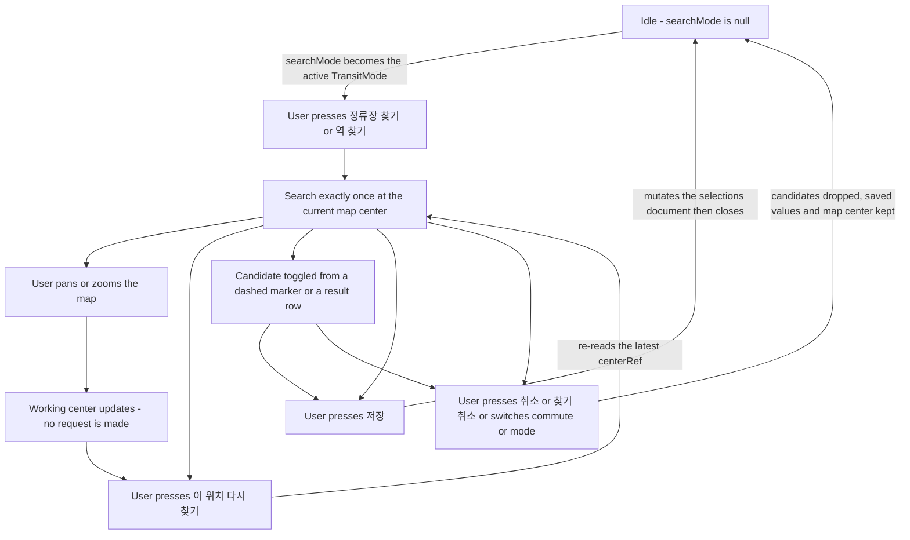
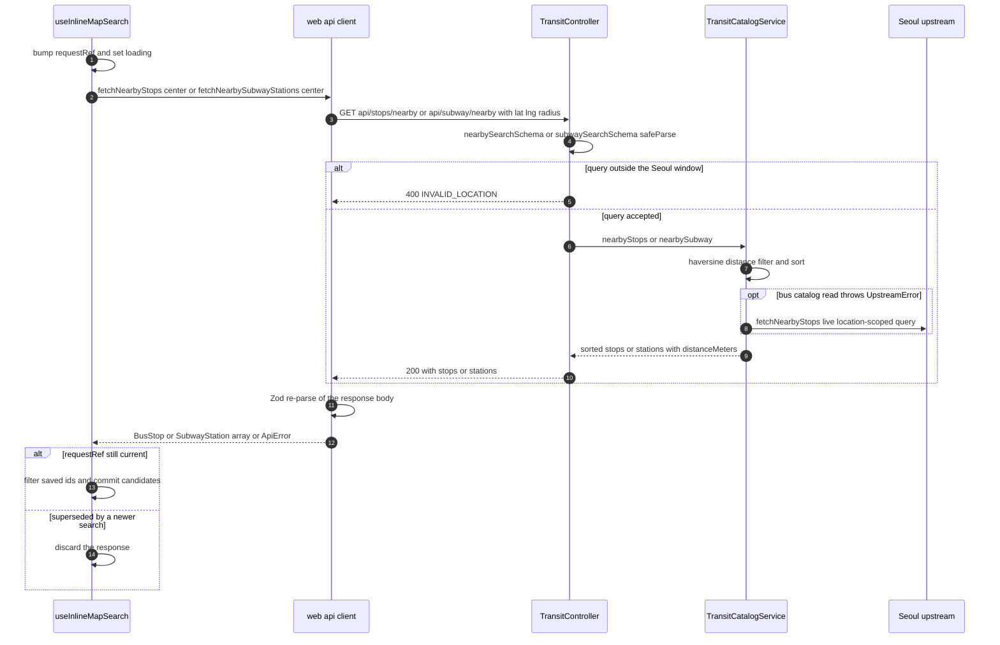

# Inline Map Stop and Station Finder

Saving a new bus stop or subway station is the only flow in mota that has to put
*choice* and *geography* on the same screen. The product contract
(`DESIGN.md` §5, 인라인 지도 찾기) forbids the obvious solution: there is no
second map, no dialog, and no scrim. Pressing `정류장 찾기` or `역 찾기` turns
the map the user is already looking at into the finder — an overlay of tools and
a candidate list sitting on the same `MapContainer`, at the same center, with the
saved points still drawn underneath.

This page walks that flow end to end: who owns which piece of state, exactly when
a network request happens (and when it deliberately does not), how a candidate is
selected from either a marker or a list row, what `저장` and `취소` actually
commit, and the accessibility mechanics that make SVG circles usable from a
keyboard.

## Ownership: three components, three disjoint state domains

| Concern | Owner | Lifetime |
|---|---|---|
| *Whether* a search is active, and for which mode | `App` (`searchMode: TransitMode \| null`) | survives map pans, list scrolling, and mode switches that cancel it |
| *Where* the map currently is | `MapStage` (`mapCenter`), fed by `MapCanvas`'s `onCenterChange` | lives as long as the stage is mounted |
| *What* was found and *which candidates are chosen* | `useInlineMapSearch` (inside `MapStage`) | created and torn down with the search; never persisted |

The split is what makes "panning never re-requests" cheap. `MapStage` re-renders
on every center change (that is how the anchor-follow works), but `useInlineMapSearch`
holds the center in `centerRef` rather than in a dependency of its search effect,
so a pan updates a ref and nothing else. No effect keyed on `center` exists in the
search path.

### The trigger and its cancel twin

`TransitPointSelector` renders the trigger with
`id="point-search-trigger"`, `aria-pressed={searching}` and a label that flips
from `${label} 찾기` to `찾기 취소` while active. Its handler in `App` is a
toggle: `setSearchMode(current => current === mode ? null : mode)` — pressing the
trigger a second time is a cancel, not a no-op. The trigger's id is load-bearing:
`App.closeSearch()` clears `searchMode` and then, inside a `queueMicrotask`,
focuses `document.getElementById("point-search-trigger")`, so a keyboard user who
cancels or saves lands back on the button that opened the search rather than being
dropped at the document start.

Three other paths also cancel an in-flight search: switching the commute context
(`출근`/`퇴근`), switching the transit mode tab (`버스`/`지하철`), and pressing
`취소` in the overlay. All of them set `searchMode` to `null` without any
additional cleanup — the hook's own entry effect is the cleanup.

### Mobile mount behavior

`App` renders `MapStage` only when `isDesktop || mobileMapOpen || searchMode !== null`.
On a phone with the map closed, entering a search therefore *mounts* the map.
`.map-stage` is `flex: 0 0 55dvh; height: 55dvh` below 960px, so the finder
immediately occupies the top 55dvh and the bottom sheet keeps its own scroll. Two
consequences worth knowing: `MapStage` hides its `지도 닫기` button while
`searching` (`!isDesktop && !searching`), so the only exit from the finder is
`취소`/`저장`/the trigger; and `.map-stage:not(.is-searching)
.leaflet-bottom.leaflet-right { bottom: 60px }` lifts the OSM attribution out from
under the close button when no search is active.

## The search state machine



*The finder's control flow. The only two transitions that produce a network
request are entering the search and pressing `이 위치 다시 찾기`; a pan is
terminal on its own branch.*

## `useInlineMapSearch`: the candidate owner

The hook takes `{mode, center, savedStops, savedStations}` and returns
`{busStops, stations, selectedBusStops, selectedStations, loading, error, search,
toggleBusStop, toggleStation}`. Everything mutable that a request needs is mirrored
into a ref during render — `modeRef`, `centerRef`, `savedStopsRef`,
`savedStationsRef` — so the `search` callback can be a stable `useCallback` with
an empty dependency array and still read fresh values at call time.

### Entry: reset and search once

```ts
useEffect(() => {
  requestRef.current += 1;
  setBusStops([]); setStations([]);
  setSelectedBusStops([]); setSelectedStations([]);
  setLoading(false); setError(null);
  if (mode !== null) {
    void search();
  }
}, [mode, search]);
```

The effect depends only on `mode` (and the stable `search`), not on `center`.
Entering a search bumps `requestRef` — which **invalidates any response still in
flight from a previous session** — wipes both candidate arrays and both pending
selection arrays, clears `loading`/`error`, and issues exactly one request.
Exiting (`mode` → `null`) runs the same reset without a request, so a response
arriving after the user cancelled is dropped by the counter check rather than
resurrecting dead candidates.

### `search()`: one request, three exit paths

The request counter is the whole race story. `search()` reads
`requestRef.current + 1` into a local `request`, stores it, and from then on
commits **nothing** unless `requestRef.current === request` still holds:

- A successful bus response sets `busStops` to the candidates and `stations` to
  `[]` (and symmetrically for subway), so the two modes can never both have live
  candidates.
- An empty candidate list is surfaced as the sentence
  `이 주변에서 새 정류장을 찾지 못했습니다.` /
  `이 주변에서 새 지하철역을 찾지 못했습니다.` through the same `error` slot a
  transport failure uses — an empty result and a failed request are
  indistinguishable to the status paragraph, by design, because the remedy
  ("move the map and press the button again") is the same.
- A thrown error sets `error` via `searchError(mode, error)`, which special-cases
  `isServiceAreaError(error)` — an `ApiError` with `code === "INVALID_LOCATION"` —
  into `서울 서비스 범위 밖이에요. 지도를 서울 근처로 옮겨 주세요.`, and
  otherwise returns a mode-specific retry sentence.
- The `finally` block clears `loading` only when the counter still matches, so a
  superseded request cannot un-set the loading flag of the request that replaced
  it.

Candidates are filtered against the already-saved ids *before* being committed:
`nextStops.filter(stop => !savedIds.has(stop.id))` where `savedIds` came from
`savedStopsRef` at call time. A stop the user already saved never comes back as
its own candidate.

### Toggling

`toggleBusStop`/`toggleStation` are pure array toggles over the *pending*
selection arrays. They touch nothing else — not the saved document, not the map,
not the mode. The pending selection is unbounded inside the search; the cap on
how many stops may be watched is applied at save time, not at pick time.

## The request path, browser to upstream



*One nearby search. The subway branch has no live fallback — an unavailable
subway catalog surfaces as 502 `UPSTREAM_UNAVAILABLE`.*

### Browser side

Both fetchers live in `apps/web/src/api/client.ts` and share the same shape: URL-
encode `lat`/`lng` (`.toFixed(6)`) plus `radius`, `GET`, Zod-parse the body
(`nearbyResultSchema` / `nearbySubwayResultSchema`), and throw `ApiError(status,
code)` on any non-2xx. The defaults differ by mode and are the whole reason the
two modes feel different on the map:

| Mode | Function | Radius | Timeout |
|---|---|---|---|
| Bus | `fetchNearbyStops(center, radius = 800)` | 800 m | 8 s (the client default) |
| Subway | `fetchNearbySubwayStations(center, radius = 3_000)` | 3 000 m | 35 s (Overpass-grade) |

The subway search is allowed to run for 35 seconds — pinned by
`api/client.test.ts`, which asserts `AbortSignal.timeout` was called with
`35_000` ("allows 35s for Overpass-backed searches instead of the default 8s").
The reason a nearby search needs that long is server-side: a **cold** station
catalog has to load the quarterly official T-Data CSV (a 15 s upstream timeout of
its own) before any geometry can happen. The UI consequence is real: `지도 중심
주변을 찾는 중…` can legitimately stay up for a long stretch on a cold subway
search. Once the catalog has a snapshot, `read()` never blocks a reader, so the
same search is fast afterwards.

### Server side

`TransitController` (`@Controller("api")`) exposes `GET stops/nearby` and
`GET subway/nearby`. Both validate the raw query with `safeParse` before touching
the catalog and throw `BadRequestException({error: "INVALID_LOCATION", …})` on
failure; both wrap catalog failures in `BadGatewayException({error:
"UPSTREAM_UNAVAILABLE", …, detail})`.

The validation window is where the map and the API disagree, and the disagreement
is deliberate:

| | `nearbySearchSchema` (bus) | `subwaySearchSchema` | `MapCanvas` `maxBounds` |
|---|---|---|---|
| lat | 37.3 – 37.8 | 37.3 – 37.8 | 37.2 – 37.95 |
| lng | 126.7 – 127.3 | 126.7 – 127.3 | 126.6 – 127.45 |
| radius | 100 – 1500, default 800 | 300 – 5000, default 3000 | — |

The Leaflet clamp is padded ("slightly padded so edge stops pan naturally") while
the API window is tight. A user can therefore drag the map to a corner the API
will refuse, and the refusal is exactly what `isServiceAreaError` +
`서울 서비스 범위 밖이에요. 지도를 서울 근처로 옮겨 주세요.` exist to explain.

Behind the controller, `TransitCatalogService` does not ask Seoul "what is near
me" — it holds the *whole city* in memory and does the geometry locally
(see [In-Memory Transit Catalogs](/openwiki/concepts/transit-catalogs.md)):

- `nearbyStops` maps every catalog point through a haversine `distanceMeters`,
  filters to `<= radius`, sorts by distance then id, and rounds the distance.
- `nearbySubway` additionally **dedupes by station name**, keeping the closest
  point per name — a transfer station served by several lines and therefore
  several coordinates collapses to one candidate.
- Bus only: if `this.bus.read()` throws an `UpstreamError` (catalog rejected or
  never loaded), the service falls back to `fetchLiveNearbyStops`, a live
  location-scoped query against `bus.go.kr/sbus/bus/selectNearStops.do`. This is
  the one place the nearby path does hit Seoul per request, and
  `test/transit-catalog-fallback.e2e.test.ts` pins the sequence (a rejected
  45 km catalog load followed by a `kiloMeter=0.8` live query).

## Rendering: saved points stay, candidates arrive dashed

`MapStage` feeds the search straight into the existing marker channels:

```tsx
<MapCanvas
  center={mapCenter}
  stops={stops}                                  // saved bus stops — unchanged
  subwayStations={subwayStations}               // saved stations — unchanged
  selectedStopIds={[...selectedStops.map(s => s.id),
                    ...search.selectedBusStops.map(s => s.id)]}
  pendingStops={search.busStops}
  pendingSubwayStations={search.stations}
  selectedSubwayStationIds={[...(selectedSubwayStation ? [selectedSubwayStation.id] : []),
                             ...search.selectedStations.map(s => s.id)]}
  onAddPending={search.toggleBusStop}
  onAddPendingSubway={search.toggleStation}
  …
/>
```

Two things follow. Saved markers keep rendering through the search, so the user
sees what they already have next to what they might add. And because
`selectedStop` is deliberately passed as `null` from `MapStage`, *both* saved and
pending markers derive `active` from that one union array — the two sets are
disjoint by the saved-id filter, so activation never crosses between them, and a
candidate's dashed circle turns solid lime while it is picked even though nothing
has been committed.

`MapCanvas` filters the pending arrays *again* against the saved ids
(`pendingStops.filter(stop => !savedStopIds.has(stop.id))`), a second line of
defense on top of the hook's filter — the invariant "a saved point is never its
own candidate" holds even if one of the two filters is removed.

Visually the distinction is stroke geometry, not color alone:

```css
.map-marker-pending        { stroke: var(--route-blue); stroke-dasharray: 5 3; }
.map-marker-pending-subway { stroke: var(--subway);      stroke-dasharray: 5 3; }
.map-marker-pending.is-active,
.map-marker-pending-subway.is-active { stroke: var(--ink); stroke-dasharray: none; fill: var(--signal); }
```

A pending marker is a dashed ring; picking it removes the dash and fills it with
the lime signal, matching the saved-marker active treatment. The active state is
carried by `aria-pressed` (on the hit circle) and by the class, satisfying the
design rule that color never carries state by itself.

## MapCanvas accessibility mechanics

Leaflet `CircleMarker` renders an SVG `<path>`. Out of the box that is invisible
to assistive technology and unreachable from a keyboard, so `MapCanvas` rebuilds
the semantics by hand.

### Two circles per point, one job each

`MapPointMarker` renders a **visible** circle (`radius={9}`,
`interactive: false`) and a **dedicated invisible hit circle** (`radius={22}`,
`className: "map-marker-hit"`, transparent fill) carrying the click handler, the
keyboard handler, and all ARIA state. The 22-radius circle is a 44 px-diameter
target that satisfies the touch-target minimum, and because it is real SVG
geometry its hit area is the path's geometry, not a CSS box. The visible circle is
non-interactive on purpose — the CSS comment notes that Leaflet therefore never
adds `.leaflet-interactive` to it, which is why the token rules style the marker
class names directly rather than gating on Leaflet's class.

### `AccessibleMarker`: an effect, not an event handler

The hit circle's element is upgraded in a `useEffect` keyed on `[label, active]`:

```ts
element.setAttribute("role", "button");
element.setAttribute("tabindex", "0");
element.setAttribute("aria-label", label);
element.setAttribute("aria-pressed", String(active));
element.classList.add("map-marker-hit-target");
```

The comment above the component states the constraint that forces this shape:
react-leaflet exposes the Leaflet marker instance through a ref, and Leaflet's
`add` event fires **once** when the marker is created. Attaching the attributes in
a one-time `add` callback would freeze `aria-pressed` at whatever `active` was on
first render — selection changes would never reach the DOM. Re-running the effect
on `[label, active]` re-syncs the pressed state on every toggle.

The same reasoning applies to the handler: `onSelect` is stored in
`onSelectRef` (`onSelectRef.current = onSelect` during render) so the keydown
listener, which is re-attached on each `[label, active]` run, always calls the
*current* callback rather than a stale closure. Because the listener is removed
and re-added on every selection change, keeping a fresh ref is what stops the
key press from dispatching into an out-of-date `onSelect`.

The keydown contract:

- `Escape` → `marker.closePopup()`.
- `Enter` or `Space` → `preventDefault()`, **`marker.closePopup()` first**, then
  `onSelectRef.current()`, then `marker.openPopup()`. Closing before selecting is
  required so the newly opened popup *replaces* any popup that was already open
  instead of stacking or being suppressed — it matches the click behavior, where
  Leaflet closes the previous popup on a new marker click.
- Anything else → ignored.

`onMarkerReady` hands the marker instance back to `MapPointMarker`, which stores
it in `hitMarkerRef` so the visible circle's `mouseover` handler can call
`openPopup()` on the interactive one — hover-preview works without the visible
circle having to be interactive.

### Class-name re-application

`MapPointMarker` splits `visualClassName` into `[baseClass, suffix]` and, in an
effect, does `element.classList.add(baseClass)` and
`element.classList.toggle("is-active", suffix === "is-active")`. This is a
workaround for a Leaflet detail: `pathOptions.className` is applied only at
creation and `setStyle()` never re-applies it, so toggling `is-active` through
props alone would be a no-op after the first render.

### Frame-level popup Escape

`CenterObserver` re-dispatches Leaflet's `popupopen`/`popupclose` as **bubbling
DOM custom events** on the map container, carrying the popup instance (and its
`_source` marker link) in `detail`. A keydown handler on the frame element then
handles `Escape` for the whole map: it finds `.leaflet-popup`, clicks its close
button, and — only when `document.activeElement` was *inside* the popup —
refocuses the owning marker element on the next animation frame. Marker-focused
and container-focused Escape keep their natural target. `MapCanvas.test.tsx` pins
both branches.

## The overlay: `InlineMapSearchControls`

While `searchMode !== null`, `MapStage` renders the controls and adds
`is-searching` to the stage's class list. The component is a focusable
`<section tabIndex={-1}>` labeled `버스 정류장 지도 찾기` / `지하철역 지도 찾기`,
and its mount effect calls `regionRef.current?.focus()` — the search, not the
map, takes focus on entry.

Its three zones:

1. **Toolbar** — the eyebrow `현재 지도에서 찾기`, the mode title with a
   `BusFront`/`TrainFront` icon, `취소`, and `저장`. The save button is labeled
   `{selectedCount}곳 저장` and `disabled={selectedCount === 0}`, so the primary
   action is unavailable until something is actually picked.
2. **Status line** — a polite `aria-live` paragraph showing
   `지도 중심 주변을 찾는 중…` while loading, the `error` string if one is set,
   or `가까운 {정류장|역} {resultCount}곳`. Live regions carry one sentence, never
   the list.
3. **Re-search button** — `RefreshCw` + `이 위치 다시 찾기` (relabeled
   `찾는 중…` and `disabled` while loading), wired to `search.search`. This is
   the *only* re-search entry point.

### The candidate reel, and the shared `aria-pressed`

When `resultCount > 0` the candidates render into a
`<fieldset className="inline-map-result-reel">` with an sr-only
`<legend>` (`정류장 검색 후보` / `지하철역 검색 후보`). Each candidate is a
button:

```tsx
<button type="button" aria-pressed={selectedBusStopIds.includes(stop.id)}
        onClick={() => onToggleBusStop(stop)}>
  <strong>{stop.name}</strong>
  <small>ARS {stop.arsId}</small>
</button>
```

Both the reel button and the map marker read the same pending-selection array
through the same props, so both expose the identical `aria-pressed` for the same
candidate — `DESIGN.md`'s "마커와 지도 아래의 후보 목록 선택은 동일한
`aria-pressed` 상태를 공유한다". Toggling from either surface flips both. This
is also the answer to `DESIGN.md` §7's "지도 마커만으로 선택을 강제하지
않는다": the reel is a full keyboard-and-screen-reader path to every candidate,
and neither surface is privileged.

The reel is a single horizontal scroll lane (`overflow-x: auto`,
`scroll-snap-type: inline proximity`, `min-inline-size: 0`), which is how the
mobile contract "후보 목록은 지도 하단의 한 줄 스크롤 영역을 사용한다" and "기본
시트와 별도의 세로 스크롤을 만들지 않는다" are satisfied. `MapStage.test.tsx`
reads `styles.css` and asserts the reel rule contains `min-inline-size: 0` so it
shrinks inside the panel before it scrolls. Below the 960px breakpoint the
toolbar and the status line stack vertically and the two action buttons become a
two-column grid (`grid-template-columns: repeat(2, minmax(0, 1fr))`) — no second
scroll surface appears at any width.

## Save and cancel semantics

**Nothing is committed until `저장`.** The pending selection lives entirely in
hook state. `저장` in `MapStage` branches on `searchMode` and hands the array to
`App`:

```tsx
onSave={() => {
  if (searchMode === "bus") { onSaveBusStops(search.selectedBusStops); return; }
  onSaveSubwayStations(search.selectedStations);
}}
```

`App.saveStops` / `App.saveStations` then, in order: call
`addBusStops(commute, stops)` / `addSubwayStations(commute, stations)` — the
single mutator on `useTransitSelections`, which applies the pure transition in
`transitSelectionMutations.ts` and writes to `localStorage` (anonymous) or enqueues
a `PUT /api/settings` (authenticated); set a polite announcement
(`${commuteLabel}에 ${first.name} 정류장을 선택했습니다.` / `…${first.name}역을
선택했습니다.`); force `mode` to match what was saved; and call `closeSearch()`.

The downstream transitions impose the product caps at commit time:

- `addBusStopsToCommute` appends every candidate to the unbounded saved list but
  unions the ids into `selectedBusStopIds` and `.slice(0, MAX_SELECTED_BUS_STOPS)`
  (= 4). Picking five candidates into an empty watched set saves all five and
  watches the first four; against a non-empty watched set the fill order is
  existing-then-new, so the cap can bite before every new candidate is reached.
- `addSubwayStationsToCommute` appends every candidate and sets
  `selectedSubwayStationId = stations[0]?.id` — the first candidate becomes the
  watched station, because subway is single-watch.

**`취소` discards only the candidates.** It runs the same `closeSearch()` —
`setSearchMode(null)` plus the refocus — and nothing else. Because the pending
selection was never written anywhere, it simply evaporates when the overlay
unmounts; the hook's entry effect wipes whatever survives on the next entry.
Three things are *specifically preserved*:

- **The saved document** — no mutator is called, so neither
  `mota:transit-selections:v1` nor `PUT /api/settings` fires.
- **The working map center** — `MapStage`'s `mapCenter` is reset only by the
  effect on the `center` prop, and `App`'s derived anchor does not change on a
  cancel. The map stays exactly where the user panned it.
- **The selection mode and commute context** — cancel does not touch `mode` or
  `commute` (unlike save, which forces `mode`).

The same preservation applies to the cancel twins: switching commute or mode
mid-search, and pressing `찾기 취소`. All three are pure `setSearchMode(null)`.

Note the deliberate asymmetry with save: saving *does* move the map, because
`addBusStops` changes the selections and therefore `App`'s `mapAnchor`, which
flows down as the `center` prop and re-pans via `CenterObserver`'s
`setView(center, zoom, {animate: false})`. After a save the map snaps (without
animation) to the first thing you just saved — a confirmation cue that costs no
extra state.

## Locate-me: the accuracy philosophy in `locate.ts`

`apps/web/src/components/locate.ts` is a self-contained geolocation boundary whose
header comment is the policy statement, and the policy is a *negative* result
recorded for the future:

> The platform's accuracy radius is NOT a reliable rejection signal: a fix can be
> centered exactly right while reporting a conservative multi-kilometer radius
> (IP-based fallback does this constantly). Rejecting on radius broke locate
> entirely for such devices, so coarse fixes are ACCEPTED and flagged.

The git history shows this was learned the hard way — an earlier
`fix(locate): gate geolocation fixes for accuracy and freshness` was followed by
`fix(locate): accept coarse fixes and warn instead of rejecting` and then
`fix(locate): guide IP-fallback fixes to device settings`.

`requestCurrentPosition()` returns a discriminated `LocateResult`:

| Kind | Meaning |
|---|---|
| `located` | `{lat, lng, accuracy, coarse}` — always a usable center |
| `unsupported` | `navigator.geolocation` is absent |
| `unavailable` | the platform error callback fired |

Three thresholds and one hard rule:

- **`COARSE_LOCATE_ACCURACY_METERS = 200`** — a fix above 200 m (or one with a
  non-finite accuracy, mapped to `Number.POSITIVE_INFINITY`) is flagged `coarse:
  true`. It is still returned as `located`; the map still pans to it.
- **`IP_FALLBACK_ACCURACY_METERS = 3_000`** — a fix at or above 3 000 m is
  treated as almost certainly IP-based fallback, where "the center is the ISP's
  registered area, not the user". `locateCoarseNotice` returns a notice that
  explicitly points at **device settings** rather than at a retry, because the
  comment is explicit that "no app-side retry can improve this".
- **`maximumAge: 0`** — cached fixes are forbidden: "it can be where the user WAS
  a minute ago, not where they are now". Together with
  `enableHighAccuracy: true` and `LOCATE_TIMEOUT_MS = 8_000`, this is the
  freshness half of the original gating commit that survived; the accuracy half
  did not.

The two notice helpers are the user-facing half of the policy:

- `locateCoarseNotice(result)` returns `null` for precise fixes, the
  device-settings sentence for `≥ 3 000 m` (or non-finite), and otherwise
  `위치 오차가 약 {N}m|약 {N}km 있어요. 내 위치가 아니라면 지도를 직접 옮겨 주세요.`
  — the map already moved, so the notice tells the user to *verify and correct*,
  not to retry.
- `locateFailureNotice(result)` returns the browser-capability sentence for
  `unsupported` and the permission sentence for `unavailable`.

The point of the design is that **"coarse" and "wrong" are separated**: a coarse
fix is accepted as a starting center and flagged, because the user can drag the
rest of the way; only a *missing* fix is an error. This composes with the finder,
where the user's remedy for a bad center is the same pan-and-`이 위치 다시 찾기`
loop as for an empty result.

**Current status:** `locate.ts` has no callers in the tree, and the
`.locate-button` CSS is equally dormant (the `.picker-overlay` / `.map-center-pin`
/ `.locate-button` rules are leftovers of the dialog-based picker the inline
finder replaced). The boundary is ready and documented but not wired; do not
assume a locate control exists in the UI.

## Invariants worth defending

- **One request per entry, one per explicit re-search.** There is no effect keyed
  on `center` anywhere in the search path. Adding one silently converts every pan
  into a network request and breaks the product contract.
- **A superseded response commits nothing.** Every state write in `search()` is
  guarded by `requestRef.current === request`, including the `finally` that clears
  `loading`.
- **A saved point is never its own candidate** — filtered in the hook and again in
  `MapCanvas`.
- **`aria-pressed` on a marker is always current.** It is set by an effect on
  `[label, active]`, never by a one-shot Leaflet event handler; the select handler
  is read through a ref, never through a stale closure.
- **Enter replaces the popup.** `closePopup()` before `openPopup()`, matching
  click semantics.
- **Cancel is a no-op on persistence.** It writes nowhere and resets no center.
- **The finder never creates a second scroll surface.** The reel is one
  horizontal lane inside the map stage.

## Tests that pin this flow

- `apps/web/src/App.test.tsx` — entering `정류장 찾기`/`역 찾기` sets
  `data-search-mode` on the map region and `queryByRole("dialog")` is absent, for
  both modes; the mobile map stays closed until `지도 열기` and closes with
  `지도 닫기`; saving from the search feeds the arrivals flow and the two commute
  contexts stay independent.
- `apps/web/src/components/MapStage.test.tsx` — a bus search calls
  `fetchNearbyStops` with the stage's current center, the search region takes
  focus, `.map-stage` gains `is-searching`, no dialog appears, a candidate can be
  picked (enabling `1곳 저장`), and `지도 닫기` is gone while searching; the subway
  path does the same on desktop; the reel rule keeps `min-inline-size: 0`; the
  mobile close control exists and desktop has none.
- `apps/web/src/components/MapCanvas.test.tsx` — Leaflet marker refs stay stable
  across a center re-render (the two `CircleMarker`s per point are not remounted
  by a pan); Escape closes a popup and restores focus to the owner marker *only*
  when focus was inside it; zoom gestures anchor to the center; animations all
  disable under reduced motion; `moveend` events coalesce into one center update
  per animation frame; the marker CSS carries the token classes without gating on
  `.leaflet-interactive`.
- `apps/web/src/api/client.test.ts` — a non-OK body carrying
  `{error: "INVALID_LOCATION"}` round-trips into an `ApiError` for which
  `isServiceAreaError` is true, and a body without a code does not; the subway
  nearby search requests a 35-second abort timeout.
- `apps/api/test/transit-catalog-fallback.e2e.test.ts` — a rejected bus catalog
  degrades to the live location-scoped upstream and still returns the stop.

## Related pages

- [Web App](/openwiki/architecture/web-app.md) — where `MapStage`,
  `MapCanvas`, and the inline search mount; the `searchMode` shell state and the
  mode gating around it.
- [In-Memory Transit Catalogs](/openwiki/concepts/transit-catalogs.md) — the
  `ManagedCatalog` state machine, stale-serving, and the bus-only live fallback
  behind `/api/stops/nearby` and `/api/subway/nearby`.
- [Saved Selections Document Model](/openwiki/concepts/transit-selections.md) —
  the document `저장` writes into, and the `MAX_SELECTED_BUS_STOPS` cap.
- [Arrival Display and Refresh](/openwiki/workflows/arrival-refresh.md) — what
  happens to the stops and station this flow saves.
- [Selections Persistence and Sync](/openwiki/workflows/settings-sync.md) — the
  localStorage and `PUT /api/settings` lanes a save lands in.
